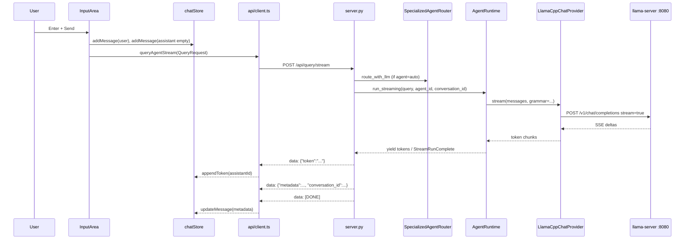

# Cerebro (SecondBrain) — Program Architecture Reference

This document is a technical map of the **Cerebro** codebase at the repository root (`/Users/mb/Desktop/Javier/SecondBrain`). The product is a **local-first agentic personal OS**: a Python **FastAPI** backend on port **7842**, a **React 18 + TypeScript + Zustand** frontend inside a **Tauri 2** desktop shell, and **llama.cpp** (`llama-server`) for on-device chat and embeddings.

> **Note on `cerebro/` subdirectory:** The repo also contains a largely mirrored tree under `cerebro/` (same `core/`, `ui/tray/`, `main.py`, tests). **Runtime and documentation here refer to the root layout** (`main.py`, `core/`, `ui/tray/`). Treat `cerebro/` as a packaged or historical duplicate unless your workflow explicitly `cd cerebro`.

---

## 1. OVERALL PROJECT ARCHITECTURE & DESIGN PATTERNS

### 1.1 Tech stack

| Layer | Technology | Role |
|-------|------------|------|
| Desktop shell | Tauri 2 (`ui/tray/src-tauri/`) | Native window, drag region, optional shell/dialog plugins |
| Frontend | React 18, TypeScript (strict), Vite 5, Tailwind CSS | Chat UI, settings, wizard, status bar |
| Client state | Zustand (`ui/tray/src/stores/`) | Chat, history, settings, system polling, wizard |
| API transport | `fetch` → `http://localhost:7842` | REST + SSE (no WebSockets in the hot path) |
| Backend | FastAPI + Uvicorn (`ui/tray/server.py`) | All `/api/*` routes, dependency-injected `app_state` |
| Agent loop | LangGraph `StateGraph` (`core/agents/runtime.py`) | Tool loop: context → reason → tool/observe → update |
| Inference | llama.cpp HTTP OpenAI-compatible API | Chat: `:8080`, embeddings: `:8082` (defaults) |
| Optional inference | MLX (`core/inference/providers/mlx_provider.py`), Claude API | Secondary/fallback backends via env |
| Vector memory | LanceDB (`core/memory/vector_store.py`) | Long-term chunks under `~/.cerebro/db` |
| Persistence | JSON files under `~/.cerebro/state/` | Agent profiles, conversations, config, wizard |
| Tooling | Python callables in `core/tools/handlers/` | Calendar, filesystem, math, macOS, execution |
| Testing | pytest + mocks at `AppState` injection | No live llama-server required for unit tests |

**Entry point:** `main.py` calls `_build_app_state()` then `uvicorn.run(app, host="0.0.0.0", port=PORT)` where `PORT` defaults to `7842` (`CEREBRO_PORT`).

### 1.2 Directory structure map

```
SecondBrain/
├── main.py                 # Wires providers, memory, tools, AgentRuntime → app_state; starts Uvicorn
├── pyproject.toml          # Python deps: fastapi, langgraph, lancedb, httpx, anthropic, …
├── Makefile                # install, test, run, engine, engine-embed, lint, package targets
├── bin/
│   ├── start_engine.sh     # Launches llama-server from config/{profile}.args
│   └── models/             # GGUF files (chat, embed, fleet models)
├── config/
│   ├── chat.args           # llama-server CLI for chat profile (port 8080)
│   ├── embed.args          # Embedding server (port 8082)
│   ├── coding.args, deep.args
│   ├── grammars/agent_response.gbnf   # GBNF template for tool/answer JSON
│   └── settings.toml       # Static defaults (not the runtime config.json)
├── core/                   # All backend domain logic (importable package)
│   ├── agents/             # Runtime, routing, conversation/state stores, planner, enricher
│   ├── inference/          # Providers, registry, model manager, fleet, health, RAM preflight
│   ├── memory/             # Short/long term, context builder, vector store
│   ├── tools/              # Registry, policy, handlers (calendar, fs, math, …)
│   ├── pipeline/           # Optional middleware stages (tested; not on main query path)
│   ├── ingestion/          # PDF/DOCX/text chunking for indexing
│   ├── rag/                # Vector query engine
│   ├── watcher/            # Filesystem watch → re-index hooks
│   ├── scheduler/          # APScheduler proactive tasks
│   ├── cache/              # Embedding LRU cache wrapper
│   ├── observability/      # RAM monitor, response metadata, macOS permission probes
│   └── i18n/               # Localized user-facing strings (e.g. tool confirm pause)
├── integrations/           # calendar_reader (EventKit / Apple Calendar bridge)
├── ui/tray/
│   ├── server.py           # FastAPI app + Pydantic models + route handlers
│   ├── wizard.py           # First-launch wizard helpers
│   └── src/                # React frontend (api/, stores/, components/, layouts/)
├── tests/                  # pytest suite mirroring core modules
├── scripts/                # smoke.sh, smoke_runner.py, diag/
└── docs/                   # Human guides (not runtime)
```

### 1.3 Core design patterns

1. **Dependency injection via singleton `AppState`** (`ui/tray/server.py`): `app_state.runtime`, `provider_registry`, `router`, `conv_store`, `vector_store`, `fleet_orchestrator`, etc. Tests replace these without starting real servers.

2. **Provider registry + strategy selection** (`core/inference/registry.py`): `ProviderRegistry` holds named `(chat, embed)` pairs; `select_for_task(TaskHint)` picks primary vs fallback using **available RAM** (`psutil`).

3. **LangGraph state machine for agents** (`AgentRuntime._build_graph`): Explicit nodes and conditional edges instead of ad-hoc loops; state serialized as `_RunState` dict.

4. **Specialized agents as profiles** (`core/agents/specialized.py`): Same runtime, different `AgentProfile` (instructions + `authorized_tools`); routing via prefixes, keywords, or `LLMRouter`.

5. **Human-in-the-loop tools** (`requires_confirmation` on `ToolDefinition` + `CONFIRMATION_REQUIRED_TOOLS`): Runtime pauses, API returns `metadata.pending_tool`, frontend `ConfirmModal` → `POST /api/tool-confirm`.

6. **Protocol-oriented inference** (`ChatProvider`, `EmbeddingProvider` in `registry.py`): `LlamaCppChatProvider`, `ClaudeApiChatProvider`, `MlxChatProvider` share the same call surface.

7. **OpenAI-compatible HTTP to llama-server** (`LlamaCppChatProvider.complete` / `.stream`): POST `/v1/chat/completions`; embeddings POST `/v1/embeddings`.

8. **GBNF-constrained JSON actions** (`build_agent_response_grammar` + `AgentAnswerStreamParser`): Forces `{"action":"tool"|"answer", ...}` shape during streaming.

9. **Layered context assembly** (`ContextBuilder.build`): Token budget with priority: instructions → session summary → long-term memory → recent messages.

10. **Pipeline middleware (parallel design, not wired to `/api/query`)** (`core/pipeline/pipeline.py`): Stages (`IntentDetectionStage`, `PolicyValidationStage`, …) exist for composable preprocessing; **production queries go through `AgentRuntime` directly**.

---

## 2. FRONTEND TO BACKEND COMMUNICATION (E2E DATA FLOW)

### 2.1 Transport summary

| Mechanism | Used for | Format |
|-----------|----------|--------|
| REST JSON | `/api/query`, `/api/tool-confirm`, `/api/status`, config, conversations, index, wizard | `Content-Type: application/json` |
| **Server-Sent Events (SSE)** | `/api/query/stream`, `/api/query/plan` | `text/event-stream`, lines `data: {...}\n\n`, terminator `data: [DONE]\n\n` |
| Polling | System status | `GET /api/status` + `GET /api/health` every 10s (`useSystemStore.startPolling`) |
| WebSockets | **Not used** in the chat path | — |

**Base URL:** `ui/tray/src/api/client.ts` → `const BASE = "http://localhost:7842"`.

**Optional auth:** If `VITE_CEREBRO_KEY` is set, requests include header `X-Cerebro-Key`. Backend mirrors this with `CEREBRO_API_KEY` and `_verify_api_key` on all routes (`server.py`).

### 2.2 Complete chat request lifecycle (default path)



#### Step-by-step with files

1. **UI trigger** — `ui/tray/src/components/chat/InputArea.tsx`, function `send()`:
   - Trims input; blocks if `llamaServer === "down"` (from `useSystemStore` + `selectLlamaServerState`) unless Claude mode.
   - `addMessage({ role: "user", content: query })`.
   - Creates `AbortController`, `setLoading(true)`.
   - Adds empty assistant bubble; stores `assistantId`.

2. **Agent ID mapping** — `AGENT_ID_MAP` in `client.ts`:
   - UI `AgentId` → backend profile id, e.g. `general` → `"general-v1"`, `thesis` → `"academic-v1"`, `code` → `"code-v1"`, `calendar` → `"calendar-v1"`, `auto` → `"auto"`.

3. **Request body** (`api/types.ts` → `QueryRequest`):
   ```json
   {
     "question": "<user text>",
     "agent": "general-v1" | "auto" | ...,
     "conversation_id": "<uuid or omitted>"
   }
   ```

4. **HTTP call** — `queryAgentStream()` in `client.ts`:
   - `POST ${BASE}/api/query/stream`
   - Reads `response.body` via `ReadableStream` + `TextDecoder`.
   - Parses SSE: `data: ` prefix; JSON payloads with `token`, `metadata`, `conversation_id`, `model_swap`, or `error`.
   - On `[DONE]`, returns `ResponseMetadata | null`.

5. **Backend route** — `query_stream_endpoint` in `ui/tray/server.py`:
   - Validates `app_state.runtime` (503 if missing).
   - If `req.agent == "auto"`: `await app_state.router.route_with_llm(req.question)` → `agent_id`, stripped `query_text`.
   - Else: `agent_id = req.agent`, `query_text = req.question`.
   - Creates conversation via `app_state.conv_store.create(agent_id)` if needed.
   - **`async for chunk in app_state.runtime.run_streaming(...)`** — not the legacy `runtime.stream()` shortcut.
   - Emits `data: {"token": chunk}\n\n` for each string chunk.
   - On `StreamRunComplete`, builds `ResponseMetadata`, persists turn via `conv_store.append`, emits metadata + `[DONE]`.
   - **Fallback:** If no live tokens were streamed, splits final answer by words and yields word-sized tokens (simulated streaming).

6. **Special case: calendar agent** — `InputArea.tsx` uses **`queryAgent`** (non-streaming `POST /api/query`) because tool-heavy calendar flows were pinned to the sync path; answer is replayed char-by-char for UX.

7. **Rendering** — `useChatStore.appendToken(assistantId, token)` updates assistant `content`. `ChatWindow` / `MessageBubble` read `messages` from Zustand.

8. **Metadata panels** — `ResponseMetadata` may include `sources_used`, `tools_called`, `warnings`, `pending_tool`. `MessageBubble` toggles `expandedPanel` for sources/tools/memory.

### 2.3 Tool confirmation flow

1. Runtime `_tool_node` sets `needs_confirmation=True` when `_requires_confirmation(tool_name)` (registry flag or `CONFIRMATION_REQUIRED_TOOLS`).
2. `final_state.pending_tool_name` / `pending_tool_args` stored; `app_state._pending_tools[conv_id]` on server.
3. SSE metadata includes `pending_tool: { name, args }`.
4. `InputArea` calls `setPendingConfirmation` → `ConfirmModal` (via layout/chat components).
5. User approves/denies → `confirmTool(convId, decision)` → `POST /api/tool-confirm` (`tool_confirm_endpoint`).
6. Server runs handler directly (approve) or returns denial message; appends conversation turn.

### 2.4 State management (frontend)

| Store | File | Responsibility |
|-------|------|----------------|
| `useChatStore` | `stores/chat.ts` | Messages, loading, `conversationId`, `activeAgent`, `pendingConfirmation`, abort |
| `useSystemStore` | `stores/system.ts` | Polls `/api/status`, `/api/health`, `/api/fleet/status`; RAM/engine state |
| `useSettingsStore` | `stores/settings.ts` | `GET/PATCH /api/config`, model/folders UI |
| `useHistoryStore` | `stores/history.ts` | Conversation list from `/api/conversations` |
| `useWizardStore` | `stores/wizard.ts` | Onboarding steps |

**App bootstrap** — `ui/tray/src/App.tsx`: On mount, `getWizardStatus()`; if not first launch, `complete()` wizard; `startPolling()`; `loadSettings()`. Renders `WizardShell` or `MainLayout`.

### 2.5 API surface (primary routes)

All mounted at `app.include_router(api)` with `prefix="/api"` (`server.py` ~line 1243). Wizard routes: separate router `prefix="/api/wizard"`.

| Method | Path | Handler | Purpose |
|--------|------|---------|---------|
| POST | `/api/query` | `query_endpoint` | Sync full answer |
| POST | `/api/query/stream` | `query_stream_endpoint` | SSE token stream + metadata |
| POST | `/api/query/plan` | `query_plan_endpoint` | Multi-step planner SSE |
| POST | `/api/tool-confirm` | `tool_confirm_endpoint` | Resume after tool approval |
| POST | `/api/index` | `index_endpoint` | Start async index job |
| GET | `/api/index/status` | `index_status_endpoint` | Poll job |
| GET | `/api/status` | `status_endpoint` | RAM, latency, model, metrics |
| GET | `/api/health` | `health_endpoint` | llama-server health via monitor |
| GET/PATCH | `/api/config` | `get_config` / `patch_config` | Persistent settings |
| GET | `/api/conversations` | `list_conversations` | Session list |
| GET | `/api/conversations/{id}` | `get_conversation` | Full thread |
| GET | `/api/models` | `list_models` | GGUF + MLX listing |
| GET/PATCH | `/api/fleet/*` | `fleet_status`, `fleet_models`, `fleet_config` | Fleet orchestrator UI |

---

## 3. BACKEND ARCHITECTURE & CORE LOGIC

### 3.1 Server layer (`ui/tray/server.py`)

**`AppState` dataclass** holds injectable services:

- `runtime: AgentRuntime | None`
- `provider_registry: ProviderRegistry | None`
- `router: SpecializedAgentRouter | None`
- `conv_store: ConversationStore`
- `vector_store`, `model_manager`, `fleet_orchestrator`, `planner`, `enricher`
- `metrics: MetricsCollector`, `ram_monitor`, `llama_health_monitor`
- `_pending_tools`, `_index_jobs`, `_config` (JSON at `~/.cerebro/state/config.json`)

**Lifespan** (`lifespan`):

- Probes macOS calendar permission → `app_state.macos_permissions`.
- Starts `ModelManager` subprocess servers if `CEREBRO_LLAMACPP_SIMPLE=false`.
- Starts `LlamaServerHealthMonitor` when llamacpp backend.

**Validation layer (before AI):**

- **Pydantic models** on ingress: `QueryRequest` (`question` min_length=1), `ToolConfirmRequest`, `IndexRequest`, etc.
- **HTTP exceptions:** 503 if runtime unset; 404 for unknown conversation/tool confirm; 500 on runtime exceptions.
- **RAM warnings:** `_apply_ram_pressure_warnings` + `collect_ram_warnings` injected into response metadata.
- **API key:** `_verify_api_key` global dependency on `app`.

**No separate “controller” layer** — route handlers orchestrate directly: routing → conversation id → `runtime.run` / `run_streaming` → metadata → persistence.

### 3.2 Agent routing (`core/agents/specialized.py`, `llm_router.py`)

`SpecializedAgentRouter.route_with_llm(raw_input)`:

1. **Prefix fast path:** `/academic`, `/calendar`, `/code` → strip prefix, fixed agent id.
2. **Keyword fast path:** `classify_intent_fast` in `core/agents/intent_keywords.py`.
3. **LLM slow path:** If still `general-v1`, `LLMRouter.classify` POSTs to llama-server with `_CLASSIFY_PROMPT`, `temperature=0.0`, `max_tokens=5`.
4. Maps category → `academic-v1` | `calendar-v1` | `code-v1` | `general-v1`.

### 3.3 Agent runtime (`core/agents/runtime.py`)

**Public methods:**

| Method | Behavior |
|--------|----------|
| `run(query, agent_id, conversation_id?)` | Full tool loop via compiled LangGraph; returns `(answer, AgentState)` |
| `run_streaming(...)` | Manual loop mirroring graph; yields answer tokens + `StreamRunComplete` |
| `stream(...)` | Direct `chat.stream()` without tools (legacy/simple path; not used by `/api/query/stream` today) |
| `prepare_conversation` / `save_conversation_session` | Hydrate short-term + session summary from `ConversationStore` |

**Graph nodes:**

| Node | Function | Effect |
|------|----------|--------|
| `context_assembly` | `_context_assembly_node` | `ContextBuilder.build`, optional `ContextEnricher.enrich`, build `messages[]` with system prompt |
| `reason_node` | `_reason_node` / `_reason_node_streaming` | LLM call with GBNF grammar; parse JSON action |
| `tool_node` | `_tool_node` | Execute tool or set confirmation pause |
| `observe_node` | `_observe_node` | Inject tool result as user message for next reason pass |
| `update_state` | `_update_state_node` | Append to `session_summary`, persist agent state |

**Limits:** `MAX_ITERATIONS=10`, `MAX_TOOL_CALLS=5`, `TIMEOUT_SECONDS=120`.

**Math fast path:** `try_pure_math_fast_path` (`core/agents/math_fast_path.py`) bypasses LLM for pure arithmetic when `evaluate_math` is authorized.

### 3.4 Memory and context

| Component | File | Role |
|-----------|------|------|
| `ShortTermStore` | `core/memory/short_term.py` | In-process turn list for active session |
| `LongTermStore` | `core/memory/long_term.py` | Embed query → LanceDB search → `MemoryChunk` |
| `ContextBuilder` | `core/memory/context_builder.py` | Budgeted assembly; `maybe_consolidate` summarizes old turns |
| `VectorStore` | `core/memory/vector_store.py` | LanceDB wrapper at `CEREBRO_DB` |
| `ConversationStore` | `core/agents/conversation_store.py` | JSON files `~/.cerebro/state/conversations/{uuid}.json` |
| `AgentStateStore` | `core/agents/state_store.py` | Per-agent profile + session_summary + tool_trace on disk |

**Session policy** (`core/agents/session_policy.py`): `hydrate_short_term`, `apply_conversation_to_agent_state`, `persist_session_summary` bridge conversation files and runtime state.

### 3.5 Tools (`core/tools/`)

- **`ToolRegistry`** (`registry.py`): Registers `ToolDefinition` (handler, `requires_confirmation`, `parameters`, scope).
- **Registration in `main.py`:** `register_calendar_tools`, `register_filesystem_tools`, `register_macos_tools`, `register_math_tools`.
- **Handlers:** `handlers/calendar.py`, `filesystem.py`, `math.py`, `macos.py`, `execution.py`, `search.py`.
- **Policy** (`policy.py`): `PolicyEngine` for validation (used in pipeline tests; runtime checks authorization inline in `_tool_node`).

### 3.6 Observability

- **`MetricsCollector`** / **`ResponseMetadata`** (`core/observability/response_meta.py`): Attached to every query; exposed in `/api/status` aggregates.
- **`RamMonitor`** (`core/observability/ram_monitor.py`): Pressure levels for status endpoint.
- **Inference warnings** (`core/inference/inference_warnings.py`): Thread-local list consumed after each query.

### 3.7 Indexing (partial wiring)

`POST /api/index` creates job in `app_state._index_jobs`; `_run_index_job` currently counts files (full embed pipeline integration may be extended via `IngestionPipeline` + vector store). Document ingestion logic lives in `core/ingestion/pipeline.py` (chunk size 768, overlap 96).

---

## 4. LOCAL AI MODEL INTEGRATION & INFERENCE PIPELINE

### 4.1 How local models are run

**Primary path: external `llama-server` process** (not Ollama).

- Start: `make engine` → `./bin/start_engine.sh chat` → reads `config/chat.args`, binds `127.0.0.1:8080`.
- Embeddings: `make engine-embed` → profile `embed` → port **8082** (`config/embed.args`).
- Example chat args (`config/chat.args`): `--model bin/models/llama-3.2-3b-instruct-q4_k_m.gguf`, `--ctx-size 4096`, `--temp 0.7`, GPU layers, flash attention.

**Alternate: `ModelManager`** (`core/inference/model_manager.py`) when `CEREBRO_LLAMACPP_SIMPLE=false`:

- Spawns subprocesses: router (SmolLM2) `:8080`, specialist `:8081`, embed `:8082`.
- `ensure_specialist(role)` swaps GGUF for `general` vs `code`.
- `ProviderRegistry.get_chat_for_agent` returns dynamic `LlamaCppChatProvider` pointed at specialist port.

**MLX** (`CEREBRO_INFERENCE_BACKEND=mlx` or secondary when `CEREBRO_MLX_ENABLED=auto` on Apple Silicon ≥12GB RAM): in-process `mlx_lm` generation.

**Claude** (`CEREBRO_INFERENCE_BACKEND=claude` + `ANTHROPIC_API_KEY`): `ClaudeApiChatProvider`; embeddings still local llamacpp embed server.

### 4.2 Bootstrap wiring (`main.py` → `_build_app_state`)

1. `FleetOrchestrator.select_on_startup()` — logs hardware-aware model rationale (stored on `app_state.fleet_orchestrator`).
2. `ProviderRegistry(ram_threshold_primary_gb, ram_threshold_fallback_gb)` from env.
3. Register chat + embed providers; `registry.set_primary(...)`.
4. Build `VectorStore`, `AgentStateStore`, `ShortTermStore`, `LongTermStore`, `ContextBuilder`.
5. Build `ToolRegistry` + handlers with **authorized paths** (`AUTHORIZED_READ_PATHS`, `AUTHORIZED_WRITE_PATHS`).
6. `AgentRuntime(registry, state_store, context_builder, tool_registry, tool_definitions, enricher, conversation_store)`.
7. `SpecializedAgentRouter(llm_router)` + `ensure_profiles(state_store)`.
8. Optional `LlamaServerHealthMonitor` for llamacpp mode.

### 4.3 Prompt formation pipeline

```
User query (API)
    → SpecializedAgentRouter (optional)
    → AgentRuntime.prepare_conversation
         → ConversationStore hydrate → ShortTermStore + session_summary on AgentState
    → [math fast path?] → return immediately
    → _context_assembly_node:
         → ContextBuilder.maybe_consolidate (LLM summary if context >85%)
         → ContextBuilder.build:
              - long_term.search(query) with domain_tags filter
              - short_term messages (newest-first, trim to token budget)
         → ContextEnricher.enrich (if CEREBRO_PROACTIVE_CONTEXT=true)
              - get_upcoming_events, search_files (macOS), 3s timeout
         → _build_system_prompt (JSON tool schema instructions, date line, memory, tools list)
         → messages = [system, ...history, user with _date_preamble() + query]
    → sync_prompt_cache(system_prompt, authorized_tools)  # llama.cpp prompt cache hint
    → LlamaCppChatProvider.complete/stream + grammar from build_agent_response_grammar()
```

**System prompt templates:** `_SYSTEM_TEMPLATE` (JSON actions) vs `_STREAM_SYSTEM_TEMPLATE` (plain text) in `runtime.py`. Production tool loop uses JSON template.

**Date handling:** `_date_preamble()` prepends localized “today is …” to the **user** message only (not shown in UI log) to reduce temporal hallucination.

**Temperature:** Chat profile default from `config/chat.args` (`--temp 0.7`). `LlamaCppChatProvider.complete` passes `temperature` only if provided in `kwargs`; streaming path omits it (server defaults). Router classify uses `temperature: 0.0`.

**Grammar:** `config/grammars/agent_response.gbnf` + dynamic `tool-name ::= "read_file" | ...` injection in `build_agent_response_grammar()`.

### 4.4 Backend → model HTTP

**`LlamaCppChatProvider`** (`core/inference/providers/llamacpp_provider.py`):

```python
# Non-streaming
POST {base_url}/v1/chat/completions
{
  "model": self._model,
  "messages": [...],
  "stream": false,
  "temperature": <optional>,
  "grammar": <gbnf string optional>
}

# Streaming
POST ... "stream": true
# Reads SSE lines data: {...}, yields delta.content
```

**Preflight:** `run_ram_preflight()` before each call (`core/inference/ram_preflight.py`).

**Context window reporting:** `_PROFILE_CTX` maps profile `chat|coding|deep` → 4096/8192/6144; `log_context_usage` after completion.

**Embeddings:** `LlamaCppEmbeddingProvider.embed` → `POST /v1/embeddings` with `{"model", "input": [text]}`; wrapped by `CachedEmbeddingProvider` (`core/cache/embedding_cache.py`).

### 4.5 Output processing and streaming back

1. **Raw LLM text** → `_parse_llm_response` strips thinking tags, markdown fences, extracts JSON.
2. **Action `tool`:** `tool_node` runs handler; `observe_node` adds observation user message; loop continues.
3. **Action `answer`:** `final_answer` set; route to `update_state` → END.
4. **Streaming:** `AgentAnswerStreamParser.feed(delta)` extracts visible characters from JSON `"answer"` field while grammar constrains structure (`core/inference/agent_answer_stream.py`).
5. **Server SSE:** Each token → `data: {"token": "..."}\n\n`; final → metadata JSON + `[DONE]`.
6. **Frontend:** `appendToken` concatenates into assistant message.

**Health / recovery:** `LlamaServerHealthMonitor` (`core/inference/health_monitor.py`) can mark server `restarting`; UI blocks send when `llamaServer === "down"|"restarting"`.

---

## 5. COMPONENT-BY-COMPONENT DETAILED BREAKDOWN

### 5.1 Entry and packaging

#### `main.py`
- **Purpose:** Application composition root.
- **Key:** `_build_app_state()` mutates global `app_state`; `if __name__ == "__main__"` runs Uvicorn.
- **Inputs:** Environment variables (`CEREBRO_*`, `ANTHROPIC_API_KEY`).
- **Outputs:** Populated `app_state`; listening HTTP server.
- **Side effects:** Disk stores under `~/.cerebro/`; may start `ModelManager` / health monitor on app lifespan (not in main itself).

#### `Makefile`
- **Purpose:** Dev ergonomics — `make run`, `make test`, `make engine`, `make lint`.
- **Side effects:** Spawns venv Python, llama-server via shell script.

#### `bin/start_engine.sh`
- **Purpose:** Idempotent llama-server launcher per profile.
- **Key logic:** Port 8080 (chat) vs 8082 (embed); health check via `curl /health`; `exec llama-server $(cat config/${PROFILE}.args)`.

---

### 5.2 API server

#### `ui/tray/server.py`
- **Purpose:** FastAPI application; single module for models, routes, `AppState`, CORS.
- **Key classes:** Pydantic `QueryRequest`, `QueryResponse`, `ResponseMetadataModel`, `AppState`.
- **Key functions:**
  - `query_endpoint` / `query_stream_endpoint` — main agent invocation.
  - `tool_confirm_endpoint` — executes pending tool after user approval.
  - `status_endpoint` — aggregates metrics, RAM, fleet fields, model id.
  - `lifespan` — startup/shutdown hooks.
- **Inputs:** HTTP JSON bodies.
- **Outputs:** JSON or `StreamingResponse`.
- **Side effects:** Writes conversations, config, wizard state; mutates `_pending_tools`, metrics.

#### `ui/tray/wizard.py`
- **Purpose:** Helpers for first-run wizard (`recommend_lite_profile`, folder checks).
- **Consumed by:** `/api/wizard/*` routes in `server.py`.

---

### 5.3 Agents

#### `core/agents/runtime.py`
- **Purpose:** LangGraph agent executor; heart of reasoning + tools.
- **Key classes:** `AgentRuntime`, `StreamRunComplete`, `_RunState`.
- **Key functions:** `run`, `run_streaming`, `_build_graph`, node methods, `_parse_llm_response`.
- **Inputs:** `query`, `agent_id`, optional `conversation_id`.
- **Outputs:** Answer string, `AgentState`, or async token stream.
- **Side effects:** Updates `AgentStateStore`, `ShortTermStore`, conversation session summary; may call tools (filesystem, calendar, etc.).

#### `core/agents/specialized.py`
- **Purpose:** Agent profile factories and `SpecializedAgentRouter`.
- **Key:** `make_*_profile()`, `RouteResult`, `route`, `route_with_llm`, `ensure_profiles`.
- **Side effects:** Creates/updates JSON agent state files on disk.

#### `core/agents/llm_router.py`
- **Purpose:** Slow-path intent classification via small LLM call.
- **Key:** `LLMRouter.classify(query) -> str` category.
- **I/O:** HTTP to llama-server; no persistent state.

#### `core/agents/state_store.py`
- **Purpose:** Persist `AgentState` per `agent_id` under state dir.
- **Key:** `AgentStateStore.load/save/list_agents`.
- **Side effects:** JSON read/write.

#### `core/agents/conversation_store.py`
- **Purpose:** Multi-turn chat persistence keyed by `conv_id` (UUID).
- **Key:** `create`, `get`, `append`, `update_session_summary`, `list_all`.
- **Side effects:** One JSON file per conversation.

#### `core/agents/session_policy.py`
- **Purpose:** Bridge conversation records ↔ short-term memory ↔ agent session summary.
- **Key:** `hydrate_short_term`, `apply_conversation_to_agent_state`, `persist_session_summary`.

#### `core/agents/context_enricher.py`
- **Purpose:** Proactive ambient context (calendar events, recent files).
- **Key:** `ContextEnricher.enrich(query) -> str` block appended to system prompt.
- **Side effects:** Invokes tool handlers in-process; macOS permissions gate calendar.

#### `core/agents/planner.py`
- **Purpose:** `TaskPlanner` for `/api/query/plan` multi-step decomposition.
- **Used by:** `query_plan_endpoint` in server (streams plan steps).

#### `core/agents/math_fast_path.py`
- **Purpose:** Deterministic arithmetic without LLM.
- **Key:** `try_pure_math_fast_path(query, authorized_tools)`.

#### `core/agents/intent_keywords.py`
- **Purpose:** Regex/keyword classifier for zero-latency routing.
- **Key:** `classify_intent_fast(query) -> category | None`.

---

### 5.4 Inference

#### `core/inference/registry.py`
- **Purpose:** Provider registration and RAM-aware selection.
- **Key:** `ProviderRegistry.register`, `get_chat`, `select_for_task`, `get_chat_for_agent`.
- **Types:** `Message` TypedDict, `TaskHint` enum, `ChatProvider` / `EmbeddingProvider` protocols.

#### `core/inference/providers/llamacpp_provider.py`
- **Purpose:** HTTP client for chat completions.
- **Key:** `LlamaCppChatProvider.complete`, `.stream`, `.is_available`, `.context_window`.
- **Exceptions:** `LlamaCppUnavailableError`, `InferenceTimeoutError`, `ModelNotFoundError`.

#### `core/inference/providers/llamacpp_embedding_provider.py`
- **Purpose:** Embedding vectors via `/v1/embeddings`.

#### `core/inference/providers/mlx_provider.py`
- **Purpose:** On-device Apple Silicon inference via MLX.

#### `core/inference/providers/claude_api_provider.py`
- **Purpose:** Anthropic API chat backend.

#### `core/inference/model_manager.py`
- **Purpose:** Subprocess lifecycle for multi-model swapping.
- **Key:** `start`, `stop`, `ensure_specialist`, `_launch`, `_wait_healthy`.
- **Side effects:** Spawns/kills `llama-server` children; port 8080/8081/8082.

#### `core/inference/agent_grammar.py`
- **Purpose:** Build per-agent GBNF grammar string from template + tool names.
- **Key:** `build_agent_response_grammar(authorized_tools)`.

#### `core/inference/agent_answer_stream.py`
- **Purpose:** Incremental parser to stream human-readable answer text from JSON tokens.
- **Key:** `AgentAnswerStreamParser.feed(delta)`.

#### `core/inference/prompt_cache.py`
- **Purpose:** `sync_prompt_cache` — aligns stable system prefix for llama.cpp KV cache reuse.

#### `core/inference/health_monitor.py`
- **Purpose:** Background probe/restart logic for llama-server; feeds `/api/health`.

#### `core/inference/ram_preflight.py`
- **Purpose:** Block or warn inference when RAM critically low.

#### `core/inference/fleet/orchestrator.py`
- **Purpose:** Hardware-aware model selection (`FleetOrchestrator.select_model`, `select_on_startup`).
- **Related:** `hardware_monitor.py`, `model_registry.py`, `task_classifier.py`, `script_writer.py`.

#### `core/inference/engine.py`
- **Purpose:** Shared inference exceptions (`InferenceTimeoutError`, `ModelNotFoundError`).

---

### 5.5 Memory & RAG

#### `core/memory/short_term.py`
- **Purpose:** In-memory list of `Message` dicts for current session.
- **Key:** `push_message`, `get_context`, `drop_oldest`.

#### `core/memory/long_term.py`
- **Purpose:** Episodic memory search via embeddings + LanceDB.
- **Key:** `LongTermStore.search(query, RetrievalContext)`.

#### `core/memory/context_builder.py`
- **Purpose:** Token-budgeted context assembly and consolidation.
- **Key:** `build`, `maybe_consolidate`, `estimate_session_fill`.
- **Output:** `AssembledContext` dataclass.

#### `core/memory/vector_store.py`
- **Purpose:** LanceDB table CRUD and similarity search.

#### `core/rag/query_engine.py`
- **Purpose:** Higher-level RAG query interface over vector store (used when indexing integrated into agent path).

---

### 5.6 Tools & integrations

#### `core/tools/registry.py`
- **Purpose:** Central catalog of `ToolDefinition` and `register_*_tools` helpers.
- **Side effects:** None by itself; handlers perform I/O.

#### `core/tools/handlers/filesystem.py`
- **Purpose:** `read_file`, `write_file`, `list_directory`, etc. with path allowlists from `main.py`.

#### `core/tools/handlers/calendar.py`
- **Purpose:** Calendar read/write via `integrations/calendar_reader.py`.

#### `core/tools/handlers/math.py`
- **Purpose:** `evaluate_math` safe evaluation.

#### `core/tools/handlers/execution.py`
- **Purpose:** `execute_python`, `run_script` with sandbox constraints.

#### `integrations/calendar_reader.py`
- **Purpose:** macOS EventKit / AppleScript bridge for events.

---

### 5.7 Pipeline (optional middleware)

#### `core/pipeline/pipeline.py`
- **Purpose:** `Pipeline` runner chaining `PipelineStage` implementations with per-stage timing.
- **Context:** `PipelineContext` carries `raw_input` → `final_response`.
- **Note:** Used in `tests/test_pipeline.py`; **not** invoked from `query_endpoint` today.

#### Stages (`core/pipeline/stages/`)
| File | Stage | Role |
|------|-------|------|
| `normalization.py` | InputNormalizationStage | Trim/sanitize input |
| `intent.py` | IntentDetectionStage | Set `detected_intent` enum |
| `context.py` | ContextRetrievalStage | Attach `assembled_context` |
| `prompt.py` | PromptAssemblyStage | Build prompt string |
| `policy.py` | PolicyValidationStage | Tool policy checks |
| `tools.py` | ToolExecutionStage | Execute tools in pipeline context |
| `postprocess.py` | PostProcessingStage | Format final response |
| `audit.py` | AuditStage | Record stage latencies |

---

### 5.8 Ingestion & watcher

#### `core/ingestion/pipeline.py`
- **Purpose:** Parse PDF/DOCX/txt/md/py → chunk → `Document` list with content hashes.
- **Key:** `IngestionPipeline.ingest(file_path)`.

#### `core/watcher/file_watcher.py`
- **Purpose:** Watchdog-based folder monitor to trigger re-indexing.

#### `core/scheduler/proactive.py`
- **Purpose:** APScheduler periodic tasks (proactive agent behavior).

---

### 5.9 Observability & cache

#### `core/observability/response_meta.py`
- **Purpose:** `ResponseMetadata`, `MetricsCollector`, `ToolCallRecord` for API metadata block.

#### `core/observability/ram_monitor.py`
- **Purpose:** Sample system memory for status and warnings.

#### `core/cache/embedding_cache.py`
- **Purpose:** LRU cache around embed provider (`CachedEmbeddingProvider`).

---

### 5.10 Frontend

#### `ui/tray/src/main.tsx` / `App.tsx`
- **Purpose:** React mount, wizard gate, global polling.

#### `ui/tray/src/api/client.ts`
- **Purpose:** All HTTP functions (`queryAgent`, `queryAgentStream`, `confirmTool`, `getStatus`, …).
- **Side effects:** Network only.

#### `ui/tray/src/api/types.ts`
- **Purpose:** TypeScript interfaces mirroring Pydantic models.

#### `ui/tray/src/stores/chat.ts`
- **Purpose:** Chat UI state (see §2.4).

#### `ui/tray/src/components/chat/InputArea.tsx`
- **Purpose:** User input, send/cancel, stream vs sync branch, tool confirm handlers.

#### `ui/tray/src/components/chat/ChatWindow.tsx`
- **Purpose:** Renders message list, typing indicator, confirm modal host.

#### `ui/tray/src/components/chat/MessageBubble.tsx`
- **Purpose:** Single message UI + metadata footers.

#### `ui/tray/src/layouts/MainLayout.tsx`
- **Purpose:** Header + ChatWindow + StatusBar + lazy SettingsPanel.

#### `ui/tray/src/components/status/StatusBar.tsx`
- **Purpose:** RAM gauge, latency, engine indicator (`EngineIndicator.tsx`).

#### `ui/tray/src-tauri/`
- **Purpose:** Tauri config (`tauri.conf.json`), capabilities, Rust `lib.rs` — window management, native permissions.

---

### 5.11 Configuration artifacts

| File | Purpose |
|------|---------|
| `config/chat.args` | llama-server flags for default chat model |
| `config/embed.args` | Embedding model server flags |
| `config/grammars/agent_response.gbnf` | GBNF root for agent JSON |
| `~/.cerebro/state/config.json` | Runtime UI config (model, folders) via PATCH /api/config |
| `~/.cerebro/state/wizard.json` | Wizard completion flag |
| `.env` / `load_dotenv()` in `main.py` | Local secrets and overrides |

---

## Appendix A — Environment variables (inference-critical)

| Variable | Default | Effect |
|----------|---------|--------|
| `CEREBRO_PORT` | `7842` | FastAPI listen port |
| `CEREBRO_INFERENCE_BACKEND` | `llamacpp` | `llamacpp` \| `mlx` \| `claude` |
| `CEREBRO_LLAMACPP_URL` | `http://127.0.0.1:8080` | Chat server |
| `CEREBRO_LLAMACPP_EMBED_URL` | `http://127.0.0.1:8082` | Embed server |
| `CEREBRO_LLAMACPP_MODEL` | `llama-3.2-3b-instruct-q4_k_m.gguf` | Model id in API payloads |
| `CEREBRO_LLAMACPP_SIMPLE` | `true` | `false` → `ModelManager` subprocesses |
| `CEREBRO_LLAMACPP_PROFILE` | `chat` | Context size profile in provider |
| `CEREBRO_PROACTIVE_CONTEXT` | `true` in code / docs vary | Enables `ContextEnricher` |
| `CEREBRO_DB` | `~/.cerebro/db` | LanceDB path |
| `CEREBRO_STATE` | `~/.cerebro/state` | JSON state |
| `CEREBRO_API_KEY` / `VITE_CEREBRO_KEY` | unset | Optional API auth |
| `CEREBRO_MLX_ENABLED` | `auto` | MLX secondary registration |
| `ANTHROPIC_API_KEY` | — | Required for Claude backend |

---

## Appendix B — Typical dev process (three terminals)

1. `make engine` — llama-server chat on :8080  
2. `make engine-embed` — embeddings on :8082  
3. `make run` — FastAPI on :7842  
4. Frontend: `cd ui/tray && npm run dev` (Vite; Tauri optional) — UI talks to :7842  

---

## Appendix C — Design tensions worth knowing

1. **`/api/query/stream` always uses `run_streaming` (tool loop)**, not the simpler `AgentRuntime.stream()` direct-LLM path — so calendar/tools work in streaming mode; simulated word streaming applies when the model picks tools instead of streaming JSON answers.

2. **Pipeline middleware is implemented but not on the hot path** — extending behavior via stages requires explicit wiring into `query_endpoint` or `AgentRuntime`.

3. **Index endpoint** currently counts files in `_run_index_job`; full embed→LanceDB pipeline may be completed in ingestion/RAG modules separately.

4. **Duplicate `cerebro/` tree** — keep changes in root `core/` and `ui/tray/` unless your release process targets the nested package only.

---

*Generated as an architectural reference for the SecondBrain / Cerebro repository. For operational fixes and runbooks, see `docs/`, `CLAUDE.md`, and `.cursor/rules/cerebro.mdc`.*
