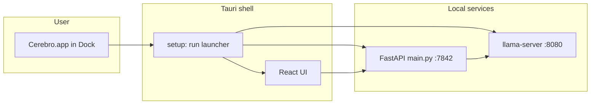

# Desktop one-click launch — implementation plan

**Goal:** Double-click **Cerebro** in the Dock or Applications and get the chat UI **without opening Terminal**.

**Update (2026-06-25 — engine/backend split):** Opening the app now starts **only the backend** (`:7842`). The LLM engine (`:8080`) is controlled via **Start engine** / **Stop engine** in the header (or `POST /api/engine/start`). Settings, history, and documents work without loading the GGUF. See [`docs/plans/engine-backend-split.md`](../plans/engine-backend-split.md).

**Chosen approach:** **Tauri desktop app + integrated service launcher** (Phase 1–3 below).

---

## Why this approach (and not the others)

| Option | Verdict |
|--------|---------|
| **`npx tauri build` only** | Gives icon + window, but backend (`:7842`) and engine (`:8080`) still manual — **does not meet your goal**. |
| **Automator / `.command` wrapper** | Works quickly, but no menu-bar tray, no ⌘⇧Space toggle, ugly Dock icon story — **skip**. |
| **Full `make package-macos` (PyInstaller + bundled backend)** | Best for shipping to strangers; **build scripts are not in the repo yet**; large effort. Do as **Phase 4 (later)**. |
| **Tauri app + launcher script on startup** ✅ | Reuses existing UI, icon, tray; starts engine + backend if down; one config file points at your install folder. **Best balance for you now.** |

---

## What “done” looks like (post-split)

1. **Cerebro.app** in `/Applications` (or Dock) with your logo.
2. First click:
   - Starts Python API on `:7842` if not reachable (background, via `cerebro_desktop_backend.sh`).
   - **Does not** load the GGUF until you click **Start engine**.
3. Window opens; settings, documents, and fast paths (math, calendar read) work without the engine.
4. **Start engine** → `POST /api/engine/start` → llama-server on `:8080` → full LLM chat.
5. **Stop engine** → frees ~2 GB RAM; backend and settings stay available.
6. Quitting the app leaves the backend running (faster next open on 8 GB Macs).

**Legacy full stack:** `make desktop-launch-full` or `make dev-full` (backend + motor together).

### Original “done” (pre-split, still available via `desktop-launch-full`)

**Out of scope for Phase 1–3:** Embedding server on `:8082` — with the **lite-8gb** profile, embeddings are in-process; you only need **chat engine + backend**.

---

## Architecture



**Config anchor:** `~/.cerebro/desktop.json` stores the absolute path to your `cerebro/` directory (models, venv, `bin/start_engine.sh`). The `.app` does not embed the 2 GB model — it only orchestrates what you already installed.

---

## Prerequisites (one-time, before building the app)

Run once from your machine:

```bash
# 1. Rust (Tauri)
curl --proto '=https' --tlsv1.2 -sSf https://sh.rustup.rs | sh

# 2. Xcode CLI tools (macOS)
xcode-select --install

# 3. Cerebro Python env + deps
cd /Users/mb/Desktop/Javier/SecondBrain/cerebro
make install

# 4. GGUF model present (see docs/guides/FIX_CHAT_RUNTIME_WARNINGS.md if missing)
ls bin/models/*.gguf

# 5. llama-server on PATH (however you install llama.cpp today)
which llama-server

# 6. Frontend deps
cd /Users/mb/Desktop/Javier/SecondBrain/cerebro/ui/tray
npm install
```

**Optional 8 GB profile** (fewer processes, no embed server): use `config/profiles/lite-8gb.env` when starting the backend (launcher sets this).

---

## Phase 1 — Install path config ✅

The packaged app must know where `cerebro/` lives on disk.

### 1.1 Create config schema

**File:** `~/.cerebro/desktop.json` (created by setup script or first launch)

```json
{
  "cerebro_root": "/Users/mb/Desktop/Javier/SecondBrain/cerebro",
  "profile_env": "config/profiles/lite-8gb.env",
  "inference_backend": "llamacpp",
  "start_embed_server": false
}
```

| Field | Purpose |
|-------|---------|
| `cerebro_root` | Directory containing `main.py`, `.venv`, `bin/start_engine.sh`, `config/` |
| `profile_env` | Relative path under `cerebro_root`; sourced before `main.py` (empty string = default) |
| `inference_backend` | Passed as `CEREBRO_INFERENCE_BACKEND` |
| `start_embed_server` | `false` for lite profile; `true` if you still use `make engine-embed` |

### 1.2 Bootstrap script (run once after clone)

**File to add:** `cerebro/scripts/write_desktop_config.sh`

```bash
#!/usr/bin/env bash
set -euo pipefail
ROOT="$(cd "$(dirname "$0")/.." && pwd)"
mkdir -p "$HOME/.cerebro"
cat > "$HOME/.cerebro/desktop.json" <<EOF
{
  "cerebro_root": "${ROOT}",
  "profile_env": "config/profiles/lite-8gb.env",
  "inference_backend": "llamacpp",
  "start_embed_server": false
}
EOF
echo "Wrote $HOME/.cerebro/desktop.json"
```

**Makefile target (done):**

```makefile
desktop-config:
	bash scripts/write_desktop_config.sh
```

**Verify:**

```bash
cd /Users/mb/Desktop/Javier/SecondBrain/cerebro
make desktop-config
cat ~/.cerebro/desktop.json
```

---

## Phase 2 — Idempotent launcher script ✅

**Files (implemented):**

| Path | Purpose |
|------|---------|
| `cerebro/scripts/cerebro_desktop_launcher.sh` | Canonical launcher |
| `scripts/cerebro_desktop_launcher.sh` | Same for repo-root installs |
| `make desktop-launch` | In root and `cerebro/` Makefiles |

Responsibilities:

1. Read `~/.cerebro/desktop.json` (fail with clear message if missing → “Run `make desktop-config`”).
2. `cd "$cerebro_root"`.
3. **Engine:** if `http://127.0.0.1:8080/health` OK → skip; else `bin/start_engine.sh chat` in background, log to `~/.cerebro/logs/engine.log`.
4. **Embed (optional):** only if `start_embed_server` is true; same pattern for `:8082`.
5. **Backend:** if `http://127.0.0.1:7842/api/health` OK → skip; else:
   ```bash
   set -a
   [ -n "$profile_env" ] && . "${cerebro_root}/${profile_env}"
   set +a
   export CEREBRO_INFERENCE_BACKEND=llamacpp
   nohup "${cerebro_root}/.venv/bin/python" main.py >> ~/.cerebro/logs/backend.log 2>&1 &
   ```
6. **Wait loop:** up to 120s, poll `7842/api/health` every 2s; exit 0 on success, exit 1 with last log lines on failure.

**Makefile target (done):**

```makefile
desktop-launch:
	bash scripts/cerebro_desktop_launcher.sh
```

Logs: `~/.cerebro/logs/engine.log`, `backend.log`, and `embed.log` (only if embed enabled).

**Test without Tauri:**

```bash
make desktop-launch
curl -s http://127.0.0.1:7842/api/health
open http://localhost:7842   # optional; UI still via Tauri later
```

Copy the same files to repo root `scripts/` if you develop from `/SecondBrain` instead of `/cerebro` — keep **one canonical tree** (`cerebro/`).

---

## Phase 3 — Wire launcher into Tauri ✅

**Primary tree:** `cerebro/ui/tray/` (mirrored under `ui/tray/`)

| Deliverable | Path |
|-------------|------|
| Launcher module | `src-tauri/src/launcher.rs` |
| Tauri setup + `restart_cerebro_services` command | `src-tauri/src/lib.rs` |
| Startup UI | `src/components/shared/StartupGate.tsx` |
| Tauri detection | `src/lib/tauri.ts` |
| Bundled launcher (release) | `tauri.conf.json` → `../../../scripts/cerebro_desktop_launcher.sh` |
| Shell permissions | `capabilities/main.json` |

### 3.1 Bundle the launcher for release builds

In `src-tauri/tauri.conf.json`, extend `bundle.resources`:

```json
"resources": [
  "icons/tray-icon.png",
  "../../../scripts/cerebro_desktop_launcher.sh"
]
```

For dev, call the script from `cerebro_root` in `desktop.json` (not from the bundle).

### 3.2 Spawn from Rust `setup`

**File:** `cerebro/ui/tray/src-tauri/src/lib.rs`

In `.setup(|app| { ... })`, **before** showing the window:

1. Resolve launcher path:
   - **Debug:** `$HOME/.cerebro/desktop.json` → `cerebro_root` + `/scripts/cerebro_desktop_launcher.sh`
   - **Release:** `app.path().resource_dir()?.join("cerebro_desktop_launcher.sh")` and pass `CEREBRO_ROOT` env from JSON
2. Use `tauri_plugin_shell::ShellExt` to run:
   ```text
   /bin/bash -lc '/path/to/cerebro_desktop_launcher.sh'
   ```
3. If exit code ≠ 0, show a dialog: “Could not start Cerebro backend. Open logs in ~/.cerebro/logs/”.

**Pseudo-Rust (implement in `setup`):**

```rust
use tauri_plugin_shell::ShellExt;
// ...
let status = app.shell()
    .command("/bin/bash")
    .args(["-lc", &launcher_script])
    .status()
    .await; // use async runtime or std::process in blocking setup
```

Use `tauri::async_runtime::block_on` inside `setup` if needed, or spawn a thread that waits before `window.show()`.

### 3.3 Shell permissions

**File:** `cerebro/ui/tray/src-tauri/capabilities/main.json`

Add scoped spawn (Tauri 2):

```json
"permissions": [
  "core:default",
  "shell:default",
  "shell:allow-spawn",
  "shell:allow-execute",
  ...
]
```

Restrict in `tauri.conf.json` / capability allowlist to:

- `/bin/bash`
- your `cerebro_desktop_launcher.sh` path only (security)

Mirror changes under `ui/tray/` if you unify the two trees later.

### 3.4 Splash / “Starting…” state (UX)

**File:** `cerebro/ui/tray/src/App.tsx` (or a small `StartupGate` component)

- On mount, poll `GET http://localhost:7842/api/health` every 1s.
- Show spinner + “Starting Cerebro…” until OK.
- If launcher failed, show retry + link to log path.

This avoids a blank error state if Rust spawn finishes before Python is up.

### 3.5 Quit behavior (optional)

**Recommendation:** Do **not** kill `llama-server` on app quit (slow cold start). Document menu item **“Restart services”** later that re-runs the launcher script.

---

## Phase 4 — Build the `.app` and install

### 4.1 App icon (your logo)

```bash
cd /Users/mb/Desktop/Javier/SecondBrain/cerebro/ui/tray
npx tauri icon /path/to/your-logo.png   # e.g. app-icon.png or BestLogosSVG/whitelogo.png
```

### 4.2 Production build

```bash
cd /Users/mb/Desktop/Javier/SecondBrain/cerebro
make desktop-config

cd ui/tray
npm run build
npm run tauri:build:release
```

**Output:**

```text
cerebro/ui/tray/src-tauri/target/release/bundle/macos/Cerebro.app
cerebro/ui/tray/src-tauri/target/release/bundle/dmg/Cerebro_0.1.0_*.dmg
```

### 4.3 Install like any Mac app

```bash
cp -R src-tauri/target/release/bundle/macos/Cerebro.app /Applications/
```

Open from **Applications** → right-click Dock icon → **Options → Keep in Dock**.

### 4.4 Makefile convenience (add to `cerebro/Makefile`)

```makefile
.PHONY: desktop-config desktop-launch desktop-app

desktop-config:
	bash scripts/write_desktop_config.sh

desktop-launch:
	bash scripts/cerebro_desktop_launcher.sh

desktop-app: desktop-config
	cd ui/tray && npm run build && npm run tauri:build:release
	@echo "Install: open ui/tray/src-tauri/target/release/bundle/macos/Cerebro.app"
```

**Your daily workflow after this:**

1. Click **Cerebro** in the Dock.
2. Wait for “Starting…” (first time ~30–90s while model loads).
3. Chat.

No Terminal unless something fails (read `~/.cerebro/logs/`).

---

## Phase 5 — Verification checklist

| Step | Command / action | Expected |
|------|------------------|----------|
| Config exists | `cat ~/.cerebro/desktop.json` | Valid `cerebro_root` |
| Launcher alone | `make desktop-launch` | exit 0 |
| Health | `curl -s localhost:7842/api/health` | JSON OK |
| Engine | `curl -s localhost:8080/health` | OK |
| Tauri dev | `cd ui/tray && npx tauri dev` | Window + auto-start |
| Installed app | Open `/Applications/Cerebro.app` | Same, no Terminal |
| Second open | Quit UI only, reopen app | Fast (services still up) |

---

## Troubleshooting

| Symptom | Fix |
|---------|-----|
| “Cannot reach backend” | `make desktop-launch`; check `~/.cerebro/logs/backend.log` |
| Engine won’t start | `which llama-server`; model path in `config/chat.args` |
| Port in use | `lsof -i :8080` / `:7842`; kill stale process |
| Wrong folder | Re-run `make desktop-config` after moving the repo |
| macOS blocks script | `chmod +x scripts/cerebro_desktop_launcher.sh` |
| Gatekeeper blocks app | System Settings → Privacy & Security → Open Anyway (unsigned dev build) |

---

## Phase 6 (future) — True standalone installer

When you want **no** `desktop.json` and **no** separate git clone:

1. Implement missing `build/cerebro-backend.spec` + `build/build_macos.sh` (see `docs/project/spec-v1.0.md` Module 13).
2. PyInstaller bundle → `ui/tray/src-tauri/resources/cerebro-backend`.
3. Launcher starts bundled binary instead of `.venv/bin/python`.
4. `make package-macos` → `.dmg` for distribution.

Until then, **Phase 1–4** matches your request with minimal risk and reuses all current scripts.

---

## Implementation order (copy-paste task list)

1. [x] Add `scripts/write_desktop_config.sh` + `make desktop-config`
2. [x] Add `scripts/cerebro_desktop_launcher.sh` + `make desktop-launch` — test standalone
3. [x] Add `StartupGate` in React (health poll)
4. [x] Extend `lib.rs` `setup` to run launcher
5. [x] Update `capabilities/main.json` + `tauri.conf.json` resources
6. [ ] `npx tauri icon …` with your logo
7. [ ] `make desktop-app` → copy to `/Applications`
8. [ ] Smoke: Dock click only, send one chat message

**Estimated effort:** ~4–6 hours for an experienced contributor; first `tauri build` adds ~15 min compile time.

---

## Related docs

- [howToRun.md](./howToRun.md) — manual 3-terminal flow (development)
- [FIX_CHAT_RUNTIME_WARNINGS.md](./FIX_CHAT_RUNTIME_WARNINGS.md) — engine/model fixes
- [docs/project/spec-v1.0.md](../project/spec-v1.0.md) — Module 13 full packaging (later)

---

## Frontend: “Turn on” / “Turn off” engine + backend (planned)

Two buttons in the UI so you can start or stop the **llama engine** (`:8080`) and **Cerebro API** (`:7842`) without Terminal. Below: how the UI already talks to the backend, then the steps to add the buttons (not implemented yet — follow this section to build them).

### How the frontend connects to the backend today

The tray UI is a **React app** that only talks to the Python server over HTTP. It does **not** call `llama-server` directly.

| What | Full path / URL |
|------|------------------|
| **API base (all fetch calls)** | `http://localhost:7842` |
| **Defined in** | `/Users/mb/Desktop/Javier/SecondBrain/cerebro/ui/tray/src/api/client.ts` (line `const BASE = "http://localhost:7842"`) |
| **Health check** | `GET http://localhost:7842/api/health` |
| **Status (RAM, model, engine_ok)** | `GET http://localhost:7842/api/status` |
| **Chat** | `POST http://localhost:7842/api/query` and `POST http://localhost:7842/api/query/stream` |
| **Python server entry** | `/Users/mb/Desktop/Javier/SecondBrain/cerebro/main.py` (Uvicorn, port from `CEREBRO_PORT`, default **7842**) |
| **FastAPI routes** | `/Users/mb/Desktop/Javier/SecondBrain/cerebro/ui/tray/server.py` (router prefix `/api`) |
| **Install path for launcher** | `~/.cerebro/desktop.json` → field `cerebro_root` (e.g. `/Users/mb/Desktop/Javier/SecondBrain/cerebro`) |
| **Engine process** | `http://127.0.0.1:8080` — started by `/Users/mb/Desktop/Javier/SecondBrain/cerebro/bin/start_engine.sh` |
| **Desktop app (Tauri)** | `/Applications/Cerebro.app` (or dev: `cerebro/ui/tray` + `npx tauri dev`) |

**Connection flow:**

```text
Cerebro.app (Tauri WebView)
  → fetch("http://localhost:7842/api/...")
    → ui/tray/server.py (FastAPI)
      → core/* (agents, memory, tools)
      → llamacpp provider → http://127.0.0.1:8080 (engine)
```

**Status polling (already wired):**

| File | Role |
|------|------|
| `/Users/mb/Desktop/Javier/SecondBrain/cerebro/ui/tray/src/stores/system.ts` | `refresh()` calls `getStatus()` + `getHealth()` every 10s |
| `/Users/mb/Desktop/Javier/SecondBrain/cerebro/ui/tray/src/components/status/StatusBar.tsx` | Footer; shows `engine_ok` via `EngineIndicator` |
| `/Users/mb/Desktop/Javier/SecondBrain/cerebro/ui/tray/src/components/status/EngineIndicator.tsx` | Green/red dot for engine |

Optional env: `VITE_CEREBRO_KEY` in `/Users/mb/Desktop/Javier/SecondBrain/cerebro/ui/tray/.env` if you enable API key auth.

---

### Important: why “Turn off” cannot use the backend API alone

- **Turn on** can run a **shell script** from the **Tauri app** (works even when `:7842` is down).
- **Turn off** must also run from **Tauri** (or a separate script). If you `POST /api/shutdown` and then kill the server, the HTTP response may never finish. Do **not** rely only on a backend route to stop the backend.

**Turn on** (already partially exists):

| Mechanism | Path |
|-----------|------|
| Tauri command | `restart_cerebro_services` in `/Users/mb/Desktop/Javier/SecondBrain/cerebro/ui/tray/src-tauri/src/lib.rs` |
| Script it runs | `/Users/mb/Desktop/Javier/SecondBrain/cerebro/scripts/cerebro_desktop_launcher.sh` |
| Used from UI today | `/Users/mb/Desktop/Javier/SecondBrain/cerebro/ui/tray/src/components/shared/StartupGate.tsx` (`invoke("restart_cerebro_services")` on Retry) |

---

### Step 1 — Stop script (engine + backend)

**Create:** `/Users/mb/Desktop/Javier/SecondBrain/cerebro/scripts/cerebro_desktop_stop.sh`

```bash
#!/usr/bin/env bash
set -euo pipefail
log() { echo "[cerebro-stop] $*"; }

stop_port() {
  local port="$1"
  local name="$2"
  local pids
  pids=$(lsof -t -i ":${port}" -sTCP:LISTEN 2>/dev/null || true)
  if [[ -z "${pids}" ]]; then
    log "${name} (port ${port}): not running"
    return 0
  fi
  log "Stopping ${name} on port ${port} (PIDs: ${pids})"
  kill ${pids} 2>/dev/null || true
  sleep 1
  if lsof -i ":${port}" -sTCP:LISTEN >/dev/null 2>&1; then
    log "Force kill ${name} on ${port}"
    kill -9 $(lsof -t -i ":${port}" -sTCP:LISTEN) 2>/dev/null || true
  fi
}

stop_port 7842 "Cerebro backend"
stop_port 8080 "llama-server (chat)"
# Optional embed server (lite profile usually skips this):
# stop_port 8082 "llama-server (embed)"
log "Done."
```

```bash
chmod +x /Users/mb/Desktop/Javier/SecondBrain/cerebro/scripts/cerebro_desktop_stop.sh
```

**Makefile** — add to `/Users/mb/Desktop/Javier/SecondBrain/cerebro/Makefile`:

```makefile
desktop-stop:
	bash scripts/cerebro_desktop_stop.sh
```

Mirror at `/Users/mb/Desktop/Javier/SecondBrain/scripts/cerebro_desktop_stop.sh` if you use the repo root.

---

### Step 2 — Tauri commands (desktop app buttons call these)

**Edit:** `/Users/mb/Desktop/Javier/SecondBrain/cerebro/ui/tray/src-tauri/src/lib.rs`

1. Register a stop command next to `restart_cerebro_services`:

```rust
#[tauri::command]
fn stop_cerebro_services() -> Result<(), String> {
    let script = launcher::resolve_stop_script()?;
    std::process::Command::new("/bin/bash")
        .arg(&script)
        .status()
        .map_err(|e| e.to_string())?
        .success()
        .then_some(())
        .ok_or_else(|| "Stop script failed. See ~/.cerebro/logs/".into())
}
```

2. Add to invoke handler: `tauri::generate_handler![restart_cerebro_services, stop_cerebro_services]`

**Edit:** `/Users/mb/Desktop/Javier/SecondBrain/cerebro/ui/tray/src-tauri/src/launcher.rs`

- Add `resolve_stop_script()`:
  - **Debug:** `{cerebro_root}/scripts/cerebro_desktop_stop.sh` from `~/.cerebro/desktop.json`
  - **Release:** bundled `resources/cerebro_desktop_stop.sh` (copy in `build.rs` like the start launcher)

**Edit:** `/Users/mb/Desktop/Javier/SecondBrain/cerebro/ui/tray/src-tauri/build.rs`

- Also copy `cerebro_desktop_stop.sh` into `src-tauri/resources/`.

**Edit:** `/Users/mb/Desktop/Javier/SecondBrain/cerebro/ui/tray/src-tauri/tauri.conf.json`

```json
"resources": [
  "icons/tray-icon.png",
  "resources/cerebro_desktop_launcher.sh",
  "resources/cerebro_desktop_stop.sh"
]
```

---

### Step 3 — API helpers (optional, for browser `npm run dev` only)

If you want the same buttons when developing in the **browser** (not Tauri), add read-only status + document that start/stop still need Tauri or Terminal.

**Add to** `/Users/mb/Desktop/Javier/SecondBrain/cerebro/ui/tray/server.py`:

```python
@api.get("/services/status")
async def services_status():
    # probe 7842 (self), 8080 (engine); return { backend_up, engine_up }
    ...
```

Do **not** implement `POST /api/services/stop` on the same process you are killing. Use Tauri for stop.

**Types** — `/Users/mb/Desktop/Javier/SecondBrain/cerebro/ui/tray/src/api/types.ts`:

```typescript
export interface ServicesStatus {
  backend_up: boolean;
  engine_up: boolean;
}
```

**Client** — `/Users/mb/Desktop/Javier/SecondBrain/cerebro/ui/tray/src/api/client.ts`:

```typescript
export async function getServicesStatus(): Promise<ServicesStatus> {
  return request<ServicesStatus>("/api/services/status");
}
```

---

### Step 4 — Zustand store for button actions

**Create or extend:** `/Users/mb/Desktop/Javier/SecondBrain/cerebro/ui/tray/src/stores/services.ts`

```typescript
import { create } from "zustand";
import { invoke } from "@tauri-apps/api/core";
import { isTauriRuntime } from "../lib/tauri";
import { getHealth, getStatus } from "../api/client";

interface ServicesState {
  starting: boolean;
  stopping: boolean;
  error: string | null;
  turnOn: () => Promise<void>;
  turnOff: () => Promise<void>;
}

export const useServicesStore = create<ServicesState>((set) => ({
  starting: false,
  stopping: false,
  error: null,

  turnOn: async () => {
    set({ starting: true, error: null });
    try {
      if (isTauriRuntime()) {
        await invoke("restart_cerebro_services");
      } else {
        throw new Error("Turn on from Terminal: make desktop-launch");
      }
      // Wait until backend answers
      for (let i = 0; i < 90; i++) {
        try {
          await getHealth();
          break;
        } catch {
          await new Promise((r) => setTimeout(r, 2000));
        }
      }
    } catch (e) {
      set({ error: e instanceof Error ? e.message : String(e) });
    } finally {
      set({ starting: false });
    }
  },

  turnOff: async () => {
    set({ stopping: true, error: null });
    try {
      if (isTauriRuntime()) {
        await invoke("stop_cerebro_services");
      } else {
        throw new Error("Turn off from Terminal: make desktop-stop");
      }
    } catch (e) {
      set({ error: e instanceof Error ? e.message : String(e) });
    } finally {
      set({ stopping: false });
    }
  },
}));
```

After `turnOn` / `turnOff`, call `useSystemStore.getState().refresh()` so `EngineIndicator` updates.

---

### Step 5 — UI: two buttons

**Create:** `/Users/mb/Desktop/Javier/SecondBrain/cerebro/ui/tray/src/components/status/ServiceControls.tsx`

- **Turn on** — calls `useServicesStore().turnOn()`, disabled while `starting` or when `status?.engine_ok && health` OK
- **Turn off** — calls `turnOff()`, disabled while `stopping`
- Show `error` from store under the buttons
- Use labels: **“Turn on engine”** and **“Turn off”** (stops engine + backend)

**Wire into footer** — `/Users/mb/Desktop/Javier/SecondBrain/cerebro/ui/tray/src/components/status/StatusBar.tsx`:

```tsx
import ServiceControls from "./ServiceControls";
// inside left group, after <EngineIndicator />:
<ServiceControls />
```

Mirror the same files under `/Users/mb/Desktop/Javier/SecondBrain/ui/tray/src/...` if you keep the root tree in sync.

---

### Step 6 — Rebuild desktop app after Tauri changes

```bash
cd /Users/mb/Desktop/Javier/SecondBrain/cerebro
make desktop-app
make desktop-install
```

---

### Button behavior summary (post-split, 2026-06-25)

| Button | What it does | How (desktop app) |
|--------|----------------|-------------------|
| **Start engine** | Starts `llama-server` `:8080` only | `POST /api/engine/start` (fallback: `start_cerebro_engine`) |
| **Stop engine** | Stops `:8080` and `:8082`; backend stays | `POST /api/engine/stop` |

Backend auto-starts on app open via `ensure_backend_on_startup` in Tauri `setup`.

**Legacy (full stack):**

| Button / command | What it does |
|------------------|--------------|
| `restart_cerebro_services` | Engine + backend (`desktop-launch-full`) |
| `stop_cerebro_services` | Stops engine + backend |

### Button behavior summary (legacy doc below)

After **Turn off**, the window stays open but chat will fail until **Turn on** (or Dock relaunch). Status bar should show engine **down** once `GET http://localhost:7842/api/status` fails or returns `engine_ok: false`.

---

### Checklist (implementation)

- [x] `/Users/mb/Desktop/Javier/SecondBrain/cerebro/scripts/cerebro_desktop_stop.sh`
- [x] `make desktop-stop` in `/Users/mb/Desktop/Javier/SecondBrain/cerebro/Makefile`
- [x] `stop_cerebro_services` in `/Users/mb/Desktop/Javier/SecondBrain/cerebro/ui/tray/src-tauri/src/lib.rs` + `launcher.rs`
- [x] Bundle stop script in `/Users/mb/Desktop/Javier/SecondBrain/cerebro/ui/tray/src-tauri/build.rs` + `tauri.conf.json`
- [x] `/Users/mb/Desktop/Javier/SecondBrain/cerebro/ui/tray/src/stores/services.ts`
- [x] `/Users/mb/Desktop/Javier/SecondBrain/cerebro/ui/tray/src/components/status/ServiceControls.tsx`
- [x] Import in `/Users/mb/Desktop/Javier/SecondBrain/cerebro/ui/tray/src/components/status/StatusBar.tsx`
- [ ] `make desktop-app` && `make desktop-install`
- [ ] Test: Turn off → status red → Turn on → chat works

---

### Quick test without building UI (Terminal)

```bash
# Connect / probe backend
curl -s http://127.0.0.1:7842/api/health
curl -s http://127.0.0.1:7842/api/status

# Start stack
cd /Users/mb/Desktop/Javier/SecondBrain/cerebro && make desktop-launch

# Stop stack (after adding script)
cd /Users/mb/Desktop/Javier/SecondBrain/cerebro && make desktop-stop
```
