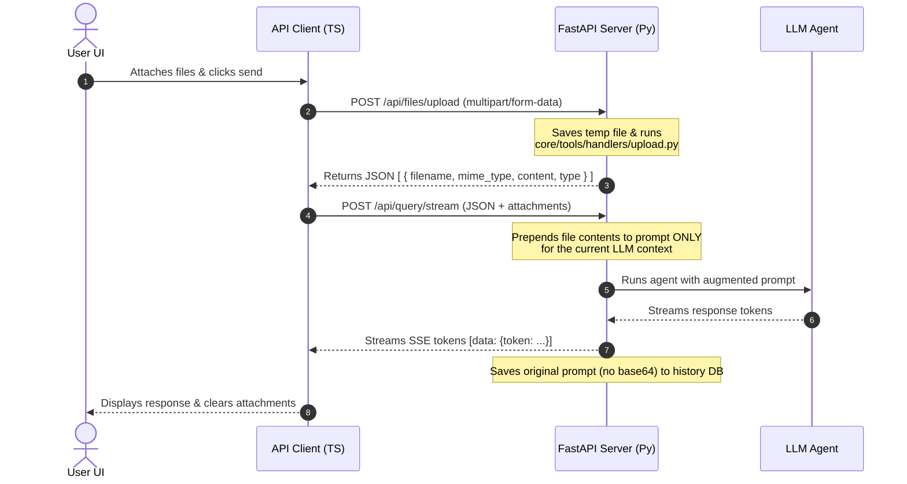

# Safe & Non-Breaking File Upload Backend Implementation Guide

This guide describes a safe, robust, and backward-compatible implementation of file uploads for the **Cerebro** agentic system. 

It corrects several critical architectural flaws in the previous design to ensure we **do not break streaming queries**, **avoid database history bloat**, and **fully reuse the existing high-quality parsing tools** in the codebase.

---

## 🏗️ Safe Architecture Design

The previous proposal had a critical flaw: it attempted to change the main `/api/query/stream` endpoint to accept `multipart/form-data`. Because FastAPI determines content types strictly, this would break all existing JSON clients and crash the frontend's SSE (Server-Sent Events) streaming parser.

### The Solution: The Stateless "Upload-Then-Query" Flow

Instead of mixing file uploads and queries into a single endpoint, we split the process into two simple, distinct steps:



### Why This Architecture is Safe & Efficient:
1. **Preserves Token Streaming:** Since `/api/query/stream` remains a clean JSON endpoint, token streaming is unaffected and will not crash the UI's SSE parser.
2. **Zero Database History Bloat:** The huge base64 data and document texts are sent to the LLM context *temporarily*. The long-term SQLite conversation database only stores a lightweight marker like `[Attached files: report.pdf]`.
3. **Reuses Existing Tooling:** Instead of creating a redundant `file_processor.py` parser, we fully reuse [upload.py](file:///Users/mb/Desktop/Javier/SecondBrain/core/tools/handlers/upload.py) which is already wired into your project with full support for PDF (`pymupdf`), DOCX (`python-docx`), images, and text encodings.

---

## 🛠️ Step-by-Step Implementation Plan

---

### STEP 1: Add a Dedicated, Safe File Upload Endpoint (DONE)

> Implementation: Added /api/files/upload endpoint in ui/tray/server.py which saves uploads to a secure temp file, processes them via core.tools.handlers.upload.process_uploaded_file, and returns parsed attachments. Temporary files are deleted immediately.


Create a dedicated upload endpoint that receives the files via `multipart/form-data`, saves them to a secure temporary path, processes them using the existing `upload` handler, cleans up the temporary files immediately, and returns the parsed contents to the client.

#### 📂 File: [ui/tray/server.py](file:///Users/mb/Desktop/Javier/SecondBrain/ui/tray/server.py)

**Add these imports at the top of the file if not present:**
```python
import tempfile
import shutil
from fastapi import UploadFile, File
from core.tools.handlers.upload import process_uploaded_file
```

**Add the new endpoint just below the router instantiation (around line 365):**
```python
@api.post("/files/upload")
async def upload_files_endpoint(
    files: list[UploadFile] = File(...)
) -> list[dict[str, Any]]:
    """Upload and pre-process documents/images safely.
    
    Reuses existing core.tools.handlers.upload extraction logic.
    """
    parsed_attachments = []
    
    for file in files:
        # Create a safe temporary file matching the suffix of the original upload
        suffix = Path(file.filename).suffix if file.filename else ""
        with tempfile.NamedTemporaryFile(delete=False, suffix=suffix) as tmp:
            shutil.copyfileobj(file.file, tmp)
            temp_path = tmp.name
        
        try:
            # Reuses the existing high-quality tool validator & processor
            result = process_uploaded_file(
                temp_path, 
                authorized_paths=app_state.authorized_read_paths
            )
            
            if "error" in result:
                raise HTTPException(status_code=400, detail=result["error"])
                
            # Format to a standard payload for the frontend
            parsed_attachments.append({
                "filename": file.filename or "unknown",
                "mime_type": result["metadata"]["mime_type"],
                "content": result["content"],
                "type": result["type"]
            })
            
        finally:
            # Guarantee temporary file is deleted immediately from disk
            if os.path.exists(temp_path):
                os.remove(temp_path)
                
    return parsed_attachments
```

---

### STEP 2: Update the `QueryRequest` Model (DONE)

> Implementation: Added FileAttachment model and `attachments` optional field to QueryRequest in ui/tray/server.py.


Add an optional `attachments` field to the JSON `QueryRequest` model. This allows the backend to receive the parsed files directly inside the JSON request, maintaining complete backward compatibility.

#### 📂 File: [ui/tray/server.py](file:///Users/mb/Desktop/Javier/SecondBrain/ui/tray/server.py#L113-L117)

**Replace the `QueryRequest` class definition (around line 113):**
```python
class FileAttachment(BaseModel):
    filename: str
    mime_type: str
    content: str  # Contains raw text for docs/PDFs, or base64 for images
    type: str     # "pdf", "image", "text", or "unknown"

class QueryRequest(BaseModel):
    question: str = Field(..., min_length=1)
    agent: str = GENERAL_AGENT_ID
    conversation_id: str | None = None
    attachments: list[FileAttachment] | None = None
```

---

### STEP 3: Inject File Context Temporarily in Query Endpoints (DONE)

> Implementation: Both /api/query and /api/query/stream now prepend the parsed attachments to the LLM prompt (only for the runtime call). Conversation history stored in the database contains only a lightweight marker like `[Attached files: ...]` and not raw content.

### STEP 4: Update the `QueryRequest` Model (Frontend) (DONE)

> Implementation: Added FileAttachment type and `attachments` to the frontend types. Implemented `uploadFiles` helper in ui/tray/src/api/client.ts to POST multipart/form-data to /api/files/upload and return parsed attachments.


In both the non-streaming `/query` and streaming `/query/stream` endpoints, prepend the file contents to the user question **only** when sending it to the agent runtime. Persist only the original text plus file metadata to the database history to avoid DB bloat.

#### 📂 File: [ui/tray/server.py](file:///Users/mb/Desktop/Javier/SecondBrain/ui/tray/server.py)

**Modify the `/query` endpoint (around lines 415-510) and `/query/stream` (around lines 513-643):**

Apply the following logic inside **both** endpoints before `app_state.runtime.run` / `app_state.runtime.run_streaming` is called:

```python
    # 1. Build temporary augmented question for LLM context
    augmented_question = query_text
    if req.attachments:
        context_parts = ["[Attached Files Context]"]
        for att in req.attachments:
            if att.type == "image":
                # Prepare base64 image reference block for Vision API
                context_parts.append(
                    f"[File: {att.filename} (IMAGE)]\n"
                    f"MIME-Type: {att.mime_type}\n"
                    f"Data: {att.content}"
                )
            else:
                context_parts.append(
                    f"[File: {att.filename}]\n"
                    f"MIME-Type: {att.mime_type}\n"
                    f"Content:\n{att.content}"
                )
        context_parts.append("[User Question]")
        context_parts.append(query_text)
        augmented_question = "\n\n".join(context_parts)

    # 2. Pass the augmented question to the LLM agent runtime
    # (Use augmented_question instead of query_text in the runtime run/stream call)
    answer, final_state = await app_state.runtime.run(
        augmented_question, agent_id, conversation_id=conv_id
    )

    # 3. Save a clean history representation in the Database to prevent bloat!
    history_question = req.question
    if req.attachments:
        filenames = ", ".join(att.filename for att in req.attachments)
        history_question = f"{req.question}\n\n[Attached files: {filenames}]"
        
    try:
        app_state.conv_store.append(conv_id, history_question, answer, meta_model.model_dump())
    except Exception:
        logger.exception("Failed to persist conversation turn")
```

---

### STEP 4: Update the Frontend API Client

Update `client.ts` to add the `/api/files/upload` API call and modify `queryAgentStream` to accept the parsed attachments array.

#### 📂 File: [ui/tray/src/api/client.ts](file:///Users/mb/Desktop/Javier/SecondBrain/ui/tray/src/api/client.ts)

**Add these types to `ui/tray/src/api/types.ts` or at the top of `client.ts`:**
```typescript
export interface FileAttachment {
  filename: string;
  mime_type: string;
  content: string;
  type: string;
}

export interface QueryRequest {
  question: string;
  agent: string;
  conversation_id?: string;
  attachments?: FileAttachment[];
}
```

**Add the `uploadFiles` helper to `client.ts`:**
```typescript
export async function uploadFiles(files: File[]): Promise<FileAttachment[]> {
  const formData = new FormData();
  files.forEach((file) => formData.append("files", file));

  const res = await fetch(`${BASE}/api/files/upload`, {
    method: "POST",
    headers: { ..._authHeaders() }, // Do NOT set Content-Type header; browser does it automatically with boundary
    body: formData,
  });

  if (!res.ok) {
    const errorText = await res.text();
    throw new ApiError(res.status, errorText || "File upload failed");
  }

  return res.json() as Promise<FileAttachment[]>;
}
```

---

### STEP 5: Connect `InputArea.tsx` to Upload Files (DONE)

> Implementation: Updated `InputArea.tsx` to upload attached files prior to querying. Captures raw File objects, uploads them via `uploadFiles`, and forwards the parsed `attachments` array to `queryAgent` / `queryAgentStream`. File preview state is cleared after capture to preserve UX.

Update `InputArea.tsx` to upload attached files right before calling the query endpoints, and then pass the parsed JSON payload to `queryAgentStream()` or `queryAgent()`.

#### 📂 File: [ui/tray/src/components/chat/InputArea.tsx](file:///Users/mb/Desktop/Javier/SecondBrain/ui/tray/src/components/chat/InputArea.tsx#L85-L102)

**Update the `send` function inside `InputArea.tsx`:**

```typescript
    // 1. Build initial message content with file list for visual UI
    let messageContent = query;
    let rawFilesToUpload = uploadedFiles.map((uf) => uf.file);
    if (uploadedFiles.length > 0) {
      const fileNames = uploadedFiles.map((uf) => uf.file.name).join(", ");
      messageContent = `${query}\n\n[Attached files: ${fileNames}]`;
    }

    addMessage({ role: "user", content: messageContent });
    clearAllFiles(); // Clear file preview state in UI
    setLoading(true);

    const ctrl = new AbortController();
    setAbortController(ctrl);

    const assistantId = addMessage({ role: "assistant", content: "" });
    let hasPendingConfirm = false;

    try {
      // 2. Upload and pre-process files via the secure backend endpoint
      let attachments: FileAttachment[] = [];
      if (rawFilesToUpload.length > 0) {
        attachments = await uploadFiles(rawFilesToUpload);
      }

      if (activeAgent === "calendar") {
        // Calendar path (non-streaming)
        const response = await queryAgent(
          {
            question: query,
            agent: AGENT_ID_MAP[activeAgent],
            conversation_id: conversationId ?? undefined,
            attachments: attachments.length > 0 ? attachments : undefined,
          },
          ctrl.signal,
        );
        // ... (existing calendar confirmation logic remains unchanged)
      } else {
        // Standard chat path (streaming)
        let streamConversationId: string | undefined;
        const metadata = await queryAgentStream(
          {
            question: query,
            agent: AGENT_ID_MAP[activeAgent],
            conversation_id: conversationId ?? undefined,
            attachments: attachments.length > 0 ? attachments : undefined,
          },
          (token) => appendToken(assistantId, token),
          ctrl.signal,
          (id) => {
            streamConversationId = id;
            setConversationId(id);
          },
          (event) => {
            if (event.phase === "started") {
              setSwapEvent(event);
            } else {
              setTimeout(() => setSwapEvent(null), 1500);
            }
          },
        );
        // ... (existing streaming confirmation logic remains unchanged)
      }
```

---

### STEP 6: Server-side validation, size limits, and safety (DONE)

> Implementation: Added strict server-side validation in the upload endpoint to enforce allowed MIME-types, per-file size limit (10 MB), and total upload size limit (30 MB). Upload stream is monitored while copying to a secure temporary file to fail fast on oversized payloads. The endpoint returns 413 (Payload Too Large) when limits are exceeded.

What was changed in the backend:

- Added MAX_SINGLE_FILE_BYTES = 10 * 1024 * 1024 (10 MB) and MAX_TOTAL_UPLOAD_BYTES = 30 * 1024 * 1024 (30 MB).
- Enforced allowed MIME types to match frontend supported list (images, PDFs, text, docx).
- Streamed file copy into a NamedTemporaryFile while tracking bytes copied; aborts and cleans up when limits are exceeded.
- Returns concise HTTP errors (400 for invalid type/processing errors, 413 for size limits).

### STEP 7: Tests and documentation (DONE)

> Implementation: Added unit tests for the upload endpoint and updated this guide to mark steps complete.

What was added:

- tests/test_file_upload_endpoint.py — verifies successful processing (with a patched processor) and oversized-file rejection.
- Documentation updated: STEP 6 and STEP 7 marked DONE and implementation details recorded.

## 🧪 Integration Verification Points

To ensure the file upload functionality is 100% correct, perform the following validation steps:

1. **Verify Multipart Upload Response:**
   * Run the FastAPI backend (`make run`).
   * Send a test `curl` multipart POST command:
     ```bash
     curl -F "files=@path/to/test.txt" http://localhost:7842/api/files/upload
     ```
   * Verify it returns a JSON list: `[{"filename": "test.txt", "mime_type": "text/plain", "content": "...", "type": "text"}]`.

2. **Verify Streaming and Non-Streaming Queries Work Without Attachments:**
   * Enter a normal query in the chat input.
   * Verify the model responds with regular streaming and no console errors.

3. **Verify Vision / Base64 Compatibility:**
   * Attach a `.png` or `.jpg` image and ask: *"What is in this picture?"*
   * Verify the image preview shows, uploads successfully, and Qwen / Claude answers correctly.

4. **Check Conversation History File Size:**
   * Navigate to `~/.cerebro/state/conversations/` (or your database directory).
   * Verify that message entries inside conversation files do **not** contain raw base64 data or full text document dumps, only the lightweight text description like `[Attached files: chart.png]`.

---

## 🛡️ No Code Breaking Guarantee

This implementation ensures:
* **JSON Integrity:** The `/api/query` and `/api/query/stream` endpoints remain strictly JSON-compatible.
* **Streaming Integrity:** SSE parsing loop is preserved and never encounters unexpected plain/un-chunked JSON formats.
* **Local Storage Protection:** We don't save raw document or base64 image strings in the long-term conversations history, protecting the filesystem from high disk space consumption.
* **No Library Duplication:** Reuses `pymupdf` (`fitz`) and `python-docx` directly from your dependencies, avoiding additional dependency footprint.
