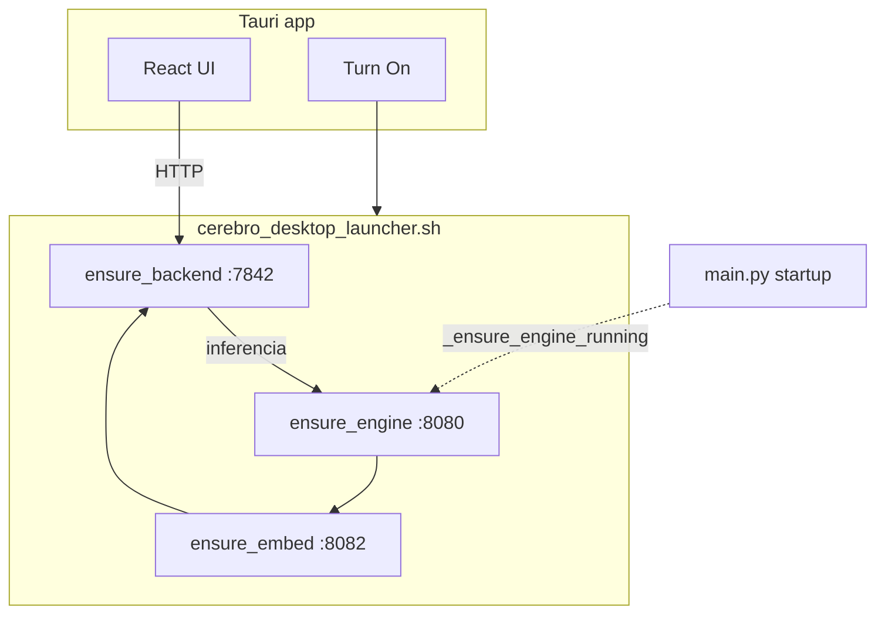
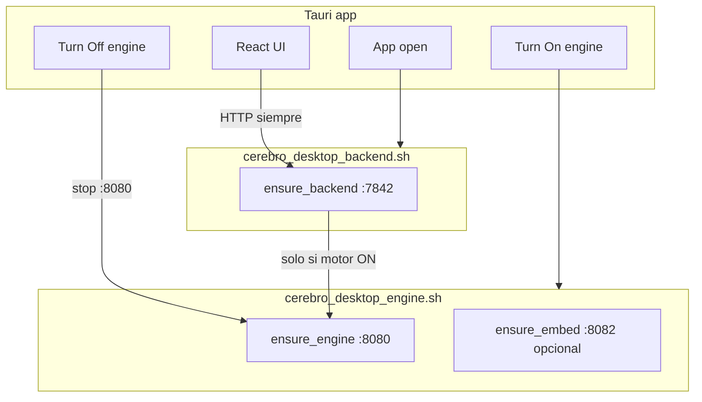

# Plan: separar backend Cerebro y motor LLM

> **Estado:** ✅ Fases 0–5 completadas — ver [`docs/implementation/engine-backend-split-phase4-5.md`](../implementation/engine-backend-split-phase4-5.md)  
> **Fecha:** 2026-06-25  
> **Objetivo:** el backend (`:7842`) arranca con la app; el botón Turn On/Off controla **solo** el motor LLM (`:8080`). El resto de Cerebro funciona sin cargar el GGUF.

---

## 1. Resumen ejecutivo

### Problema hoy

| Acción | Qué arranca / apaga |
|--------|---------------------|
| Abrir Cerebro.app | Solo UI (backend apagado por defecto) |
| **Turn On** | llama-server `:8080` → embed `:8082` (opcional) → backend `:7842` |
| **Turn Off** | Mata backend **y** motor |
| `make run` / `main.py` | Backend **y** intenta levantar el motor (`_ensure_engine_running`) |

En un Mac de 8 GB esto significa que o todo está apagado (sin settings, historial, documentos) o todo consume ~2.5 GB de RAM aunque solo quieras revisar configuración.

### Comportamiento objetivo

| Acción | Qué arranca / apaga |
|--------|---------------------|
| Abrir Cerebro.app | UI + **backend** (`:7842`) en background |
| **Turn On** | Solo **motor LLM** (`:8080`; embed `:8082` si aplica) |
| **Turn Off** | Solo **motor LLM**; backend sigue vivo |
| Cerrar la app | Backend puede seguir corriendo (recomendado) o apagarse (configurable) |

### Principio de no regresión

> **Paridad funcional:** después de *Abrir app → Turn On → chatear*, el usuario debe obtener **exactamente** el mismo resultado que hoy con *Abrir app → Turn On → chatear*. Lo que cambia es el estado intermedio (app abierta sin motor) y el ahorro de RAM.

---

## 2. Arquitectura

### Hoy



### Objetivo



### Puertos y responsabilidades

| Puerto | Proceso | Ciclo de vida nuevo | RAM ~8GB |
|--------|---------|---------------------|----------|
| — | Tauri + React | Con la app | ~150 MB |
| **7842** | `main.py` / FastAPI | Auto al abrir app | ~400 MB |
| **8080** | `llama-server` | Turn On / Turn Off | ~2–2.5 GB |
| **8082** | embed server | Con Turn On, si `start_embed_server=true` | ~500 MB–1 GB |

En perfil **lite-8gb** (`start_embed_server: false`) los embeddings son locales; Turn On solo levanta `:8080`.

---

## 3. Máquina de estados

### Backend

```
[down] --app open / desktop-backend--> [starting] --health OK--> [up]
[up]   --desktop-stop-backend / quit con stop_on_quit--> [down]
```

### Motor LLM (backend `llamacpp`)

```
[off]  --Turn On / POST /api/engine/start--> [starting] --health OK--> [on]
[on]   --Turn Off / POST /api/engine/stop--> [off]
[on]   --idle 180s--> [suspended]  (EngineSuspender SIGSTOP — sin cambio)
[suspended] --query LLM--> [on]    (SIGCONT automático — sin cambio)
[on]   --crash--> [recovering]     (solo si `engine_desired=on`)
```

### Flag crítico: `engine_desired`

El `LlamaServerHealthMonitor` **reinicia automáticamente** el motor tras 2 pings fallidos. Si el usuario apaga el motor a propósito, hay que marcar `engine_desired=off` para que el monitor **no** lo vuelva a levantar.

| `engine_desired` | Motor caído | Comportamiento del health monitor |
|------------------|-------------|-----------------------------------|
| `on` | Sí (crash) | Auto-restart (como hoy) |
| `off` | Sí (usuario apagó) | Solo reportar `down`, **sin** restart |

Persistencia recomendada: `~/.cerebro/state/engine.json` (`{"desired": "on"|"off"}`).

---

## 4. Qué funciona en cada estado

| Función | Backend up, motor off | Backend up, motor on |
|---------|----------------------|----------------------|
| Settings, config, wizard | ✅ | ✅ |
| Historial / conversaciones | ✅ | ✅ |
| Documentos (listar/borrar) | ✅ | ✅ |
| Indexación (lite-8gb, embed local) | ✅ | ✅ |
| Indexación (embed vía `:8082`) | ❌ hasta Turn On | ✅ |
| Fast paths (math, calendario lectura, archivos literales) | ✅ | ✅ |
| Fast paths que generan contenido vía LLM | ❌ → mensaje claro | ✅ |
| Chat / RAG / planificación | ❌ → mensaje claro | ✅ |
| Claude API (`inference_backend=claude`) | ✅ (sin motor local) | ✅ |
| MLX (`inference_backend=mlx`) | ⚠️ ver §8 | ⚠️ |

**Mejora respecto a hoy:** con la app abierta y motor apagado, settings/documentos/memoria **sí** funcionan (hoy `servicesOff` bloquea casi todo).

---

## 5. Fases de implementación

Cada fase termina con tests verdes. **No saltar fases.**

### Fase 0 — Preparación (sin cambio de comportamiento)

- [x] Añadir variable `CEREBRO_AUTO_START_ENGINE` (default `true` temporalmente → no rompe nada).
- [x] Añadir tests unitarios para `engine_desired` en health monitor (mock, sin llama.cpp).
- [x] Documentar en `AGENTS.md` y `docs/reference/changes.md`.

**Criterio de salida:** `make test` y `make test-stable` verdes; comportamiento idéntico al actual.

### Fase 1 — Scripts y Makefile (infraestructura)

Crear scripts idempotentes (misma filosofía que el launcher actual):

| Script nuevo | Rol |
|--------------|-----|
| `scripts/cerebro_desktop_backend.sh` | Solo `ensure_backend` |
| `scripts/cerebro_desktop_engine.sh` | Solo `ensure_engine` + `ensure_embed_server` |
| `scripts/cerebro_desktop_stop_backend.sh` | Mata `:7842` |
| `scripts/cerebro_desktop_stop_engine.sh` | Mata `:8080` y `:8082` |

Refactor:

- [x] `cerebro_desktop_launcher.sh` → llama a `backend.sh` + `engine.sh` (comportamiento **legacy / full**).
- [x] `cerebro_desktop_stop.sh` → llama a `stop_engine.sh` + `stop_backend.sh`.
- [x] Copias en `ui/tray/src-tauri/resources/` (build empaquetado).
- [x] Makefile targets (§10).

Makefile (ver §10 comandos).

**Criterio de salida:** `make desktop-launch-full` = comportamiento actual; `make desktop-backend` + `make desktop-engine` = equivalente funcional.

**Hecho (2026-06-25):** scripts en `scripts/cerebro_desktop_*.sh`, targets Makefile, sync Tauri `build.rs`.

### Fase 2 — Backend sin auto-arranque de motor

En `main.py`:

- [x] `_ensure_chat_args()` sigue reescribiendo `config/chat.args` (necesario para modelo correcto).
- [x] `_ensure_engine_running()` solo se ejecuta si `CEREBRO_AUTO_START_ENGINE=true`.
- [x] `EngineSuspender.bind_pid()` solo si hay PID en `:8080`.
- [x] Cambiar default de `CEREBRO_AUTO_START_ENGINE` a `false`.

En `config/profiles/lite-8gb.env`:

```bash
CEREBRO_AUTO_START_ENGINE=false
```

**Criterio de salida:**

```bash
make run          # :7842 up, :8080 down
make engine       # :8080 up
curl localhost:7842/api/status  # engine_ok: false luego true
make test && make test-stable
```

**Hecho (2026-06-25):** ver [`docs/implementation/engine-backend-split-phase2-3.md`](../implementation/engine-backend-split-phase2-3.md).

### Fase 3 — API de motor + health monitor

Nuevos endpoints en `ui/tray/server.py`:

| Método | Ruta | Descripción |
|--------|------|-------------|
| `GET` | `/api/engine/status` | `{ desired, running, model, llama_server, embed_running }` |
| `POST` | `/api/engine/start` | `engine_desired=on`, ejecuta `start_engine.sh`, espera health (timeout 180s) |
| `POST` | `/api/engine/stop` | `engine_desired=off`, mata `:8080`/`:8082`, para suspender health auto-restart |

Implementación sugerida: módulo `core/inference/engine_manager.py` (spawn/stop/wait, reutiliza lógica de `health_monitor._default_spawn_engine`).

Cambios en `LlamaServerHealthMonitor`:

- [x] Consultar `engine_desired` antes de `_attempt_restart()`.
- [x] Si `desired=off`, estado `down` sin spawn.

**Criterio de salida:** tests en `tests/test_engine_api.py`; health monitor no reinicia tras `POST /api/engine/stop`.

**Hecho (2026-06-25):** `engine_manager.py`, endpoints `/api/engine/*`, `tests/test_engine_api.py`.

### Fase 4 — Frontend + Tauri

#### Tauri (`lib.rs`)

- [x] En `setup`: invocar `ensure_backend` en background (no bloquear UI).
- [x] Nuevos commands:
  - `start_cerebro_backend` → `cerebro_desktop_backend.sh`
  - `start_cerebro_engine` → `cerebro_desktop_engine.sh` (fallback si API falla)

#### Store `services.ts` → refactor semántico

- [x] `backendReady` / `engineDesired` (reemplaza `servicesOff`)
- [x] Turn On → `POST /api/engine/start`
- [x] Turn Off → `POST /api/engine/stop`
- [x] `probeBackend()` → `start_cerebro_backend` si health falla

#### UI / i18n

- [x] ServiceControls, EngineIndicator, InputArea actualizados
- [x] i18n: Start/Stop engine, backend offline, placeholders

**Hecho (2026-06-25):** ver [`docs/implementation/engine-backend-split-phase4-5.md`](../implementation/engine-backend-split-phase4-5.md).

**Criterio de salida:** flujo manual E2E (§9) + tests frontend (`StatusBar.test.tsx`, `EngineIndicator.test.tsx`).

### Fase 5 — Consolidación y docs

- [x] Actualizar `docs/guides/DESKTOP_ONE_CLICK_LAUNCH.md`.
- [x] Actualizar `AGENTS.md`, `README.md`, `docs/reference/changes.md`.
- [x] `CEREBRO_AUTO_START_ENGINE=true` como opt-in legacy (`make dev-full`).
- [x] Entrada en `docs/plans/CURRENT_FOCUS.md` (tarea completada).

---

## 6. Archivos a tocar (checklist)

| Área | Archivos |
|------|----------|
| Scripts | `scripts/cerebro_desktop_*.sh`, `ui/tray/src-tauri/resources/*.sh` |
| Makefile | `Makefile` |
| Backend entry | `main.py` |
| Engine control | `core/inference/engine_manager.py` (nuevo), `core/inference/health_monitor.py` |
| API | `ui/tray/server.py` |
| Tauri | `ui/tray/src-tauri/src/lib.rs`, `launcher.rs` |
| Frontend | `stores/services.ts`, `stores/system.ts`, `ServiceControls.tsx`, `EngineIndicator.tsx`, `InputArea.tsx`, `App.tsx` |
| i18n | `locales/en.json`, `locales/es.json` |
| Tests | `tests/test_engine_api.py` (nuevo), `tests/test_health_monitor.py`, `tests/test_api.py` |
| Config | `config/profiles/lite-8gb.env`, `scripts/write_desktop_config.sh` (campo opcional `auto_start_engine`) |
| Docs | este archivo, `DESKTOP_ONE_CLICK_LAUNCH.md`, `AGENTS.md` |

**No tocar en esta feature:** orden de fast paths en `runtime.py`, handlers de calendario/archivos, `specialized.py`.

---

## 7. Riesgos y mitigaciones

| Riesgo | Impacto | Mitigación |
|--------|---------|------------|
| Health monitor re-levanta motor apagado | Alto | `engine_desired=off` (Fase 3) |
| Usuario manda chat sin motor | Medio | Mensaje i18n + placeholder; fast paths siguen |
| `desktop.json` perfil desincronizado con UI | Medio | `POST /api/engine/start` lee modelo de `runtime config`, no solo `desktop.json` (bug conocido en changes.md) |
| MLX in-process | Medio | Turn On/Off oculto o noop; documentar que MLX ≠ separable |
| Primera vez sin `desktop.json` | Alto | Wizard / `make desktop-config` antes de empaquetar |
| Turn On tarda 15–180 s | Bajo | UI ya tiene `service.starting`; mostrar progreso con `engine/status` polling |
| Tests que asumen motor al importar | Medio | Mocks existentes en `conftest.py`; no cambiar fixtures de inferencia |
| Dos copias de scripts (repo + tauri resources) | Bajo | Script de sync en `make desktop-app` o symlink en dev |

---

## 8. Backends especiales (MLX / Claude)

| Backend | Turn On/Off en UI | Arranque al abrir app |
|---------|-------------------|------------------------|
| **llamacpp** (default) | Controla `:8080` | Backend solo |
| **claude** | Ocultar botones; indicador "Claude API" | Backend solo |
| **mlx** | Ocultar o etiqueta "MLX in-process" | Backend (carga MLX al arrancar — **sin cambio** en v1) |

MLX no se separa en v1 sin refactor grande (modelo en el proceso Python). Documentar como limitación conocida.

---

## 9. Plan de regresión (manual + CI)

Ejecutar **antes y después** de cada fase:

```bash
make test
make test-stable
make lint
```

### E2E desktop (llamacpp, lite-8gb)

1. `make desktop-stop && make desktop-config`
2. Abrir Cerebro.app → UI visible, backend responde en &lt;30 s, `engine_ok: false`
3. Abrir Settings → cambiar carpeta vigilada → guardar OK
4. **Turn On** → esperar `engine_ok: true` → enviar "2+2" → respuesta fast path
5. Enviar pregunta que requiera LLM → streaming OK
6. **Turn Off** → `engine_ok: false`; Settings siguen accesibles
7. Enviar "eventos de hoy" (calendario fast path) → debe funcionar **sin** motor
8. **Turn On** de nuevo → chat LLM OK
9. Cerrar app → reabrir → backend sigue o reinicia según config; motor off hasta Turn On

### E2E desarrollo (terminal)

```bash
make desktop-stop
make run          # terminal 1 — solo backend
make engine       # terminal 2 — solo motor
# chat en http://127.0.0.1:7842 o ui/tray npm run dev
```

### Paridad legacy (un solo comando)

```bash
make desktop-launch-full   # = comportamiento pre-cambio
```

---

## 10. Comandos nuevos (post-implementación)

### Desarrollo diario (recomendado)

```bash
# Terminal 1 — backend ligero (~400 MB)
make run

# Terminal 2 — motor LLM cuando quieras chatear (~2.5 GB)
make engine

# Frontend dev (tercera terminal)
cd ui/tray && npm run dev
```

### Desarrollo “todo junto” (paridad con el flujo antiguo de `make run`)

```bash
# Un solo comando: backend + motor + embed si aplica
make dev-full
# implementación: CEREBRO_AUTO_START_ENGINE=true + launcher engine
```

### Desktop / scripts

```bash
make desktop-config          # ~/.cerebro/desktop.json (sin cambio)

# Nuevo — componentes separados
make desktop-backend         # Solo API :7842
make desktop-engine          # Solo llama-server :8080 (+ embed si config)
make desktop-stop-engine     # Solo apaga motor
make desktop-stop-backend    # Solo apaga backend

# Paridad con hoy
make desktop-launch-full     # backend + motor (alias del launcher actual)
make desktop-launch          # → redirige a desktop-backend (solo backend)

make desktop-stop            # Apaga todo (:7842 + :8080 + :8082)
```

### App empaquetada

```bash
make desktop-app
make desktop-install
open /Applications/Cerebro.app
# → UI + backend automático; motor apagado
# → Turn On en la barra = solo motor
# → Turn Off = solo motor
```

### API (control programático)

```bash
# Estado
curl -s http://127.0.0.1:7842/api/engine/status | jq

# Encender motor (modelo de config.json / env)
curl -X POST http://127.0.0.1:7842/api/engine/start

# Apagar motor (backend sigue)
curl -X POST http://127.0.0.1:7842/api/engine/stop
```

### Variables de entorno nuevas

| Variable | Default (nuevo) | Efecto |
|----------|-----------------|--------|
| `CEREBRO_AUTO_START_ENGINE` | `false` | Si `true`, `main.py` mantiene comportamiento legacy (arranca `:8080` al boot) |
| `CEREBRO_STOP_BACKEND_ON_QUIT` | `false` | Si `true`, Tauri mata `:7842` al cerrar la app |

---

## 11. Rollback

Si algo falla en producción:

1. `export CEREBRO_AUTO_START_ENGINE=true` en `lite-8gb.env` → `main.py` vuelve a levantar motor solo.
2. Frontend: revertir `services.ts` para que Turn On llame `restart_cerebro_services` (launcher full).
3. `make desktop-launch-full` sigue disponible como escape hatch.

No requiere migración de datos; solo procesos y flags.

---

## 12. Orden de trabajo recomendado

```
Fase 0 (flag + tests)
  → Fase 1 (scripts)
  → Fase 2 (main.py)
  → Fase 3 (API + health monitor)
  → Fase 4 (Tauri + UI)
  → Fase 5 (docs + default legacy off)
```

**Estimación:** 2–4 días de desarrollo + 0.5 día QA manual en M1 8 GB.

---

## 13. Referencias

- Launcher actual: `scripts/cerebro_desktop_launcher.sh`
- Auto-start motor en boot: `main.py` → `_ensure_engine_running()`
- Health monitor auto-restart: `core/inference/health_monitor.py`
- UI Turn On/Off: `ui/tray/src/stores/services.ts`
- EngineSuspender: `core/inference/engine_suspender.py`
- Guía desktop: `docs/guides/DESKTOP_ONE_CLICK_LAUNCH.md`
- Bug perfil desktop.json vs UI: `docs/reference/changes.md`
