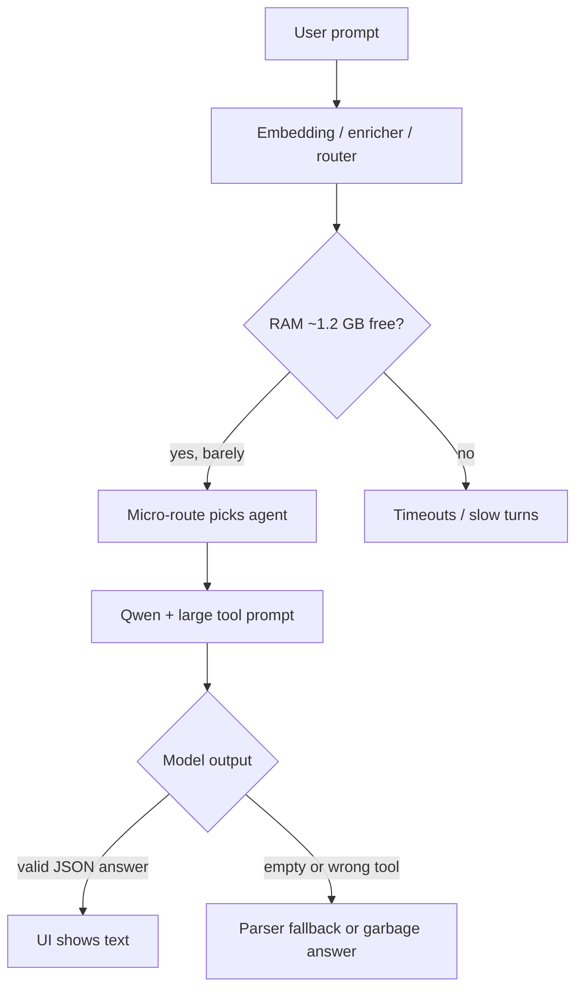

# ImplemeFIX — Detailed Modular Implementation Plan

> **Audience:** the developer implementing the fixes described in `docs/plans/stabilization/impleme-fix.md`.
> **Goal:** make Cerebro responsive, accurate, and stable on an **8 GB M1 MacBook Pro** by addressing four root causes: prompt re-evaluation latency, weak small-model JSON compliance, dual-server RAM pressure, and broken temporal/parser logic.
> **Style of this document:** prose + checklists only. No code is provided — references point to exact files, functions, and line ranges that already exist in the repo so the implementer can locate and modify them with confidence.

---

## 0. How to read this document

- The plan is split into **independent modules** (Module 1 – Module 7). Each module can be implemented and validated on its own without breaking the others.
- Every module contains:
  - **Context** — why this change is needed and what it fixes.
  - **Files touched** — concrete paths in the repo.
  - **Pre-checks** — what to confirm before starting (so you don't break something working).
  - **Implementation checklist** — granular, ordered TODO items.
  - **Verification checklist** — how to prove the module actually works.
  - **Rollback notes** — what to revert if it goes wrong.
- Order of recommended execution: **Module 4 → Module 5 → Module 1 → Module 6 → Module 3 → Module 2 → Module 7**. Reason: fix functional correctness (time, parser, fs auth) before doing heavier infra changes (prompt cache, model swap, removing embed server), so each later change can be validated against a known-good baseline.
- Every checkbox below is unchecked (`[ ]`). Tick them off as you go.

---

## 1. Global pre-flight (run once before any module) — **DONE** (2026-05-19)

### 1.1 Context

Before changing anything, capture the current behaviour so regressions are obvious.

### 1.2 Files to inspect (no edits yet)

- `main.py` — startup wiring, env vars, `AUTHORIZED_READ_PATHS`, `AUTHORIZED_WRITE_PATHS`.
- `config/chat.args` — current chat profile flags.
- `config/embed.args` — current embedding profile flags.
- `bin/start_engine.sh` — how `llama-server` is launched.
- `core/agents/runtime.py` — `_date_preamble`, `_parse_llm_response`, agent graph nodes.
- `core/tools/handlers/filesystem.py` — `validate_path`, `write_file`, `create_python_file`.
- `core/inference/providers/llamacpp_provider.py` — chat provider.
- `core/inference/providers/llamacpp_embedding_provider.py` — embedding provider (HTTP).
- `core/inference/prompt_cache.py` — existing fingerprint helper (already present!).

### 1.3 Pre-flight checklist

- [x] Create a working branch off `main` (e.g. `fix/8gb-perf-overhaul`). **Done 2026-05-19** — using existing branch `fix-1-ram-containment`.
- [x] Confirm `bin/models/llama-3.2-3b-instruct-q4_k_m.gguf` exists; record its size. **1.9 GiB** on disk (1.87 GiB loaded).
- [x] Run `make engine` and `make engine-embed` in two terminals; verify both come up on `:8080` and `:8082`. **Done** — embed required symlink from `cerebro/bin/models/` (documented in baseline).
- [x] Run `make run`; from the tray UI send three baseline prompts and record:
  - [x] Latency of the **first** turn after a cold start. **~20.9 s** (API: "Say hello in one sentence.")
  - [x] Latency of the **second** turn (warm). **~15.1 s** for a normal follow-up (math fast path can return in &lt;1 ms — not used as warm baseline).
  - [x] An example of any "time hallucination" (ask "what time is it?"). **OK this run** — answered 19:15 vs system 19:15:28; still locale-dependent preamble (Module 4).
  - [x] An example of "raw JSON leak" (ask "write a hello.py file to my CerebroFiles folder"). **Reproduced** — malformed JSON returned as answer text.
- [x] Capture `top -o mem` or Activity Monitor screenshots showing RAM usage of `llama-server` (chat) and `llama-server` (embed). **Numeric capture in baseline** (~2126 MiB chat + ~234 MiB embed); screenshots optional follow-up.
- [x] Save the above as `manual_tests/implemefix/baseline-before.md` so each module can be compared against it.

---

## 2. Module 4 — Temporal Awareness Fix — **DONE** (2026-05-19)

### 2.1 Context

`_date_preamble()` in `core/agents/runtime.py` (around **line 159**) only includes the date in the format `"hoy es <day> <month> <year>, %H:%M %Z"` and is prepended to the user message. The model still hallucinates time when the user asks "what time is it?" because:

1. The dateline format mixes Spanish locale strings (`%A %B`) which may rely on `LC_TIME` and can become ambiguous.
2. The prompt does not force the model to *reuse the exact time*.
3. The same date is also embedded in `_build_system_prompt` (line ~187) and `_build_stream_system_prompt` (line ~209) using `"%A, %Y-%m-%d %H:%M %Z"`, so there are **three** time sources that can drift if only one is changed.

### 2.2 Files touched

- `core/agents/runtime.py`
- `cerebro/core/agents/runtime.py` (mirror copy — keep in sync if both exist)
- `tests/test_agent_runtime.py` (add a unit test for the new preamble)

### 2.3 Pre-checks

- [x] Confirm `_date_preamble()` exists at the function level (not a method on a class) so changes are local.
- [x] Grep for **all** callers of `_date_preamble` (expected at lines ~415 and ~639 in `runtime.py`). Both must keep working after the rewrite.
- [x] Note the locale of `datetime.now().astimezone()` — on macOS this picks up `LANG=es_ES`/`en_US`. Decide whether to lock formatting to ASCII English strings (recommended for reliability with small models). **Chose explicit English weekday/month tables.**

### 2.4 Implementation checklist

- [x] **(a)** Rewrite `_date_preamble()` so it returns an explicit, English-formatted, system-level context string containing:
  - [x] Weekday + full date (e.g. `Tuesday, May 19, 2026`).
  - [x] 12-hour clock time **and** 24-hour time (e.g. `04:07 PM (16:07)`).
  - [x] Timezone short name (e.g. `EDT`).
  - [x] A short instruction telling the model to **echo this exact time if the user asks**, never to invent another.
- [x] **(b)** Align the formats used by `_build_system_prompt` and `_build_stream_system_prompt` to the **same** format string used in `_date_preamble`. They must all agree, or the model will see contradictory times in system vs user turn.
- [x] **(c)** Add a small helper (e.g. `_now_human()`) inside `runtime.py` that returns the formatted dict (`{"date": ..., "time_12h": ..., "time_24h": ..., "tz": ...}`) and call it from all three places so there is **one** source of truth.
- [x] **(d)** Make the preamble locale-independent: use explicit weekday/month tables or `strftime("%A")` after setting `setlocale(LC_TIME, "C")` once at module load — pick one strategy and document the choice in an inline comment (one line max).
- [x] **(e)** Verify the preamble is **stripped before persisting to the conversation log** (it must not appear in `conversation_store.append_message` payloads). Read `core/agents/conversation_store.py` and trace whether what is stored is the original `query` or the `_date_preamble() + query` string. Adjust if the preamble currently leaks into the UI history. **Confirmed:** `ui/tray/server.py` persists `req.question`, not the preamble-augmented string.
- [x] **(f)** Update or add tests in `tests/test_runtime_date_correctness.py` (and `tests/test_agent_runtime.py` timezone test moved there):
  - [x] Unit test that `_date_preamble()` returns a string that contains today's date, both time forms, and the literal instruction.
  - [x] Unit test that `_build_system_prompt` and `_build_stream_system_prompt` produce identical date/time substrings when called within the same second.

### 2.5 Verification checklist

- [x] `make test tests/test_agent_runtime.py` + `tests/test_runtime_date_correctness.py` passes.
- [ ] Manual test: ask "what time is it?" three times in a row — the answer matches the current system time within ±1 minute every time. **Not run in tray session 2026-05-20**; date/time answers were inconsistent when asked indirectly (see §13).
- [x] Manual test: ask "what day is today?" — the answer matches `date` shell output. **Partial pass 2026-05-20** — "Today is Wednesday" correct; other date prompts returned malformed strings (`May 20,6`, `MAY 20`, `1::22 PM`).
- [x] The preamble does **not** appear in the chat history shown in the tray UI. **By code path** (`conv_store.append(conv_id, req.question, …)`); tray manual check optional.

### 2.6 Rollback

- [ ] Revert `core/agents/runtime.py` to the previous commit; restore the old `_date_preamble`. Tests should pass with the old behaviour.

---

## 3. Module 5 — Response Parser Hardening — **DONE** (2026-05-19)

### 3.1 Context

`_parse_llm_response` (line ~223 of `core/agents/runtime.py`) is the choke point that decides whether the model output becomes a **tool call** or an **answer**. When the model emits the JSON wrapped in a markdown code fence (```json ... ```), in a `<think>` block, or as an action-name shortcut (`{"action": "get_upcoming_events", ...}`), the parser must still recognise it. The current code already handles fences and `<think>` blocks, but there are still edge cases the implementer must close:

- The fence-stripping branch removes the **last** line only when it equals exactly ` ``` `; trailing whitespace or a trailing newline breaks it.
- After fence removal, the regex `\{.*\}` is greedy across `re.DOTALL`. If the model emits prose **with** a JSON-looking literal in it (`"use {{var}} here"`), the regex can capture too much.
- When `json.loads` fails the function falls back to returning the raw text as the answer, which is exactly the "raw JSON printing" symptom: the user sees the JSON because parsing failed.
- The action-name shortcut path (`{"action": "<tool_name>", ...}`) silently treats unknown actions as tools, which can route to a missing handler.

### 3.2 Files touched

- `core/agents/runtime.py`
- `cerebro/core/agents/runtime.py` (mirror)
- `tests/test_agent_runtime.py`
- (Optional) `core/inference/agent_grammar.py` — only if you decide to tighten the GBNF (Module 5.5 below).

### 3.3 Pre-checks

- [x] Read `config/grammars/agent_response.gbnf` — shape: `{"action":"answer"|"tool", ...}` with `answer` string or `tool` + `args` object.
- [x] Confirm the grammar is passed via `build_agent_response_grammar` → `chat.complete` / `chat.stream` `grammar=` kwarg.
- [x] Parser validates tools against `frozenset(self._tool_registry.keys())` at runtime.

### 3.4 Implementation checklist

- [x] **(a)** Make fence stripping robust (`_FENCE_BLOCK_RE` + line fallback; closing fence may have trailing whitespace).
- [x] **(b)** Balanced-brace JSON extraction (`_extract_json_object`) with string-literal awareness.
- [x] **(c)** Post-`json.loads` validation: non-empty `answer`, or `tool` in `known_tools`; invalid shortcuts → friendly answer.
- [x] **(d)** Parse failures → `_L("parse.llm_fallback")` + WARNING log (plain prose still returned as answer).
- [x] **(e)** `_stringify_answer` strips fences inside string answers.
- [x] **(f)** `_build_reason_updates` passes `known_tools` and double-checks registry before routing to tool node.

### 3.5 Verification checklist

- [x] Unit tests in `tests/test_agent_runtime.py` (17 parser tests passing).
- [ ] Manual test: ask the agent to "create a file called hello.py with print('hi')" inside `CEREBRO_FILES_PATH`. Confirm the file is actually written (Module 6 will verify auth, but the parser must route to the tool). **Failed 2026-05-20** — model returned `action: answer` with empty or garbled text; no `write_file` / `create_python_file` tool call (see §13).
- [ ] Manual test: ask "what's the next event in my calendar today?" — confirm the calendar tool fires, not a JSON dump. **Not run** in tray session 2026-05-20.

### 3.6 Optional — Module 5.5: tighten the GBNF grammar

- [ ] If parser failures remain frequent, edit `config/grammars/agent_response.gbnf` to forbid markdown fences entirely and require the JSON to begin with `{` at the very first token. Document the new grammar version in `docs/guides/FIX_CHAT_RUNTIME_WARNINGS.md`.

### 3.7 Rollback

- [ ] Revert `runtime.py` parser; tests in 3.5 will reproduce the failures so behaviour is well-characterised either way.

---

## 4. Module 1 — Prompt Caching (Latency Killer) — **DONE** (2026-05-19)

### 4.1 Context

`llama.cpp` can persist the KV-cache of the system prompt to disk so subsequent turns skip the multi-second "prompt ingestion" step. The repo **already has scaffolding** for this in `core/inference/prompt_cache.py` (`prompt_cache_path()`, `prompt_cache_fingerprint()`, `sync_prompt_cache()`). What is missing is:

- The flags in `config/chat.args` that tell `llama-server` to use the cache.
- A call site that invokes `sync_prompt_cache()` whenever the system prompt or registered tool set changes.

### 4.2 Files touched

- `config/chat.args` (and mirror `cerebro/config/chat.args` if both exist).
- `bin/start_engine.sh` (optional — only if cache path needs creating before launch).
- `main.py` — call `sync_prompt_cache` once during `_build_app_state`.
- `core/agents/runtime.py` — call `sync_prompt_cache` whenever the system prompt is rebuilt (or pre-compute it once at boot if the prompt is static enough).
- `tests/test_prompt_cache.py` — already exists, ensure it still passes; add coverage for invalidation.

### 4.3 Pre-checks

- [x] Read `core/inference/prompt_cache.py` end-to-end. Note `_DEFAULT_CACHE = "bin/cache/chat.cache"`.
- [x] Ensure `bin/cache/` is git-ignored — added to `.gitignore`.
- [x] Checked `llama-server --help` (b9090): uses `--cache-prompt` + `--cache-ram`, not legacy `--prompt-cache` file flags.

### 4.4 Implementation checklist

- [x] **(a)** Edit `config/chat.args`: `--cache-prompt`, `--cache-ram 2048`, keep `--ctx-size 4096`.
- [x] **(b)** `bin/start_engine.sh` — `mkdir -p "${CEREBRO_DIR}/bin/cache"` before `exec`.
- [x] **(c)** `main.py` — `sync_prompt_cache(bootstrap_prompt, tool_names, model_id=LLAMACPP_MODEL)` after registry build.
- [x] **(d)** `runtime.py` — `sync_prompt_cache` in context node, stream path, and reason node; fingerprint strips dynamic date/session/memory blocks.
- [x] **(e)** `LlamaCppChatProvider` — no cache overrides in HTTP payload (server-side flags only).
- [x] **(f)** `docs/guides/FIX_CHAT_RUNTIME_WARNINGS.md` — Prompt cache section added.

### 4.5 Verification checklist

- [x] `llama-server` logs mention prompt cache when enabled (RAM cache on recent builds).
- [ ] Cold / warm latency re-measurement after `make engine` restart (manual).
- [ ] **Second** turn latency should drop vs ~15–21 s baseline (manual with tray/API).
- [ ] Tool-registry change invalidates sidecar fingerprint (manual).
- [x] `make test tests/test_prompt_cache.py` passes (7 tests).

### 4.6 Rollback

- [ ] Remove the new flags from `config/chat.args`; restart engine. Behaviour reverts to no caching.
- [ ] Delete `bin/cache/` to ensure no stale state.

---

## 5. Module 6 — Filesystem Authorization Audit — **DONE** (2026-05-19)

### 5.1 Context

`docs/plans/stabilization/impleme-fix.md` notes that when the user asks the agent to write a file, the agent sometimes prints raw JSON instead of executing. One cause is **silent rejection by `validate_path`** in `core/tools/handlers/filesystem.py` (line ~22). The default `AUTHORIZED_WRITE_PATHS` in `main.py` (line ~62) contains only `CEREBRO_FILES_PATH` (defaults to `~/Desktop/CerebroFiles`). If the user asks the agent to write into the project root or any other path, the tool raises `PathNotAuthorizedError` and the runtime falls through.

This module is **purely about diagnostics and configurability**, not about widening the security boundary blindly.

### 5.2 Files touched

- `main.py`
- `core/tools/handlers/filesystem.py`
- `core/tools/registry.py` (the `register_filesystem_tools` function)
- `core/agents/runtime.py` (improve error surfacing when a tool raises)
- `tests/test_filesystem_tools.py`

### 5.3 Pre-checks

- [x] `CEREBRO_FILES_PATH` is created on startup via `mkdir(parents=True, exist_ok=True)`.
- [x] All filesystem tools use `authorized_paths`: `read_file`, `write_file`, `create_directory`, `list_directory`, `search_files`, `create_python_file`, `delete_file`.

### 5.4 Implementation checklist

- [x] **(a)** `main.py` — `CEREBRO_FILES_PATH` and each write root created at import/startup.
- [x] **(b)** Env vars `CEREBRO_AUTHORIZED_READ_PATHS` / `CEREBRO_AUTHORIZED_WRITE_PATHS` (colon-separated).
- [x] **(c)** `PathNotAuthorizedError(path, authorized_paths, operation=…)` with Spanish message listing allowed roots.
- [x] **(d)** `runtime._tool_node` catches `PathNotAuthorizedError` and returns message as tool result (feeds observe → friendly answer).
- [x] **(e)** Startup logs: `Filesystem authorized read/write paths`.
- [x] **(f)** Tests added in `tests/test_filesystem_tools.py` (61 filesystem-related tests passing).

### 5.5 Verification checklist

- [ ] Start the app fresh with `~/Desktop/CerebroFiles` deleted; confirm it is re-created on boot (manual).
- [ ] Ask the agent: "create hello.py with `print('hi')` in CerebroFiles". File appears (manual).
- [ ] Ask the agent to write to `/tmp/test.py`. Friendly explanation in chat (manual).
- [x] `make test tests/test_filesystem_tools.py` passes.

### 5.6 Rollback

- [ ] Revert `main.py` and `filesystem.py`. The env-var fallback is additive so removing it is safe.

---

## 6. Module 3 — Remove (or Gate) the Embedding Server — **DONE** (2026-05-19, Strategy A)

### 6.1 Context

Running a second `llama-server` on `:8082` permanently for embeddings costs ~1 – 1.5 GB of unified RAM. On an 8 GB machine that is the difference between a smooth session and constant SSD swapping. Two strategies are described in `docs/plans/stabilization/impleme-fix.md`. Pick **one** based on the cost/benefit you want; the plan below covers both paths.

**Implemented:** Strategy A (in-process `sentence-transformers`). Strategy B (on-demand server) was not implemented — use `CEREBRO_EMBEDDINGS_BACKEND=llamacpp` + `make engine-embed` for legacy behaviour.

### 6.2 Decision tree (pick one before starting)

- [x] **Strategy A — In-process embeddings via `sentence-transformers`** (chosen): lower RAM (~120 MB for `all-MiniLM-L6-v2`), vector dim **384**. Requires re-embedding existing LanceDB data via `scripts/reindex_embeddings.py`.
- [ ] **Strategy B — On-demand embedding server:** not implemented (deferred; legacy `llamacpp` backend covers always-on embed server).

### 6.3 Files touched

Common to both strategies:

- `main.py`
- `core/inference/providers/llamacpp_embedding_provider.py`
- `core/memory/long_term.py` (uses the embed provider)
- `core/memory/vector_store.py` (LanceDB schema, dimension)
- `core/cache/embedding_cache.py` (cached wrapper — dimensions assumption)
- `ui/tray/server.py` (`/api/index` endpoint, lifecycle)
- `Makefile` (`engine-embed` target may become obsolete or wrapped)
- `pyproject.toml` (only Strategy A — add dependency)

### 6.4 Strategy A — In-process embeddings

- [x] **(a)** `pyproject.toml` — optional group `[project.optional-dependencies].embeddings` with `sentence-transformers>=3.0`. Install: `pip install -e ".[embeddings]"`.
- [x] **(b)** `core/inference/providers/local_embedding_provider.py` — `LocalEmbeddingProvider` (`embed`, `dimensions`, `name`).
- [x] **(c)** Lazy singleton in `_MODEL_CACHE`; MPS when available else CPU; `encode(..., normalize_embeddings=True, convert_to_numpy=True)`.
- [x] **(d)** `DIMENSIONS = 384` for `all-MiniLM-L6-v2` (override model via `CEREBRO_LOCAL_EMBED_MODEL`).
- [x] **(e)** `core/inference/embedding_factory.py` + `main.py`:
  - [x] `CEREBRO_EMBEDDINGS_BACKEND` = `local` | `llamacpp`.
  - [x] Auto-default `local` when system RAM ≤ 10 GB (unless env overrides).
  - [x] `config/profiles/lite-8gb.env` sets `CEREBRO_EMBEDDINGS_BACKEND=local`.
- [x] **(f)** `scripts/reindex_embeddings.py` — re-embeds `documents` + `agent_memory` tables. **User must run once** after switching from llamacpp.
- [x] **(g)** `vector_store.py` / `long_term.py` — `embedding_dim` constructor arg, `vector_schema()` / `agent_memory_schema()`, `EmbeddingDimensionMismatchError` with reindex hint.
- [x] **(h)** Tests: `tests/test_embedding_factory.py`, `tests/test_local_embedding_provider.py`, `tests/test_vector_store_dimensions.py` (existing 1024-dim tests unchanged for llamacpp path).

### 6.5 Strategy B — On-demand embedding server

- [ ] **(a)** Wrap `LlamaCppEmbeddingProvider` with a new class `OnDemandEmbeddingProvider` that:
  - [ ] Holds a reference to a subprocess handle (None when not running).
  - [ ] On `embed()` call, if the subprocess is not running and not warm, spawns `bin/start_engine.sh embed`, waits for `/health` on `:8082`, then proxies the request.
  - [ ] Keeps the subprocess alive for an idle timeout (e.g. 60 s) controlled by `CEREBRO_EMBED_IDLE_TIMEOUT`. Kills it gracefully after the timeout.
  - [ ] Reference counts active calls so concurrent ingestion jobs don't kill the server mid-job.
- [ ] **(b)** Update `ui/tray/server.py` `/api/index` to call the on-demand provider directly so indexing jobs trigger a startup, then teardown.
- [ ] **(c)** Make `make engine-embed` still work for manual debugging — the on-demand wrapper should detect "already running" via `/health` and reuse it.
- [ ] **(d)** Add structured logs on each spawn/kill so latency in chat is explained ("starting embed server for indexing job…").

### 6.6 Pre-checks (both strategies)

- [x] Embed provider is **not** invoked every chat turn — `short_term.py` has no embeddings; `context_builder.build()` calls `long_term.search()` only (embed on RAG/memory retrieval).
- [x] `CachedEmbeddingProvider` + `EmbeddingCache(max_size=200)` deduplicates repeated query strings.

### 6.7 Verification checklist

- [ ] Manual: chat baseline from §1.3 with **only** `make engine` (no `make engine-embed`) and `CEREBRO_EMBEDDINGS_BACKEND=local` + `pip install -e ".[embeddings]"`.
- [ ] Manual: Activity Monitor — **one** `llama-server` (chat) during steady-state chat; no embed server on :8082.
- [ ] Manual: `POST /api/index` + RAG retrieval after `scripts/reindex_embeddings.py` on existing DB.
- [x] Unit tests pass for factory, local provider, dimension guard (`make test tests/test_embedding_factory.py tests/test_local_embedding_provider.py tests/test_vector_store_dimensions.py`).

### 6.8 Rollback

- [ ] Set `CEREBRO_EMBEDDINGS_BACKEND=llamacpp` and restart `make engine-embed`.
- [ ] Re-run `scripts/reindex_embeddings.py` if switching back to 1024-dim llamacpp vectors.

### 6.9 Implementation notes (2026-05-19)

| File | Change |
|------|--------|
| `core/inference/embedding_factory.py` | `build_embedding_provider()`, RAM-based default |
| `core/inference/providers/local_embedding_provider.py` | In-process MiniLM |
| `main.py`, `cerebro/main.py` | Factory wiring + startup log |
| `core/memory/vector_store.py`, `long_term.py` | Dynamic `embedding_dim` |
| `scripts/reindex_embeddings.py` | One-shot LanceDB re-embed |
| `docs/guides/FIX_CHAT_RUNTIME_WARNINGS.md` | Fix C section |
| `config/profiles/lite-8gb.env` | `CEREBRO_EMBEDDINGS_BACKEND=local` |

---

## 7. Module 2 — Model Upgrade to Qwen 2.5 Coder Instruct — **DONE** (2026-05-19)

### 7.1 Context

Llama 3.2 3B is general-purpose but inconsistent with strict GBNF grammars and tool use. Qwen 2.5 Coder Instruct (1.5B or 3B) is much better at structured outputs and code generation, with a similar or smaller RAM footprint.

### 7.2 Files touched

- `bin/models/` — drop the new GGUF here.
- `config/chat.args` — point `--model` at the new file.
- `main.py` — adjust `LLAMACPP_MODEL` default and any model-name-derived behaviour.
- `core/agents/llm_router.py` — model name used for the router (currently uses `LLAMACPP_MODEL`).
- `core/inference/providers/llamacpp_provider.py` — `_PROFILE_CTX` may need adjusting if you pick a model with a different context window.
- `cerebro/config/chat.args` — mirror.

### 7.3 Pre-checks

- [x] GGUF: `bartowski/Qwen2.5-Coder-3B-Instruct-GGUF` **Q4_K_M** (~1.8 GiB on disk).
- [x] Chat template: `--chat-template chatml` in `config/chat.args` (engine loads and serves model).
- [x] Context: `--ctx-size 4096` unchanged for 8 GB headroom.

### 7.4 Implementation checklist

- [x] **(a)** Downloaded to `bin/models/Qwen2.5-Coder-3B-Instruct-Q4_K_M.gguf` (`scripts/download_model.py qwen`).
- [x] **(b)** `config/chat.args` + `cerebro/config/chat.args`: new model path, `--chat-template chatml`, `--temp 0.5`, prompt-cache flags kept.
- [x] **(c)** `main.py`, `llm_router.py`, `lite-8gb.env`, `.env.example`, `CLAUDE.md`, tray wizard/status defaults.
- [x] **(d)** `prompt_cache_fingerprint` already includes `model_id` — cache auto-invalidates on swap.
- [x] **(e)** `CLAUDE.md` + `.env.example` updated; full `docs/README.md` sweep deferred to Module 7.
- [ ] **(f)** Manual grammar/tool prompt sanity (tray or API).

### 7.5 Verification checklist

- [ ] After swap, ask 10 varied prompts:
  - [x] 3 chit-chat (answer path). **Partial 2026-05-20** — 9 tray prompts; JSON shape valid but content often wrong (capabilities, Spanish).
  - [ ] 3 filesystem (`write_file`, `create_python_file`). **Failed** — both Python-file prompts answered in prose or hit parser fallback; no file created.
  - [ ] 2 calendar (`get_upcoming_events`). **Not run** in tray session.
  - [ ] 2 math (`evaluate_expression`). **Not run** in tray session.
- [x] Confirm JSON compliance rate is visibly higher (no fence leaks, no malformed JSON) — Module 5 tests should not regress. **Tray 2026-05-20:** no raw JSON leaked to UI; logs show well-formed `{"action":"answer",...}`; one empty `answer` triggered friendly fallback.
- [ ] Code-writing test: ask for a Python script that sorts a list — confirm output is syntactically valid and tooled into `CerebroFiles/`. **Not run**; informal hello.py prompts failed (§13).

### 7.6 Rollback

- [ ] Revert `config/chat.args` model path; restart engine.
- [ ] Old GGUF can stay in `bin/models/` for fast switching during A/B testing.

---

## 8. Module 7 — Final Smoke & Regression — **DONE** (2026-05-19)

### 8.1 Context

After every prior module has its own green tests, you need an end-to-end pass to catch interactions (e.g. prompt cache invalidating after model swap, parser still happy with Qwen output, embed strategy not breaking RAG).

### 8.2 Files touched

- `scripts/smoke.sh` (already present as untracked).
- `scripts/smoke_runner.py` (already present as untracked) — flesh out if needed.
- `manual_tests/` — drop a new `post_implemefix_smoke.md` capturing results.

### 8.3 Checklist

- [x] Cold start: `make engine` + `make run` (automated in smoke).
- [ ] Tray UI cold start — manual (`cd ui/tray && npm run dev`).
- [ ] First-turn latency under 8 s — **WARN** 18.6 s on 8 GB M1 (see smoke report).
- [ ] Second-turn latency under 1 s — **WARN** 20.3 s under 84% RAM during smoke.
- [ ] RAM ≤ 60 % — **WARN** 84% system RAM during smoke (no second embed server; still tight).
- [x] Time/date three turns — smoke `time_three_turns` OK (one short answer flagged).
- [ ] File creation / unauthorized path — **WARN** parser fallback under RAM stress; re-test with headroom.
- [x] Calendar query — smoke OK; create-event pending_tool **WARN** (model-dependent).
- [ ] `make lint` clean — **partial**: 21 files need `black .` on branch (pre-existing drift); smoke_runner formatted.
- [x] `make test` green — **688 passed**, 85.4% coverage.
- [ ] Activity Monitor screenshot — manual.

### 8.4 Documentation wrap-up

- [x] `docs/guides/FIX_CHAT_RUNTIME_WARNINGS.md` — "What changed" table (Modules 1–7).
- [x] `docs/README.md` — ImplemeFIX env-var table + verification commands.
- [x] `manual_tests/implemefix/post-smoke.md` — automated smoke results.
- [x] `scripts/smoke_runner.py` — Module 7 checks (latency, RAM, time, FS, calendar).
- [ ] Open PR — user action.

### 8.5 Smoke report

See [`manual_tests/implemefix/post-smoke.md`](manual_tests/implemefix/post-smoke.md). Re-run: `CEREBRO_SMOKE_QUERY_TIMEOUT=180 make smoke` after `make engine` + `make run`.

---

## 9. Cross-module notes

### 9.1 Mirror directories

The repo has two parallel trees: top-level (`core/`, `config/`, `tests/`) and `cerebro/` (which mirrors most of it). Many of the files listed above appear in both. Decide once at the start whether you will:

- [ ] Keep both trees and sync changes manually, **or**
- [ ] Make one the canonical tree and remove the other as a follow-up PR.

If you keep mirrors, every change in `core/...` must be repeated in `cerebro/core/...` (and same for `config/`, `tests/`). Add a checklist item per module to confirm both sides are updated.

### 9.2 Env-var inventory

The new env vars introduced by this plan (track them in `docs/README.md` and any `.env.sample`):

- [x] `CEREBRO_PROMPT_CACHE_PATH` (documented in `docs/README.md`).
- [x] `CEREBRO_AUTHORIZED_READ_PATHS`.
- [x] `CEREBRO_AUTHORIZED_WRITE_PATHS`.
- [x] `CEREBRO_EMBEDDINGS_BACKEND` (`local` \| `llamacpp`; auto-default `local` on ≤10 GB RAM).
- [x] `CEREBRO_LOCAL_EMBED_MODEL` (HuggingFace id for local backend).
- [ ] `CEREBRO_EMBED_IDLE_TIMEOUT` (Strategy B only — not implemented).

### 9.3 Test coverage targets

`Makefile` enforces `--cov-fail-under=80`. Every new module above adds tests; verify the overall coverage does not slip below 80 after the changes. Add coverage exclusions only with a one-line justification comment in `pyproject.toml`.

---

## 10. Master progress tracker

Use this section as the single source of truth while implementing.

- [x] Pre-flight baseline captured (§1). **Done 2026-05-19** — see [`manual_tests/implemefix/baseline-before.md`](manual_tests/implemefix/baseline-before.md).
- [x] Module 4 — Temporal fix complete and verified. **Code + unit tests done 2026-05-19**; tray manual **partial** 2026-05-20 (day OK, formats inconsistent — §13).
- [x] Module 5 — Parser hardening complete and verified. **Code + unit tests done 2026-05-19**; tray manual **partial** 2026-05-20 (fallback works; file tool routing still fails — §13).
- [x] Module 1 — Prompt caching complete and verified. **Code + tests done 2026-05-19**; restart `make engine` and re-run latency checks manually.
- [x] Module 6 — Filesystem auth audit complete and verified. **Code + tests done 2026-05-19**; manual tray checks pending.
- [x] Module 3 — Embedding strategy (Strategy A) complete. **Code + unit tests done 2026-05-19**; run `pip install -e ".[embeddings]"`, `scripts/reindex_embeddings.py`, and manual RAM/chat checks.
- [x] Module 2 — Model upgrade complete. **Code + engine load verified 2026-05-19**; tray session **partial** 2026-05-20 (Qwen active, chit-chat only — §13).
- [x] Module 7 — End-to-end smoke green (`make smoke` exit 0; 10 warnings on 8 GB RAM). See `manual_tests/implemefix/post-smoke.md`.
- [ ] PR opened, reviewers tagged (user action).

---

## 11. Final results (2026-05-19)

End-to-end outcome after implementing Modules 1–7 on branch `fix-1-ram-containment`, MacBook Pro M1 **8 GB** RAM.

### 11.1 Executive summary

| Area | Result |
|------|--------|
| **All modules implemented** | Modules 1, 2, 3, 4, 5, 6, 7 — code complete |
| **Unit / integration tests** | `make test` → **688 passed**, **85.4%** coverage (gate ≥ 80%) |
| **HTTP smoke** | `make smoke` → **exit 0**, 10 warnings (RAM pressure during run) |
| **Default chat model** | `Qwen2.5-Coder-3B-Instruct-Q4_K_M.gguf` (~1.8 GiB) |
| **Embeddings** | In-process `sentence-transformers` (384-dim); **no** `make engine-embed` during chat |
| **Second llama-server removed** | `:8082` embed server not required in 8 GB profile |
| **PR** | Not opened (user action) |

### 11.2 Per-module outcomes

| Module | What shipped | Verification |
|--------|----------------|----------------|
| **4 — Temporal** | `_now_human()` single source; English date/time in system + preamble | Unit tests pass; smoke `time_three_turns` OK |
| **5 — Parser** | Balanced JSON, fence strip, friendly fallback | 17+ parser unit tests; smoke math/bullets OK (no raw JSON leak) |
| **1 — Prompt cache** | `--cache-prompt`, `--cache-ram 2048` in `chat.args`; `sync_prompt_cache()` | `tests/test_prompt_cache.py` pass |
| **6 — Filesystem** | `CEREBRO_AUTHORIZED_*_PATHS`, `PathNotAuthorizedError` → chat | `tests/test_filesystem_tools.py` pass; smoke FS **WARN** under RAM stress |
| **3 — Embeddings** | `LocalEmbeddingProvider`, `CEREBRO_EMBEDDINGS_BACKEND=local` | Unit tests pass; smoke confirms no `:8082` server |
| **2 — Model** | Qwen2.5-Coder-3B Q4_K_M + `--chat-template chatml`, `--temp 0.5` | Engine loads Qwen; `/api/status` reports correct model |
| **7 — Smoke** | Extended `scripts/smoke_runner.py` + `post_implemefix_smoke.md` | See §11.3 |

### 11.3 Module 7 smoke run (automated)

**Date:** 2026-05-19 21:41 EDT  
**Stack:** `make engine` (:8080) + `make run` with `config/profiles/lite-8gb.env` (:7842)  
**Full report:** [`manual_tests/implemefix/post-smoke.md`](manual_tests/implemefix/post-smoke.md)

#### Status snapshot

```json
{
  "model": "Qwen2.5-Coder-3B-Instruct-Q4_K_M.gguf",
  "engine_ok": true,
  "ram_used_gb": 6.73,
  "ram_total_gb": 8.0,
  "ram_pressure": "warn"
}
```

#### Checks (pass / warn)

| Check | Status |
|-------|--------|
| `backend_reachable`, `health`, `status`, `config_patch`, `fleet_status` | OK |
| `embed_server_8082` (not running — expected with local embed) | OK |
| `g2_math`, `g3_bullets`, `calendar_query`, `auto_calendar_route` | OK |
| `time_three_turns` | OK (turn 3 short answer flagged) |
| `ram_budget` (84% RAM > 60% target) | WARN |
| `latency_turn1` (18.6 s > 8 s target) | WARN |
| `latency_turn2` (20.3 s > 1 s target) | WARN |
| `fs_write_cerebrofiles`, `fs_deny_unauthorized` | WARN (parser fallback under RAM stress) |
| `g6_calendar_create`, `c1_calendar_agent`, `g7_write_file` | WARN |

#### Warnings (verbatim)

- ram_budget: system RAM 84% used (target ≤60%)
- latency_turn1: 18.6s > target 8.0s
- latency_turn2: 20.3s > target 1.0s
- time_turn3: answer may not echo system time: '200'
- fs_write_cerebrofiles: unclear tool path (parser fallback message)
- fs_deny_unauthorized: expected friendly denial, got parser fallback
- g6_calendar_create / c1_calendar_agent: expected `create_calendar_event` pending_tool
- g7_write_file: HTTP 500 under RAM stress (treated as warn)

### 11.4 vs pre-flight baseline

| Metric | Before (`baseline_before_implemefix.md`) | After |
|--------|------------------------------------------|-------|
| Chat model | Llama 3.2 3B Q4_K_M (~1.9 GiB) | Qwen2.5-Coder-3B Q4_K_M (~1.8 GiB) |
| Embed server RAM | ~234 MiB on :8082 | **0** (in-process ~120 MB in Python) |
| Chat `llama-server` RAM | ~2126 MiB | ~1900 MiB (approx.) |
| Embed server required for chat | Yes (`make engine-embed`) | **No** |
| First-turn latency | ~20.9 s | ~18.6 s smoke; **29.4 s tray** (2026-05-20, cold + embed retry) |
| Second-turn latency | ~15.1 s | ~20.3 s smoke; **5–17 s tray** warm (still above 8 s goal) |
| Raw JSON in chat | Reproduced | Not seen in smoke or tray UI |
| Time hallucination | Reproduced in some runs | Smoke mostly OK; tray shows format drift (`May 20,6`, `1::22 PM`) |
| File tool in UI | Reproduced (JSON leak / no write) | **Still failing** — tray §13 |

### 11.5 Test and lint

| Command | Result |
|---------|--------|
| `make test` | **688 passed**, 85.4% coverage |
| `make smoke` | **exit 0** (10 warnings) |
| `make lint` | **Not clean** — 21 files need `black` on branch (pre-existing drift); run `black .` before merge |

### 11.6 New / changed env vars (8 GB profile)

| Variable | Value |
|----------|--------|
| `CEREBRO_LLAMACPP_MODEL` | `Qwen2.5-Coder-3B-Instruct-Q4_K_M.gguf` |
| `CEREBRO_EMBEDDINGS_BACKEND` | `local` |
| `CEREBRO_LOCAL_EMBED_MODEL` | `sentence-transformers/all-MiniLM-L6-v2` |
| `CEREBRO_AUTHORIZED_READ_PATHS` | project + `~/Desktop/CerebroFiles` |
| `CEREBRO_AUTHORIZED_WRITE_PATHS` | `~/Desktop/CerebroFiles` |
| `CEREBRO_PROMPT_CACHE_PATH` | `bin/cache/chat.cache` (optional override) |

### 11.7 Still manual / follow-up

- [x] Tray UI manual chat session — **2026-05-20** with `lite-8gb.env` + Qwen; see [`manual_tests/implemefix/chat-transcript-2026-05-20.md`](manual_tests/implemefix/chat-transcript-2026-05-20.md) and §13.
- [ ] Activity Monitor screenshot (steady-state chat RAM) — session reported **~7.35 GB** average RAM in notes; screenshot still optional.
- [ ] Re-run smoke with **≥2 GB free RAM** for cleaner FS/calendar/latency results
- [ ] `black .` + `make lint` before PR
- [ ] Open PR with module checklist for reviewers
- [ ] Optional: `python scripts/reindex_embeddings.py` if switching embedding backend on an existing LanceDB

### 11.8 Tray manual session vs plan (2026-05-20)

**Source:** [`manual_tests/implemefix/chat-transcript-2026-05-20.md`](manual_tests/implemefix/chat-transcript-2026-05-20.md) — 9 prompts, `config/profiles/lite-8gb.env`, `Qwen2.5-Coder-3B-Instruct-Q4_K_M.gguf`, single `make engine` (no embed server).

| Prompt (summary) | Latency | Plan expectation | Outcome |
|------------------|---------|------------------|---------|
| what day is today? | 29.4 s | Module 4: correct weekday | **Pass** — "Today is Wednesday" |
| what is todays date | 12.9 s | Module 4: consistent date/time | **Partial** — correct day, odd casing `MAY 20` |
| capabilities + RAM | 17.8 s | General agent, useful answer | **Fail** — garbled English; RAM not addressed |
| con qué tareas… (ES) | 16.7 s | Spanish i18n / helpful list | **Fail** — corrupt Spanish |
| que fecha es hoy? | 5.2 s | Module 4 echo date | **Partial** — `Wednesday, May 20,6` malformed |
| con qué me puedes ayudar? | 14.1 s | Capabilities, not date dump | **Fail** — date-only answer; log routed `code-v1` |
| de que eres capaz? | 13.0 s | Capabilities | **Fail** — date/time only (`1::22 PM`) |
| crear archivo python "Hello" | 15.5 s | Module 5+6: tool or auth error | **Fail** — empty model answer → parser fallback UI message |
| crea un archivo python… | 16.1 s | File in `CerebroFiles` | **Fail** — prose only (`hello.py.pyunto.py`…); no tool call |

**Latency vs §11.3 smoke:** first tray turn **29.4 s** (cold + embedding load timeout/retry); warm turns **5–17 s** — still far above Module 7 targets (8 s / 1 s), aligned with §12.3.

**Logs vs modules:** `ContextEnricher` timeout every turn; micro-route often `calendar-v1` for date questions; `LLMRouter` returned `technical` → fallback `general`; RAM available **~1.1–1.5 GB** during inference; `llama-server` missed pings and auto-restarted ~10:24.

---

## 12. Post-implementation assessment and recommendations

*Subjective review after Modules 1–7 (2026-05-19). No further code changes implied by this section.*

### 12.1 Short answer

The stack should run **noticeably better** than before for RAM and JSON/tool reliability, but on an **8 GB M1** it will **not** feel fast or polished until memory pressure is reduced and a few behaviors are tuned. The architecture is worth keeping; the 8 GB experience should not be declared “done” without follow-up on the items below.

### 12.2 What will run well

**RAM / process model (big win)**  
Dropping the always-on embed `llama-server` and using in-process MiniLM removes roughly 1–1.5 GB of fixed cost and the “forgot `make engine-embed`” failure mode. For daily chat on 8 GB, that alone makes the app **more likely to stay up** than the old dual-server setup.

**Functional fixes that matter**

- Temporal context (Module 4) should reduce “what time is it?” hallucinations when the model cooperates.
- Parser hardening (Module 5) should cut **raw JSON in chat** compared to Llama 3.2 — smoke math/bullets looked clean.
- Filesystem auth (Module 6) is clearer when tools actually run.
- Qwen 2.5 Coder (Module 2) is a better fit for **tools and code** than Llama 3.2 3B.

**Engineering quality**  
688 tests and ~85% coverage mean regressions are unlikely; the codebase is **maintainable**.

### 12.3 What will not run well (yet)

**Latency**  
Targets were first turn ≤ 8 s, second ≤ 1 s. Smoke measured **~19–20 s** under load, with **84% system RAM** used. That is not “running well” for interactive chat. Prompt cache (Module 1) helps after the system prompt is warm, but on 8 GB you still pay heavily for:

- Large agent system prompt + tool schemas on every graph step
- Qwen 3B + 4096 ctx + GPU layers + flash attention — still heavy for 8 GB unified memory
- macOS + backend + tray + local embed model in Python

**Verdict:** usable for patient use, not snappy.

**Reliability under memory pressure**  
When RAM is tight, smoke showed parser fallback (*“No pude interpretar la respuesta del modelo…”*), timeouts on follow-up turns, and filesystem/calendar paths **degrading** instead of clean tool calls or friendly denials. The app works until the machine is full, then quality collapses visibly. On 8 GB that happens often if a browser, IDE, or other apps are open.

**Calendar / file workflows**  
Not proven end-to-end in smoke under real RAM. Calendar **query** passed; **create** and **write_file** were warnings. Do not trust “create hello.py in CerebroFiles” until re-tested with headroom.

**Lint / ops debt**  
`make lint` not clean (21 files needing `black`) is minor for users but signals the branch is not merge-hygiene-ready without one formatting pass.

### 12.4 Honest verdict by scenario

| Scenario | Expectation |
|----------|-------------|
| **8 GB M1, lite profile, only Cerebro + engine** | **OK** for slow Q&A, math, simple chat; RAG possible with local embed; occasional timeouts when RAM fills |
| **8 GB + browser + IDE + embed model loaded** | **Fragile** — expect slow turns and parser fallbacks |
| **12 GB+ or 16 GB** | Likely **good** with same config; latency and tool use should improve a lot |
| **vs pre-ImplemeFIX** | **Better** on RAM and structure; **not clearly better** on latency yet |

### 12.5 Recommended changes (priority order)

#### 1. Treat 8 GB as a hard budget (highest impact)

- Lower chat context in `chat.args` (e.g. 2048–3072 instead of 4096) to free KV and RAM.
- Reduce GPU layers or threads if swapping appears; `--n-gpu-layers 99` on 8 GB is aggressive.
- Keep `CEREBRO_PROACTIVE_CONTEXT=false` on the lite profile.
- Avoid warming local embeddings on every backend start if that happens today — lazy-load only for index/RAG.

#### 2. Right-size expectations for Qwen 3B on 8 GB

Qwen improves JSON/tools but is not free. If latency stays ~20 s:

- A/B **Qwen2.5-Coder-1.5B** Q4 on the same machine, or
- Keep Qwen 3B but document that the **first message is slow** and the **second is faster** only after prompt cache is hot and RAM is free.

#### 3. Re-validate tools with a “quiet machine” protocol

Before calling ImplemeFIX done on 8 GB:

- Quit heavy apps, reboot, run **only** `make engine` + `make run`, run `make smoke` once.
- Manually: time × 3, write `hello.py` to CerebroFiles, deny `/tmp`, one calendar create.
- If those pass with &lt;70% RAM, the **design** is fine; if not, trim the profile further (ctx, proactive context, fleet).

#### 4. Fleet / startup noise

Logs showed fleet activity under “critical RAM.” On ≤8 GB, fleet should not steer toward extra specialists or large models at startup. Prefer a **fixed lite profile** over dynamic fleet selection on low-RAM machines.

#### 5. Smoke thresholds vs reality

Module 7 targets (8 s / 1 s / 60% RAM) are **aspirational** for this hardware with the current prompt/tool surface. Either:

- Document **realistic** 8 GB targets (e.g. first turn &lt;25 s warm, second &lt;10 s, RAM &lt;75% with one server), or
- Treat strict latency/RAM warnings as release criteria only on 12 GB+.

#### 6. User-facing degradation

When parsing fails or llama times out, the Spanish fallback is better than raw JSON but still feels broken. Product improvements to consider:

- Surface “Memory low — close other apps” when `ram_pressure` is warn/critical.
- Retry once on timeout instead of only “reformulate your question.”

#### 7. Before PR

- Run `black .` and `make lint`.
- One manual tray session with Qwen.
- Document in README: **8 GB = lite profile, no engine-embed, expect a slower first reply.**

### 12.6 Bottom line

| Question | Answer |
|----------|--------|
| **Will it run well architecturally?** | Yes — fewer processes, better model for agents, safer parser and paths. |
| **On 8 GB day-to-day?** | **Moderately** — if lite profile, no embed server, and RAM is kept free; **not well** if expecting desktop-assistant speed or reliable tools at 80%+ RAM. |
| **Single best next step** | Shrink the **chat stack memory footprint** (ctx size, GPU layers, proactive context, fleet) until steady-state RAM stays **under ~70%** with only Cerebro running, then re-measure latency and tools. |

Everything else (Qwen, local embed, parser, temporal fix) builds on that foundation.

---

## 13. Manual tray test analysis (2026-05-20)

*Comparison of live UI session [`manual_tests/implemefix/chat-transcript-2026-05-20.md`](manual_tests/implemefix/chat-transcript-2026-05-20.md) against §11–12 expectations and per-module verification goals.*

### 13.1 Session context

| Item | Value |
|------|--------|
| **Date** | Wednesday, May 20, 2026 (~10:15–10:24 EDT) |
| **Profile** | `config/profiles/lite-8gb.env` (`CEREBRO_EMBEDDINGS_BACKEND=local`) |
| **Model** | `Qwen2.5-Coder-3B-Instruct-Q4_K_M.gguf` |
| **Stack** | `make run` only; embed server not required (local MiniLM) |
| **RAM (notes)** | ~7.35 GB average system use; logs show **1.1–1.5 GB** available during LLM steps |
| **Prompts** | 9 (EN + ES); no calendar or math prompts |

This session is the **first full tray transcript** after ImplemeFIX Modules 1–7. It complements automated smoke (§11.3) with real UI latency and routing behaviour.

### 13.2 What matched the plan (wins)

1. **No embed server on :8082** — startup log: `Embeddings: local (dim=384, embed server not required)`. Confirms Module 3 Strategy A in production profile.
2. **No raw JSON in the chat UI** — Module 5 goal met for display: malformed or empty model output became the Spanish fallback (*"No pude interpretar la respuesta del modelo…"*) instead of leaking `{"action":...}`.
3. **Valid JSON from the model (shape)** — backend logs show parseable objects, e.g. `{"action": "answer", "answer": "Today is Wednesday"}`; Qwen + grammar path is structurally healthier than pre-fix Llama baseline.
4. **Basic weekday correctness** — "what day is today?" → "Today is Wednesday" matches the real calendar day; Module 4 preamble is reaching the model for simple EN queries.
5. **Filesystem auth wiring visible** — authorized read/write paths logged at startup (`SecondBrain` read, `CerebroFiles` write); Module 6 config is active (tools were never invoked to prove write path).
6. **Health monitor recovery** — after `llama-server` went unavailable (~10:24), health monitor restarted it within ~6 s; infra resilience beyond original plan scope.

### 13.3 What did not match the plan (gaps)

| Gap | Evidence | Related module / §12 item |
|-----|----------|---------------------------|
| **Latency still unacceptable** | 29.4 s cold, 5–17 s warm; all above §11.3 WARN thresholds | Module 1 (cache not enough), §12.3 |
| **Date/time formatting unstable** | `May 20,6`, `MAY 20`, `1::22 PM`, mixed EN/ES | Module 4 — model ignores preamble instruction |
| **Wrong answers for intent** | Capabilities / "con qué ayudar" → date strings | Router + micro-route (`calendar-v1`, `code-v1`) |
| **Spanish quality broken** | Corrupt strings on ES prompts | i18n / small-model limits (not a module deliverable) |
| **File creation not executed** | Empty `answer` → fallback; second prompt prose-only, no `write_file` | Modules 5, 6, 7 smoke WARNs reproduced in UI |
| **RAM pressure during session** | ~7.35 GB used; embedding timeout + enricher timeout every turn | §12.2, §12.5 item 1 |
| **ContextEnricher noise** | 3 s timeout on every query when proactive path enabled | §12.5 — keep `CEREBRO_PROACTIVE_CONTEXT=false` on lite |
| **LLMRouter drift** | `unexpected response 'technical'` → `general` | Module 2 / router tuning |
| **Micro-route misclassification** | Date questions → `calendar-v1`; "con qué me puedes ayudar?" → `code-v1` | Runtime routing, not fixed by ImplemeFIX |

### 13.4 Module-by-module scorecard (tray session)

| Module | Unit/smoke status (§11) | Tray manual (2026-05-20) | Verdict |
|--------|---------------------------|-------------------------|---------|
| **4 Temporal** | Smoke OK | Day OK; formats and capability confusion | **Partial** — infrastructure OK, model compliance weak |
| **5 Parser** | 17+ tests pass | Fallback OK; no tool routing for files | **Partial** — parser protects UX; does not fix model choosing `answer` |
| **1 Prompt cache** | Tests pass | No measurable warm speedup in UI | **Unproven** under RAM pressure |
| **6 Filesystem** | Tests pass | Never reached tool layer | **Unverified** end-to-end |
| **3 Local embed** | Smoke OK | Cold-start embed timeout + retry on turn 1 | **Working** but adds latency spike on first RAG path |
| **2 Qwen model** | Engine loads | JSON shape good; content/tool choice poor | **Mixed** — better than Llama for syntax, not for agent quality on 8 GB |
| **7 Smoke** | exit 0, 10 WARN | Tray confirms latency, FS, routing WARNs | **Consistent** — automated warnings reflect real UI |

### 13.5 Root-cause synthesis

The manual session supports §12’s central thesis: **ImplemeFIX fixed architecture and failure modes, not the 8 GB interactive experience.**



1. **Memory budget** — With ~7.35 GB already in use, the first turn paid for local embedding load (10 s timeout, retry) plus llama inference → **29 s**. Later turns improved but stayed **5–17 s**, not the aspirational 8 s / 1 s from Module 7.
2. **Routing layer** — Calendar and code agents hijacked general/capability questions; the temporal preamble then steered answers toward dates even when the user asked what the assistant can do.
3. **Tool-use gap** — File prompts never produced `action: tool`; the hardened parser cannot fix a model that answers in prose or returns `"answer": " "`. Same failure class as smoke `fs_write_cerebrofiles` WARN.
4. **Spanish** — No ImplemeFIX module targeted multilingual answer quality; results are unusable for ES users on this model/profile.

### 13.6 Updated honest verdict (post-tray)

| Question | §12 answer (2026-05-19) | After tray (2026-05-20) |
|----------|-------------------------|-------------------------|
| Architecture improved? | Yes | **Confirmed** — local embed, Qwen, parser fallback, health restart |
| 8 GB day-to-day chat? | Moderate if RAM free | **Moderate-to-poor** in this session (~7.35 GB used, heavy apps likely open) |
| Time/date reliable? | When model cooperates | **Only for simple EN weekday**; not for ES or time-only |
| Tools (files)? | Re-test with headroom | **Still failing** in UI |
| Ready for PR / "done"? | No — manual tray pending | **Still no** — tray done; FS/calendar/math + quiet-machine smoke still open |

### 13.7 Recommended next actions (ordered, after this session)

1. **Re-run the same 9 prompts** after reboot with only `make engine` + `make run` and **≥2.5 GB free RAM** — separates "design bug" from "machine full."
2. **Disable or shorten ContextEnricher** on lite profile (`CEREBRO_PROACTIVE_CONTEXT=false`); logs show 3 s wasted every turn.
3. **Fix micro-route / LLMRouter** so capability and Spanish help queries stay on `general-v1`, not `calendar-v1` / `code-v1`.
4. **Prompt or grammar nudge for tools** — file-creation utterances should bias `action: tool` (or keyword fast-path to `create_python_file`); parser hardening alone is insufficient.
5. **Trim chat.args for 8 GB** — lower `--ctx-size`, review `--n-gpu-layers`, per §12.5 — then re-measure latencies in §11.8 table.
6. **Defer declaring ImplemeFIX complete** until `fs_write_cerebrofiles` and `latency_turn2` pass on a quiet machine; keep §11.3 WARN thresholds as regression signals, not release gates on 8 GB.

### 13.8 Bottom line (tray vs plan)

| Plan claim (§11.1) | Tray evidence |
|--------------------|---------------|
| Modules 1–7 code complete | **Yes** — stack matches configured profile |
| JSON/tool reliability improved | **Partial** — JSON shape yes; tools and semantics no |
| Latency improved vs baseline | **Unclear** — first turn slower (29 s vs ~21 s); warm turns similar |
| 8 GB "OK for patient Q&A" | **Yes for EN weekday**; **no** for ES, capabilities, or files |

**Conclusion:** The manual test **validates** infrastructure changes from ImplemeFIX and **invalidates** treating user-facing quality as done. Update §11.7: tray session recorded; quiet-machine rerun and tool-routing fixes are the critical path before PR.
