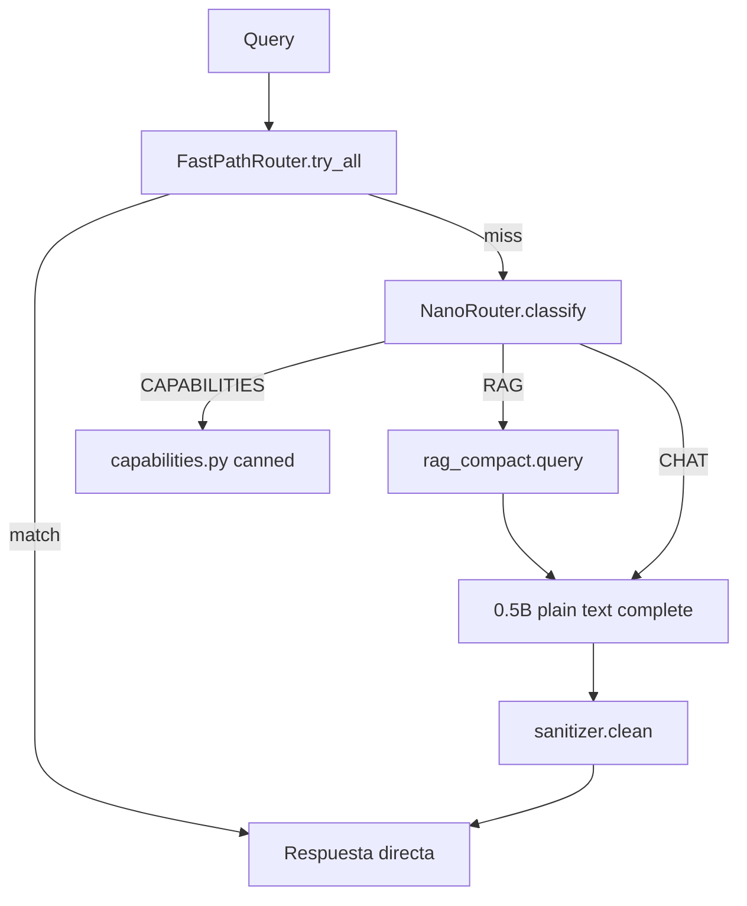

> **Status: ARCHIVADO — quizás más adelante**  
> Plan vigente: [`CURRENT_FOCUS.md`](../CURRENT_FOCUS.md) · Índice: [`maybe-later/README.md`](README.md)


# Low Power V2 — Nano Mode (Qwen2.5-0.5B)

> **Product status (2026-06-18):** Low Power is **disabled** in the app. Normal mode (Qwen3.5-2B) is the default. Re-enable for development with `CEREBRO_LOW_POWER_ENABLED=true`. Implementation follows the phases below.

**Autor:** Senior ML/Systems — Cerebro  
**Fecha:** 2026-06-18  
**Estado:** 📋 Plan — **in development, not shipped**  
**Reemplaza en espíritu:** [`LOW_POWER_MODE_0.5B.md`](LOW_POWER_MODE_0.5B.md) (v1 intentó adaptar el agente completo; v2 diseña un **perfil distinto**)

---

## 0. Resumen ejecutivo

### Problema con v1

El perfil low-power actual trata al **0.5B como un 2B más pequeño**: mismo LangGraph, mismas 17+ herramientas, JSON forzado por gramática en `llama-server`, y “lite mode” acoplado al nombre del archivo del modelo. Resultado: JSON basura en el chat, respuestas vacías, y riesgo de afectar el modo normal.

### Visión v2 — **Nano Mode**

> **El 0.5B no es un agente con herramientas. Es un motor de conversación rápido que delega acciones a código determinista.**

```
                    ┌─────────────────────────────────────┐
  Usuario ────────► │  Nano Orchestrator (solo low-power) │
                    └──────────────┬──────────────────────┘
                                   │
         ┌─────────────────────────┼─────────────────────────┐
         ▼                         ▼                         ▼
  Fast paths (14+)          RAG compacto              Chat plano 0.5B
  sin LLM                   top_k=2, chunks cortos    sin JSON, sin tools
         │                         │                         │
         └─────────────────────────┴─────────────────────────┘
                                   ▼
                         Respuesta humana (nunca JSON crudo)
```

### Principios inviolables

| # | Regla | Por qué |
|---|--------|---------|
| P1 | **Normal mode intocable** | Cero cambios de comportamiento cuando `profile != "low-power"` |
| P2 | **Un solo gancho en runtime** | `AgentRuntime.run*` delega a `NanoOrchestrator` solo si el perfil lo exige |
| P3 | **Código nuevo en `core/agents/low_power/`** | Módulo aislado; fácil de revisar, testear y borrar |
| P4 | **Fast paths primero** | Cada acción que hoy falla en 0.5B debe intentar resolverse sin LLM |
| P5 | **0.5B = texto plano** | Nunca JSON en prompt ni gramática en servidor para nano |
| P6 | **Regresión obligatoria** | `make test-stable` + suite nano antes de marcar fase done |

### Métricas objetivo (M1 8 GB)

| Métrica | Normal (2B) | Nano (0.5B) |
|---------|-------------|-------------|
| RAM llama-server | ~2.5 GB | ~0.8 GB |
| Latencia “hola” | 2–4 s | <1.5 s |
| Latencia fast path | <100 ms | <100 ms |
| Tool JSON vía LLM | ✅ | ❌ (prohibido por diseño) |
| Calendario / archivos / math | ✅ | ✅ vía fast paths |
| RAG documental | ✅ | ✅ acotado |
| Plan multi-paso (TaskPlanner) | ✅ | ❌ desactivado |

---

## 1. Mapa de capacidades del proyecto vs Nano

### 1.1 Lo que Cerebro ya tiene (reutilizable sin tocar normal)

| Capacidad | Módulo existente | Rol en Nano |
|-----------|------------------|-------------|
| 14+ fast paths | `fast_path_router.py` | **Capa principal de acción** |
| Clasificador keyword | `intent_keywords.py` | Router nano sin LLM |
| SmolLM2 router (opcional) | `llm_router.py` | Solo si hay puerto/router dedicado |
| RAG | `query_engine.py` | Modo compacto (env-gated) |
| Embeddings locales | `local` backend | Ya en `low-power.env` |
| i18n ES/EN | `core/i18n/messages.py` | Respuestas canned + sanitización |
| Confirmación tools | `ConfirmModal` + policy | Solo fast paths que ya la usan |
| Settings toggle | `ModelModeToggle.tsx` | Sin cambios de contrato API |

### 1.2 Lo que Nano **no** debe usar

| Capacidad | Motivo |
|-----------|--------|
| LangGraph tool loop completo | 0.5B no elige bien entre 17 tools |
| `build_agent_response_grammar()` | JSON estructurado → basura |
| `--grammar-file` en llama-server | Conflicto con prompt plano |
| TaskPlanner multi-paso | Alucinaciones en paso 2+ |
| Reflection LLM | Coste + calidad pobre |
| ContextEnricher proactivo | RAM + latencia (ya off en env) |
| MLX / fleet swap | Perfil single-model simple |

### 1.3 Lo que el 0.5B **sí** hace bien (diseñar alrededor de esto)

- Saludos, despedidas, tono conversacional
- Parafrasear / resumir **texto ya dado** (chunk RAG ≤300 chars)
- Preguntas de seguimiento cortas con contexto mínimo
- Clasificación binaria simple con prompt de 2 líneas (fallback keyword)
- Completar frases literales cortas (contenido de archivo ya extraído por fast path)

---

## 2. Arquitectura — aislamiento del modo normal

### 2.1 Árbol de módulos nuevos

```
core/agents/low_power/
├── __init__.py
├── profile.py          # is_nano_profile() — única fuente de verdad
├── orchestrator.py     # NanoOrchestrator.run / run_streaming
├── router.py           # NanoRouter: FAST | RAG | CHAT | (micro)
├── prompts.py          # Plantillas mínimas ES/EN
├── sanitizer.py        # Nunca filtrar JSON crudo al usuario
├── rag_compact.py      # Wrapper RAG con límites nano
├── capabilities.py     # Texto "qué puedo hacer" i18n
└── hooks.py            # Punto de entrada desde AgentRuntime
```

### 2.2 Gancho único en runtime (única edición en `runtime.py`)

```python
# core/agents/runtime.py — SOLO este patrón, sin alterar nodos existentes
from core.agents.low_power.hooks import maybe_delegate_to_nano

async def run_streaming(self, query, ...):
    if delegated := await maybe_delegate_to_nano(self, query, ...):
        async for item in delegated:
            yield item
        return
    # ... código actual sin cambios ...
```

`maybe_delegate_to_nano` retorna `None` si `profile != "low-power"` → **cero impacto en normal**.

### 2.3 Detección de perfil (reemplaza `_is_small_model()` frágil)

```python
# core/agents/low_power/profile.py
def is_nano_profile(config: dict | None = None) -> bool:
    """True solo cuando el usuario activó Low Power en Settings."""
    cfg = config or load_runtime_config()
    return cfg.get("profile") == "low-power"
```

**No** inferir nano por nombre de archivo GGUF. Un 2B en low-power sería error de UX; un 0.5B en normal mode seguiría usando el agente completo (decisión consciente del usuario).

### 2.4 Flujo Nano Orchestrator



**Orden:** fast paths → capabilities regex → RAG (si hay docs indexados y query parece documental) → chat plano.

---

## 3. Plan modular por fases

Cada fase tiene: **objetivo**, **archivos**, **checklist**, **verificación**, **rollback**.

---

### Fase 0 — Red de seguridad  
**Objetivo:** Poder implementar sin romper normal.  
**Duración estimada:** 0.5 día

#### Archivos
- [ ] `tests/test_nano_profile_isolation.py` — **CREAR**
- [ ] `tests/conftest.py` — añadir fixture `nano_config` / `normal_config`
- [ ] `Makefile` — target `test-nano` — **MODIFICAR**

#### Checklist
- [ ] **0.1** Fixture que fuerza `profile=low-power` solo en tests nano
- [ ] **0.2** Test: con `profile=normal`, `maybe_delegate_to_nano` retorna `None`
- [ ] **0.3** Test: `make test-stable` documentado como gate pre-merge
- [ ] **0.4** Documentar en este plan: *“Si un test normal falla tras cambio nano, el cambio viola P1”*

#### Verificación
```bash
make test-stable
make test tests/test_nano_profile_isolation.py -q
```

#### Rollback
Eliminar tests nano; ningún cambio en producción aún.

---

### Fase 1 — Stack de inferencia 0.5B (config only)  
**Objetivo:** llama-server nano sin gramática; normal intacto.  
**Duración estimada:** 0.5 día

#### Archivos
- [ ] `config/chat-lowpower.args` — **MODIFICAR** (quitar `--grammar-file`)
- [ ] `config/chat.args` — **NO TOCAR** gramática del modo normal
- [ ] `config/profiles/low-power.env` — **REVISAR** (sin `CEREBRO_*` que afecten normal)
- [ ] `bin/grammars/nano_plain.gbnf` — **CREAR** (opcional: solo `"text"*` libre — ver Fase 4)

#### Checklist
- [ ] **1.1** Eliminar `--grammar-file` de `chat-lowpower.args`
- [ ] **1.2** Confirmar `chat.args` sigue con grammar/API path del agente 2B
- [ ] **1.3** `--ctx-size 4096` nano (8K opcional en Fase 7 si RAM OK)
- [ ] **1.4** `--n-gpu-layers 99` + cache flags ya presentes — mantener
- [ ] **1.5** Script smoke: `scripts/smoke_nano_engine.sh` — **CREAR** — curl health + completion sin JSON

#### Verificación
```bash
# Tras make engine con perfil low-power
ps aux | grep llama-server | grep -v grammar-file   # debe ser 0 matches
curl -s http://127.0.0.1:8080/v1/chat/completions \
  -H 'Content-Type: application/json' \
  -d '{"model":"qwen2.5-0.5b-instruct-q5_k_m.gguf","messages":[{"role":"user","content":"Di hola en una palabra"}],"stream":false}' \
  | jq -r '.choices[0].message.content'   # texto plano, no JSON
```

#### Rollback
Restaurar `--grammar-file` en `chat-lowpower.args` (v1).

---

### Fase 2 — Módulo `low_power/` + delegación  
**Objetivo:** Orchestrator mínimo: fast path → chat plano.  
**Duración estimada:** 1–2 días

#### Archivos
- [ ] `core/agents/low_power/profile.py` — **CREAR**
- [ ] `core/agents/low_power/orchestrator.py` — **CREAR**
- [ ] `core/agents/low_power/prompts.py` — **CREAR**
- [ ] `core/agents/low_power/sanitizer.py` — **CREAR**
- [ ] `core/agents/low_power/hooks.py` — **CREAR**
- [ ] `core/agents/runtime.py` — **1 gancho** al inicio de `run` y `run_streaming`
- [ ] `tests/test_nano_orchestrator.py` — **CREAR**

#### Checklist
- [ ] **2.1** `is_nano_profile()` lee `~/.cerebro/state/config.json` + cache en memoria
- [ ] **2.2** `NanoOrchestrator.run`: fast path → si miss → chat con `_NANO_CHAT_PROMPT`
- [ ] **2.3** `sanitizer.clean()`: strip JSON envelopes, fences, `<think>`
- [ ] **2.4** Si respuesta vacía post-sanitize → `_L("nano.fallback")` (añadir claves i18n)
- [ ] **2.5** Streaming: emitir solo texto sanitizado (nunca `{` inicial)
- [ ] **2.6** Metadata API: `inference_mode: "nano"`, `profile: "low-power"`

#### Prompt nano (referencia)
```
Eres Cerebro en modo Nano. Responde en texto plano, breve, en el idioma del usuario.
No uses JSON. No inventes herramientas. Si no sabes, dilo en una frase.
Fecha: {current_date}
```

#### Verificación
```bash
make test tests/test_nano_orchestrator.py -q
# Manual con backend en low-power:
curl -X POST http://localhost:7842/api/query \
  -d '{"query":"hola"}' | jq -r '.answer'   # sin JSON visible
```

#### Rollback
`maybe_delegate_to_nano` siempre retorna `None` (feature flag env `CEREBRO_NANO_ENABLED=false`).

---

### Fase 3 — Fast paths nano (cobertura ES + meta)  
**Objetivo:** Consultas que hoy caen al LLM deben resolverse sin él.  
**Duración estimada:** 1–2 días

#### Archivos nuevos
- [ ] `core/agents/capabilities_fast_path.py` — **CREAR**
- [ ] `core/agents/greeting_fast_path.py` — **CREAR** (opcional si capabilities cubre hola)

#### Archivos modificados (solo añadir rutas — **no reordenar** pipeline estable)
- [ ] `core/agents/fast_path_router.py` — registrar capabilities + ES time/date
- [ ] `core/i18n/messages.py` — textos capabilities ES/EN
- [ ] `tests/test_capabilities_fast_path.py` — **CREAR**
- [ ] `tests/fixtures/nano_prompts.yaml` — **CREAR** — frases E2E

#### Checklist
- [ ] **3.1** Capabilities: regex ES/EN (`qué puedes hacer`, `what can you do`, `ayuda`, `help`)
- [ ] **3.2** Respuesta canned ≤120 palabras listando fast paths reales (calendario, archivos, math, clima…)
- [ ] **3.3** Time/date ES: `qué hora es`, `qué fecha es hoy`, `qué día es` → `_try_time_date`
- [ ] **3.4** Greeting: `hola`, `buenos días`, `hey` → respuesta instantánea sin LLM (opcional)
- [ ] **3.5** Fast path **solo se ejecuta igual en normal y nano** — mismos handlers, cero bifurcación

#### Verificación
```bash
make test-stable
make test tests/test_capabilities_fast_path.py tests/test_calendar_fast_path.py -q
```

#### Rollback
Quitar entradas nuevas del router; fast paths viejos siguen igual.

---

### Fase 4 — NanoRouter (clasificación ligera)  
**Objetivo:** Decidir RAG vs chat sin tool JSON.  
**Duración estimada:** 1 día

#### Archivos
- [ ] `core/agents/low_power/router.py` — **CREAR**
- [ ] `tests/test_nano_router.py` — **CREAR**

#### Rutas NanoRouter

| Ruta | Detección | Acción |
|------|-----------|--------|
| `FAST` | Ya resuelto por FastPathRouter | N/A |
| `CAPABILITIES` | Regex capabilities | canned |
| `RAG` | Keywords: `documento`, `pdf`, `según`, `indexado`, `en mis archivos` + docs en vector store | `rag_compact` |
| `CHAT` | default | 0.5B plain |

#### Checklist
- [ ] **4.1** Keyword-first (sin LLM) — 95% de rutas
- [ ] **4.2** Fallback LLM: prompt 1 línea “Responde solo: RAG o CHAT” — max_tokens=3, temperature=0
- [ ] **4.3** Nunca emitir `TOOL` como ruta en v2 (reservado v3 micro-bridge)
- [ ] **4.4** Log `nano_route=CHAT|RAG` en debug

#### Verificación
```bash
make test tests/test_nano_router.py -q
```

---

### Fase 5 — RAG compacto  
**Objetivo:** Respuestas documentales útiles con contexto mínimo.  
**Duración estimada:** 1 día

#### Archivos
- [ ] `core/agents/low_power/rag_compact.py` — **CREAR**
- [ ] `core/rag/query_engine.py` — **wrapper opcional** con kwargs `top_k`, `max_chunk` (default sin cambio)

#### Límites nano (env)
```bash
CEREBRO_NANO_RAG_TOP_K=2
CEREBRO_NANO_RAG_MAX_CHUNK=250
CEREBRO_NANO_RAG_MAX_PROMPT_TOKENS=1200
```

#### Checklist
- [ ] **5.1** Inyectar solo 2 chunks × 250 chars en prompt nano
- [ ] **5.2** Prompt: “Responde SOLO con el texto proporcionado. Si no está, di que no lo encuentras.”
- [ ] **5.3** Sin SemanticCompressor neural si añade latencia — TF-IDF o truncado OK
- [ ] **5.4** Metadata: `sources_used` sigue llegando al frontend

#### Verificación
```bash
# Indexar un .txt de prueba, preguntar por un dato literal
make test tests/test_rag.py -q -k nano   # tests nuevos con mock
```

---

### Fase 6 — Desactivar subsistemas pesados (profile-gated)  
**Objetivo:** Nano no invoca planner/reflection/graph tools.  
**Duración estimada:** 0.5 día

#### Archivos
- [ ] `ui/tray/server.py` — gate en `/api/query/plan` → 503 o mensaje amigable si nano
- [ ] `main.py` — si nano: no instanciar TaskPlanner **OR** orchestrator no lo llama
- [ ] `core/agents/runtime.py` — reflection skip cuando delegado a nano (ya no entra al graph)

#### Checklist
- [ ] **6.1** `POST /api/query/plan` → `{ "error": "nano_no_planner", "message": "..." }`
- [ ] **6.2** Reflector no corre en nano orchestrator
- [ ] **6.3** `CEREBRO_PROACTIVE_CONTEXT=false` en low-power.env — verificar
- [ ] **6.4** Short-term max 8 mensajes (env existente) — verificar en `short_term.py`

#### Verificación
Manual: en low-power, botón plan (si existe) muestra mensaje; en normal, plan funciona.

---

### Fase 7 — Frontend & UX  
**Objetivo:** Comunicar capacidades reales; no prometer agente completo.  
**Duración estimada:** 1 día

#### Archivos
- [ ] `ui/tray/src/components/settings/ModelModeToggle.tsx` — copy nano honesto
- [ ] `ui/tray/src/components/chat/ChatWindow.tsx` — empty state hint nano
- [ ] `ui/tray/src/components/chat/MessageFooter.tsx` — badge `Nano` si `metadata.inference_mode === "nano"`
- [ ] `ui/tray/src/locales/*.json` — strings
- [ ] `ui/tray/src/api/types.ts` — `inference_mode?: "agent" | "nano" | "fast_path"`

#### Checklist
- [ ] **7.1** Toggle: “Nano · 0.5B · chat rápido + acciones automáticas”
- [ ] **7.2** Tooltip: lista bullet de qué funciona / qué no
- [ ] **7.3** Primer mensaje en sesión nano: chip dismissible “Modo Nano activo”
- [ ] **7.4** No filtrar modelos distinto — mantener 0.5B/0.8B only en low-power

#### Verificación
Toggle low-power → UI copy correcto → normal mode copy unchanged.

---

### Fase 8 — Operaciones & Makefile  
**Objetivo:** DX reproducible.  
**Duración estimada:** 0.5 día

#### Archivos
- [ ] `Makefile` — targets abajo
- [ ] `scripts/smoke_nano_e2e.sh` — **CREAR**
- [ ] `AGENTS.md` — sección Nano v2
- [ ] `docs/reference/changes.md` — entrada al completar

#### Makefile targets
```makefile
.PHONY: test-nano smoke-nano low-power-v2
test-nano:
	.venv/bin/python -m pytest tests/test_nano_*.py tests/test_capabilities_fast_path.py -q
smoke-nano:
	bash scripts/smoke_nano_e2e.sh
low-power-v2:
	bash -c 'source config/profiles/low-power.env && exec python main.py'
```

#### Checklist
- [ ] **8.1** `smoke_nano_e2e.sh`: hola, qué hora es, qué puedes hacer, math, calendario (mock Linux)
- [ ] **8.2** Documentar switch normal ↔ nano sin corrupción de `chat.args`

---

### Fase 9 — (Opcional v2.1) Micro-bridge  
**Objetivo:** 3 “intenciones accionables” sin JSON tool schema.  
**Duración estimada:** 2 días  
**Riesgo:** medio — solo si Fases 0–8 estables

Idea creativa: el 0.5B emite **tags de una palabra** en la primera línea; el runtime las interpreta.

```
@file: crear nota.txt con hola mundo
@cal: eventos de hoy
@math: 2+2
```

#### Checklist
- [ ] **9.1** Prompt nano: “Si el usuario pide acción, empieza con @file, @cal o @math en la primera línea”
- [ ] **9.2** Parser en `low_power/micro_bridge.py` — regex primera línea
- [ ] **9.3** `@file` → delegar a `try_file_write_fast_path` con query restante
- [ ] **9.4** `@cal` → `try_calendar_fast_path`
- [ ] **9.5** `@math` → `try_pure_math_fast_path`
- [ ] **9.6** Si tag desconocido → ignorar tag, chat normal
- [ ] **9.7** Tests deterministas — sin LLM en tests de parser

**Nota:** Esto evita JSON pero da sensación “agentica”. No tocar tool loop normal.

---

## 4. Matriz de regresión (normal mode)

Ejecutar **siempre** antes de marcar cualquier fase como Done:

```bash
# Gate 1 — fast paths estables (obligatorio)
make test-stable

# Gate 2 — API + runtime normal (profile=normal en conftest)
make test tests/test_api.py tests/test_agent_runtime.py -q

# Gate 3 — nano aislado
make test-nano
```

| Escenario normal | Debe seguir igual |
|------------------|-------------------|
| `make run` sin profile | 2B + LangGraph + tools |
| Tool confirm flow | Modal + pause |
| Streaming JSON answer field | Parser incremental |
| Calendar fast paths | Orden canónico |
| PATCH profile → normal | Modelo 2B, chat.args con grammar |

---

## 5. Criterios de aceptación global (Definition of Done)

| ID | Criterio | Comando / evidencia |
|----|----------|---------------------|
| A1 | Normal mode byte-identical en tests | Gate 1 + Gate 2 green |
| A2 | Nano: hola → texto plano <2s | smoke-nano |
| A3 | Nano: capabilities → canned, sin LLM | test capabilities |
| A4 | Nano: qué hora es → fast path | smoke-nano |
| A5 | Nano: nunca JSON crudo en UI | test sanitizer + manual |
| A6 | llama-server nano sin `--grammar-file` | `ps aux \| grep grammar` |
| A7 | RAM llama-server ≤900 MB | `ps aux` manual |
| A8 | Toggle Settings persiste + reinicio OK | manual desktop.json |
| A9 | Documentación AGENTS.md actualizada | review |
| A10 | Plan: todas las fases 0–8 ✅ | este documento |

---

## 6. Riesgos y mitigaciones

| Riesgo | Prob. | Mitigación |
|--------|-------|------------|
| Gancho en runtime rompe normal | Baja | Test aislamiento Fase 0; delegate retorna None |
| Fast path reorder rompe calendario | Media | **Solo append** al router; `make test-stable` |
| 0.5B sigue emitiendo JSON | Alta | sanitizer + sin grammar servidor |
| RAG alucina en 0.5B | Media | top_k=2, prompt “solo texto dado”, fallback honesto |
| Usuario espera tools en nano | Alta | UX Fase 7 + capabilities canned |
| chat.args corrupto al swap | Media | Ya fixeado en v1; verificar args file por profile |

---

## 7. Lo que NO hacer (anti-patterns)

1. ❌ Reutilizar `_SYSTEM_TEMPLATE` con JSON en nano  
2. ❌ Poner `--grammar-file` en `chat-lowpower.args`  
3. ❌ Usar `_is_small_model()` por nombre de archivo — usar `profile`  
4. ❌ Modificar nodos LangGraph existentes para “if nano”  
5. ❌ Reducir tools del agente general-v1 en normal mode  
6. ❌ Reordenar fast paths canónicos sin suite estable  
7. ❌ Prometer TaskPlanner en UI nano  

---

## 8. Cronograma sugerido

| Semana | Fases | Entregable |
|--------|-------|------------|
| 1 | 0, 1, 2 | Chat plano funcional + aislamiento |
| 2 | 3, 4, 5 | Capabilities ES + RAG compacto |
| 3 | 6, 7, 8 | UX + smoke E2E + docs |
| 4+ | 9 (opc.) | Micro-bridge @tags |

---

## 9. Referencias internas

- Fast paths congelados: [`docs/architecture/fast-paths.md`](../architecture/fast-paths.md)
- Plan v1 (lecciones): [`LOW_POWER_MODE_0.5B.md`](LOW_POWER_MODE_0.5B.md) §15 errores post-impl
- SmolLM2 como clasificador: [`Qwen3.5-0.8B-integration-ideas.md`](Qwen3.5-0.8B-integration-ideas.md) §3
- Nuevos fast paths patrón: [`new_fast_paths_implementation.md`](new_fast_paths_implementation.md)

---

## 10. Registro de progreso

| Fase | Estado | Fecha | Notas |
|------|--------|-------|-------|
| 0 — Red de seguridad | ⬜ Pendiente | | |
| 1 — Inferencia | ⬜ Pendiente | | |
| 2 — Orchestrator | ⬜ Pendiente | | |
| 3 — Fast paths nano | ⬜ Pendiente | | |
| 4 — NanoRouter | ⬜ Pendiente | | |
| 5 — RAG compacto | ⬜ Pendiente | | |
| 6 — Subsistemas off | ⬜ Pendiente | | |
| 7 — Frontend UX | ⬜ Pendiente | | |
| 8 — Ops & Makefile | ⬜ Pendiente | | |
| 9 — Micro-bridge (opt.) | ⬜ Pendiente | | |

> Actualizar esta tabla al completar cada fase. Marcar ✅ solo si Gate 1+2+3 pasan.
