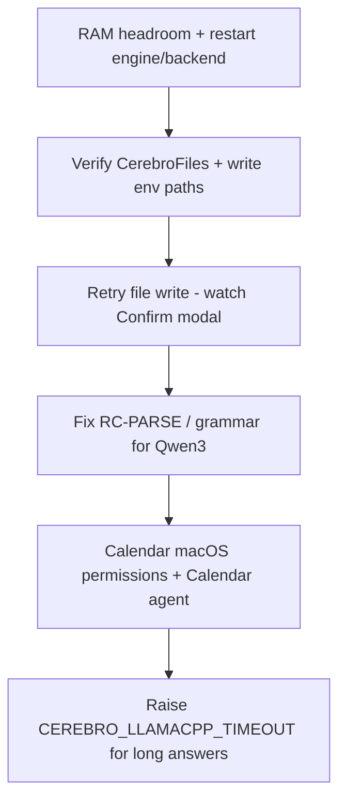

# Diagnosis — Qwen3 frontend chat session (2026-05-21)

**Source log:** [`frontend_chat_qwen3_2026-05-21.md`](frontend_chat_qwen3_2026-05-21.md)  
**Model:** `Qwen_Qwen3-4B-Instruct-2507-Q4_K_M.gguf`  
**Scope:** Filesystem writes, calendar access, response cut-offs/timeouts, and what already works.

---

## 1. Overall picture

Your session shows a **split personality** in Cerebro:

| Layer | Behavior in your test |
|--------|----------------------|
| **Plain chat** (math, capabilities, instructions) | Mostly good — correct $150, coherent Spanish, useful how-to answers |
| **Tool execution** (files, calendar) | Unreliable — model often *talks* about doing the work without the backend running the tool, or emits JSON the parser cannot use |
| **Long answers** | Fails hard — `llama-server chat timed out` on truth tables |

The app is not “broken end-to-end”; the **agent loop + small local model + tool JSON contract** is the weak link. Fixes are mostly configuration, permissions, parser/routing, and expectations about where files may be written—not a single bug in the UI.

---

## 2. Problem A — “Creates” files but nothing appears (or no path)

### What you saw

| Turn | Symptom |
|------|---------|
| #2 | “He creado un archivo de Python…” — no path, no proof |
| #3 | “No se creó ningún archivo…” — contradicts #2 |
| #4 | Says default folder is `CerebroFiles` |
| #6 | Claims `ejemplo.txt` created — still no path on disk mentioned |

### Diagnosis (likely causes, in order)

**A1 — Hallucinated answer (most likely for #2 and #6)**  
The model replied with `action: answer` prose instead of valid tool JSON like:

```json
{"action": "tool", "tool": "write_file", "args": {"path": "/Users/.../Desktop/CerebroFiles/ejemplo.txt", "content": "Hola, mundo!"}}
```

When that happens, **no `write_file` handler runs**. The UI never shows a TOOL step or Confirm modal; you only see convincing text. This matches smoke under stress: `fs_write_cerebrofiles` got the same parse fallback as calendar ([`../implemefix/post-smoke.md`](../implemefix/post-smoke.md)).

**A2 — Tool ran but you did not confirm**  
`write_file` is in `CONFIRMATION_REQUIRED_TOOLS` (`core/agents/runtime.py`). A correct tool call should pause with a **Confirm** dialog and a message like “approval needed for write_file”. If you did not see that, the tool was probably never invoked (back to A1).

**A3 — Wrong path / folder expectation**  
Authorized **writes** default to **`~/Desktop/CerebroFiles`** (`CEREBRO_FILES_PATH` in `main.py` / `config/settings.toml`).  
**Reads** can include the repo and CerebroFiles; **watched folders** in Settings mainly extend **read/search**, not automatic write targets unless you also add them to `CEREBRO_AUTHORIZED_WRITE_PATHS`.

So if your “assigned folder” is only in **Watched folders** but not in write paths, the agent must not write there—or the tool raises `PathNotAuthorizedError` and the turn may degrade to a generic parse/error message.

**A4 — Session memory gap (#2 vs #3)**  
Turn #3 asks “where did you create it?” in a **new** reasoning step. The model often only sees its last assistant message (natural language “I created it”) without a tool result row saying `write_file → success, path: ...`. So it honestly (from its view) says “nothing was created in *this* query.” That is a **UX/trust** problem: users believe #2; #3 feels like a lie.

**A5 — RAM pressure**  
Smoke at ~84% system RAM showed filesystem prompts returning **parse fallback** instead of clean tool or denial. Close heavy apps before file/calendar tests.

### How to verify (5 minutes)

1. After a “file created” reply, check **`~/Desktop/CerebroFiles/`** for `ejemplo.txt` or any `.py` file.
2. In the tray UI, look for a **TOOL** / **Confirm** step on that turn (backend logs: `write_file: wrote N bytes to ...`).
3. On backend startup, confirm log lines like:  
   `Filesystem authorized write paths: ['/Users/.../Desktop/CerebroFiles']`
4. Run: `ls ~/Desktop/CerebroFiles` and `find ~ -name ejemplo.txt -maxdepth 4` (quick sanity).

### Possible solutions

| Priority | Action | Why it helps |
|----------|--------|----------------|
| **P0** | Use an explicit prompt: *“Usa write_file para crear ~/Desktop/CerebroFiles/ejemplo.txt con contenido Hola”* | Forces tool-shaped intent; still needs valid JSON from the model |
| **P0** | Free RAM (target &lt; 70% used) before file tests | Parser/tool loop fails more often under pressure |
| **P1** | Ensure `~/Desktop/CerebroFiles` exists (app usually creates it on boot) | Avoids silent tool errors |
| **P1** | To write elsewhere, set env and restart: `CEREBRO_AUTHORIZED_WRITE_PATHS=/your/folder` (and optionally `CEREBRO_FILES_PATH`) | Aligns code with your “assigned folder” |
| **P1** | When Confirm appears, **Approve** — otherwise file is never written | Required by design for `write_file` |
| **P2** | Stronger post-tool replies: backend injects “File written at: …” into the answer so follow-ups cannot deny it | Product fix in runtime/prompt |
| **P2** | Pre-route file creation (like math fast-path): detect “crea archivo X con Y” → call `write_file` without relying on Qwen3 JSON | See `manual_tests/implemefix/fix-plan-test2.md` H3.x patterns |
| **P3** | Try **Qwen2.5-Coder-3B** or larger quant; 4B Instruct is worse at strict JSON | Smoke used Coder-3B with better tool behavior |

---

## 3. Problem B — Calendar: “No pude interpretar la respuesta del modelo”

### What you saw

Interactions #7, #10, #11, #12 — every calendar question (birthday, nearest event, this month, explicit “usa el calendario”) ended with the same Spanish fallback.

### Diagnosis

**B1 — Parser fallback (RC-PARSE), not “no calendar app”**  
That exact string is `_L("parse.llm_fallback")` in `core/i18n/messages.py`. It is returned when:

- The model output looks like JSON but `json.loads` fails, or  
- Tool JSON is malformed (e.g. unquoted tool names: `"tool": get_upcoming_events`), or  
- Required fields are missing.

So the calendar tool **`get_upcoming_events` / `search_upcoming` may never run** in those turns. This is the same root cause documented in [`FIX_TEST2.md`](fix-plan-test2.md) for Qwen3 sessions.

**B2 — macOS permissions (only after parse is fixed)**  
On macOS, live calendar data uses **Apple Calendar via osascript** (`integrations/calendar_reader.py`). If parse succeeds but events are empty, check:

- **System Settings → Privacy & Security → Automation / Calendars**  
- Allow **Terminal** (if you run `make run`) or **Cerebro** / **tauri** app that launched the backend.

Fallback: export or sync to **`~/.cerebro/calendar.ics`** (`CEREBRO_ICS`) and rely on the ICS backend.

**B3 — Agent routing**  
Calendar-heavy tools are emphasized on the **calendar** agent profile (`core/agents/specialized.py`). General agent may still *try* calendar tools but with more tool names in the grammar → harder for a 4B model. Selecting **Calendar** in the UI can help after parse is stable.

### Possible solutions

| Priority | Action | Why it helps |
|----------|--------|----------------|
| **P0** | Inspect backend logs for `LLM JSON parse failed` / raw response on calendar turns | Confirms RC-PARSE vs permissions |
| **P0** | Apply parser hardening from **FIX_TEST2 H1** (repair unquoted tool names, reject prose-as-JSON) | Same fix class as test2 #5, #11 |
| **P1** | Ensure GBNF grammar is active: `config/grammars/agent_response.gbnf` + `CEREBRO_LLAMACPP_*` with grammar support | Constrains output to valid tool JSON |
| **P1** | Grant Calendar automation to the process that runs Python (`main.py`) | Needed for Apple Calendar backend |
| **P1** | Test with: *“Lista eventos próximas 48 horas”* (simple window, one tool) | Reduces model confusion |
| **P2** | Keyword pre-route: “cumpleaños”, “calendario”, “próximo evento” → calendar agent + `get_upcoming_events` without free-form JSON | `intent_keywords.py` / planner |
| **P2** | Import/sync `.ics` if you do not use Apple Calendar | Stable read path without osascript |

**Important:** Until parse errors stop, fixing permissions alone will not make birthday queries work.

---

## 4. Problem C — Good explanations that sometimes cut off

### What you saw

- Many turns **8–48 s** (heavy for chat UX).  
- #14 truth tables: **`Error: llama-server chat timed out`**.

### Diagnosis

**C1 — Hard timeout (60 s default)**  
`LlamaCppChatProvider` uses `timeout=60` seconds (`core/inference/providers/llamacpp_provider.py`). Long didactic answers (truth tables, step-by-step proofs) can exceed that → hard error, not a graceful partial answer.

**C2 — Model + context size**  
Qwen3-4B with full system prompt, tools in grammar, and conversation history increases latency and tokens generated per turn → more timeout risk.

**C3 — RAM / engine contention**  
Under memory pressure, the engine slows; the same wall-clock timeout kills the request earlier in “effective” generation.

**C4 — Streaming vs complete**  
If streaming is on, UI usually shows partial text until error; your log shows a clean timeout message — consistent with provider-level abort, not frontend truncation alone.

### Possible solutions

| Priority | Action | Why it helps |
|----------|--------|----------------|
| **P0** | Set `CEREBRO_LLAMACPP_TIMEOUT=120` (or 180) in `.env` and restart backend | Direct fix for long explanations |
| **P1** | Ask in chunks: *“Explica tablas de verdad en 5 puntos cortos”* | Stays under token/time budget |
| **P1** | Route academic topics to **Academic** agent; avoid loading calendar tools in grammar for math prompts | Fewer tools → simpler JSON surface (FIX_TEST2 RC-INTENT) |
| **P2** | Use a slightly larger or “Coder”-tuned GGUF if RAM allows | Better speed/quality tradeoff on 8 GB Macs |
| **P2** | Enable / verify prompt cache hits (`prompt_cache.py`) after model stable | Cuts repeat latency |
| **P3** | Claude API backend for long teaching answers only | Offloads local timeout pressure |

---

## 5. What is working (do not over-fix)

| Area | Your result | Note |
|------|-------------|------|
| Arithmetic | $5×12×2.5 = **$150** correct | May use LLM or `math_fast_path`; either way acceptable |
| Capabilities list | Long tool list ~47.8 s | Aligns with registry (calendar, files, math, etc.) |
| Instructional answers | How to ask for a file (#5) | Good; does not prove tool execution |
| Date injection in #6 | “jueves 21 mayo 2026…” | Shows date preamble works; unrelated to file actually existing |

Tax question (#13) is **weak but not broken**: no VA rate in tools → generic “probably $150” is expected unless you add a tax data source or ask for `evaluate_math` with a stated rate.

---

## 6. Recommended fix order (practical roadmap)



1. **Environment:** Close memory hogs → `make engine` → `make run` → tray chat.  
2. **Filesystem:** Confirm `~/Desktop/CerebroFiles`; retry with explicit path; approve confirmation.  
3. **Calendar:** Fix parse (code path in FIX_TEST2 H1–H2), then permissions / ICS.  
4. **Timeouts:** Bump `CEREBRO_LLAMACPP_TIMEOUT`; shorten prompts for tutorials.  
5. **Model:** Consider Qwen2.5-Coder-3B for tool-heavy sessions until 4B parse rate improves.

---

## 7. Quick reference — env vars that matter for *your* symptoms

| Variable | Default (typical) | Symptom if wrong |
|----------|-------------------|------------------|
| `CEREBRO_FILES_PATH` | `~/Desktop/CerebroFiles` | Files not where you look |
| `CEREBRO_AUTHORIZED_WRITE_PATHS` | same as above | Writes rejected or parse fallback |
| `CEREBRO_AUTHORIZED_READ_PATHS` | repo + CerebroFiles | Agent cannot read “assigned” folder |
| `CEREBRO_LLAMACPP_TIMEOUT` | 60 | Long answers → timeout |
| `CEREBRO_ICS` | `~/.cerebro/calendar.ics` | Empty calendar without Apple permission |
| `CEREBRO_LLAMACPP_MODEL` | your Qwen3 GGUF | Tool JSON quality |

---

## 8. Related repo docs

- [`manual_tests/implemefix/fix-plan-test2.md`](fix-plan-test2.md) — RC-PARSE, tool JSON repair, timeout, intent routing  
- [`manual_tests/implemefix/post-smoke.md`](post-smoke.md) — same parse fallback on `fs_write_cerebrofiles` under RAM stress  
- [`manual_tests/implemefix/session-1.md`](session-1.md) — filesystem authorization and `CEREBRO_FILES_PATH`  
- [`docs/guides/FIX_CHAT_RUNTIME_WARNINGS.md`](../docs/guides/FIX_CHAT_RUNTIME_WARNINGS.md) — runtime warnings (if present)

---

*This document is diagnosis and remediation guidance only; it does not change application code.*
