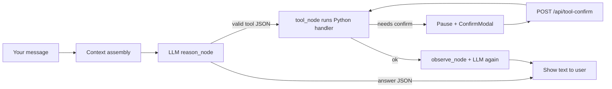

# FIX_TEST2 — Remediation plan for `manual_tests/implemefix/session-2.md`

> **Audience**: engineers fixing Cerebro chat quality on local llama.cpp (Qwen3-4B session, 2026-05-16).  
> **Companion**: extends `docs/plans/stabilization/fix-plan-v2.md` (test_1 regressions). Many steps there are **already merged**; this doc covers **what test_2 still proves is broken** and how to close it with minimal, high-leverage changes.

---

## 0. Executive summary

| Severity | Count | Theme |
|----------|-------|--------|
| **P0** | 5 interactions | Tool JSON shown to user instead of executed (5, 10, 11, 16, 18) |
| **P0** | 1 interaction | Hard failure: `llama-server chat timed out` (17) |
| **P1** | 4 interactions | Wrong tool or wrong modality (10, 16, 4, 14) |
| **P1** | 6+ interactions | Language mismatch (English prompt → Spanish answer) |
| **P2** | all | Latency 11–32 s per turn on 4B model |
| **P2** | 1 | Factual hallucination (list comprehension syntax, interaction 4) |

**Bottom line**: The runtime stack (grammar, tools, `evaluate_math`, `write_file` on general agent) is largely in place. Test 2 fails because **Qwen3 emits invalid tool JSON**, the parser **falls back to showing that string as the answer**, and **Spanish-first prompts** fight English queries. Fix parser + pre-routing first; model/tuning second.

---

## 1. Symptom → root cause map (test2 interactions)

| # | Prompt (short) | Observed | Root cause ID |
|---|----------------|----------|----------------|
| 1 | `hello` | `Hola` (~16s) | RC-LANG, RC-LAT |
| 2 | capabilities | Spanish wall of text (~26s) | RC-LANG |
| 3 | `17 × 23` | `391` correct (~18s) | RC-MATH-NO-FASTPATH (lucky LLM, tool unused) |
| 4 | list comprehension EN | Wrong syntax in ES (~26s) | RC-MODEL, RC-LANG |
| 5 | meetings 24h | Raw invalid tool JSON | **RC-PARSE** |
| 6–8 | what day is today | `Saturday` OK | RC-LANG (EN answer to EN-ish prompt is OK) |
| 9 | today's date | `Saturday, 2026-05-16` OK | — |
| 10 | write `test-cerebro.txt` | `read_file` + invalid JSON | **RC-PARSE**, RC-TOOL-PICK |
| 11 | cumpleaños cercano | invalid JSON `search_upcoming` | **RC-PARSE** |
| 12 | OS? | `macos` OK | — |
| 13 | discrete math | Generic ES paragraph OK | — |
| 14 | `/help` | LLM hallucinated help with typos | **RC-SLASH** |
| 15 | qué hora es | datetime OK | — |
| 16 | truth table (discrete) | `get_upcoming_events` JSON | **RC-PARSE**, **RC-INTENT** |
| 17 | truth table (short) | **timeout** | **RC-TIMEOUT** |
| 18 | reminder tomorrow | invalid JSON `add_reminder` | **RC-PARSE** |

### Root cause definitions

| ID | Description | Evidence in repo |
|----|-------------|------------------|
| **RC-PARSE** | Model outputs **invalid JSON** (unquoted tool names: `"tool": get_upcoming_events`, spaces in `add_reminder,`). `json.loads` fails → `_parse_llm_response` returns `action=answer` with **raw string** → user sees JSON. | `core/agents/runtime.py` `_parse_llm_response` L256-257; test2 #5,10,11,16,18 |
| **RC-TOOL-PICK** | Even when parse worked, model picks wrong tool (`read_file` vs `write_file`). | test2 #10; prompts lack explicit `write_file` example for general agent |
| **RC-INTENT** | “tabla de verdad” has no keyword → stays on general agent → calendar tool bias. | `core/agents/intent_keywords.py` — no `truth table` / `tabla de verdad` |
| **RC-SLASH** | `/help` is not in `_PREFIX_MAP`; goes to LLM. | `core/agents/specialized.py` `_PREFIX_MAP` |
| **RC-LANG** | System template + profiles are Spanish; `CEREBRO_LOCALE` defaults `es`; user preamble is Spanish. English queries still often answered in Spanish. | `runtime.py` `_SYSTEM_TEMPLATE`, `_date_preamble`, `specialized.py` |
| **RC-MATH-NO-FASTPATH** | ~~No pre-LLM path~~ **Fixed (H3.1)** — `math_fast_path.py` evaluates pure expressions before the graph. | `core/agents/math_fast_path.py`, `runtime.py` |
| **RC-TIMEOUT** | Long generations (truth table) hit `LlamaCppChatProvider` timeout (60s default). | test2 #17; `llamacpp_provider.py` |
| **RC-LAT** | 4B Qwen + full system prompt + 4096 ctx + no prompt cache hit on model swap. | metadata 11–32s; model name in test2 metadata |
| **RC-MODEL** | Small local model invents syntax (list comprehension uses `comprehension` keyword, `}`). | test2 #4 — not fixable by parser; mitigated by routing `/code` or academic |

**Invalid JSON example (test2 #5)** — this is what the parser must repair or reject:

```json
{"action": "tool", "tool": get_upcoming_events, "args": {"hours_ahead": 24}}
```

Valid shape the grammar expects:

```json
{"action": "tool", "tool": "get_upcoming_events", "args": {"hours_ahead": 24}}
```

---

## 2. Fix domains (ordered by ROI)

| Order | Domain | Fixes | Unblocks test2 # |
|-------|--------|-------|------------------|
| **H1** | Harden tool JSON parsing | H1.1–H1.3 | 5, 10, 11, 16, 18 |
| **H2** | Never surface raw tool JSON to UI | H2.1 | 5, 10, 11, 16, 18 |
| **H3** | Deterministic pre-routes (zero LLM) | H3.1–H3.4 | 3, 14, 16 (partial), 10 (partial) |
| **H4** | Language parity | H4.1–H4.2 | 1, 2, 4, 14 |
| **H5** | Inference / timeout / latency | H5.1–H5.3 | 17, all |
| **H6** | Model & prompt hygiene | H6.1–H6.2 | 4, wrong-tool rate |

---

## 3. Atomic implementation steps

Each step: **one commit**, `make lint && make test` green before the next.

### H1 — Parser repairs invalid tool JSON (P0)

**H1.1 — Add `_repair_tool_json(raw: str) -> str | None`**

File: `core/agents/runtime.py` (mirror in `cerebro/` if you maintain dual tree).

After stripping fences / thinking blocks, before `json.loads`:

1. If `"action"` and `"tool"` present but `json.loads` fails:
2. Quote bare identifiers:
   - `"tool":\s*([A-Za-z_][A-Za-z0-9_]*)` → `"tool": "$1"`
   - Same for mistaken `"action": get_upcoming_events` fallback path (already handled when JSON is valid; repair makes it valid).
3. Normalize `days_ahead: "365"` → int where schema expects int (optional, in repair or in tool handler).

**H1.2 — Regex salvage path when repair still fails**

If string matches:

```regex
"action"\s*:\s*"tool".*"tool"\s*:\s*([A-Za-z_][A-Za-z0-9_]*)
```

extract `tool` name + shallow `args` object via secondary regex / `ast`-free brace scan → return `("tool", name, args)` without full JSON.

**H1.3 — Tests**

File: `tests/test_agent_runtime.py`

```python
# New cases — copy exact strings from test2.md
def test_parse_unquoted_tool_name():
    raw = '{"action": "tool", "tool": get_upcoming_events, "args": {"hours_ahead": 24}}'
    action, tool, args = _parse_llm_response(raw)
    assert action == "tool"
    assert tool == "get_upcoming_events"

def test_parse_unquoted_tool_in_markdown_fence():
    raw = '```json\n{"action": "tool", "tool": add_reminder, "args": {"title": "Test"}}\n```'
    ...
```

**Pass signal**: Interactions 5, 11, 18 execute tools and return human text (or confirmation modal for `add_reminder` / `write_file`).

---

### H2 — User-visible answer sanitizer (P0)

**H2.1 — `_sanitize_final_answer(text: str) -> str`**

In `_build_reason_updates`, when `action == "answer"`:

- If `text.strip()` looks like tool JSON (`"action"` + `"tool"` and `{`), **do not** assign to `final_answer`.
- Return localized fallback: *“No pude ejecutar la herramienta; reformula o prueba de nuevo.”* (use `_L("error.tool_json_leaked")`).
- Log `logger.warning` with first 200 chars for debugging.

**Pass signal**: Even if H1 misses an edge case, UI never shows ```json blocks.

---

### H3 — Zero-token pre-routes (P1, big quality win)

**H3.1 — Math two-level routing** *(IMPLEMENTED — see §12)*

`core/agents/math_fast_path.py` + hooks in `run` / `run_streaming`. Pure `17 * 23` and phrased *What is 17 × 23?* bypass the LLM; `evaluate_math` tool remains Level 2 for word problems.

**Pass signal**: test2 #3 → `391` in &lt;100 ms; `metadata.warnings` contains `math_fast_path`.

**H3.2 — `/help` slash command**

File: `core/agents/specialized.py`

```python
_PREFIX_MAP["/help"] = GENERAL_AGENT_ID  # or dedicated static handler
```

Better: in `AgentRouter.route`, if stripped == `/help` → return static markdown from `core/i18n/help.py` (no LLM). Register EN+ES catalogs.

**Pass signal**: test2 #14 instant, no typos like “Quédá es hoy”.

**H3.3 — File-write micro-route**

Extend `intent_keywords.py`:

```python
(re.compile(r"\b(write|create|save)\b.*\b(file|\.txt)\b", re.I), "code"),
(re.compile(r"\btest-cerebro\.txt\b", re.I), "code"),
```

Or keep general agent but **force** tool choice in system prompt example:

```text
Para escribir texto en un archivo usa write_file, NUNCA read_file.
{"action":"tool","tool":"write_file","args":{"path":"...","content":"..."}}
```

**Pass signal**: test2 #10 → `write_file` + confirmation if policy requires.

**H3.4 — Truth-table intent**

Add patterns → `code` agent (has `execute_python`):

```python
(re.compile(r"\b(tabla de verdad|truth table)\b", re.I), "code"),
```

Prompt code agent: prefer `answer` with generated table unless user asks to save a file.

**Pass signal**: test2 #16–17 no `get_upcoming_events`.

---

### H4 — Language parity (P1)

**H4.1 — Detect query language → inject reply language**

File: `core/agents/runtime.py`

```python
def _reply_language_hint(query: str) -> str:
    # cheap heuristic: ASCII ratio, common EN words, or langdetect if already a dep
    ...
```

Append to user turn (not persisted):  
`[Responde en inglés.]` / `[Responde en español.]`

Keep `_date_preamble` locale-aware (EN: `Today is Monday, May 16, 2026, …`).

**H4.2 — `CEREBRO_LOCALE=en` + English `_MESSAGES_EN`**

File: `core/i18n/messages.py` — ship English strings; wire UI settings → env on backend start.

**Pass signal**: test2 #1 `hello` → English greeting; #4 bullets in English when prompt is English.

---

### H5 — Timeout & latency (P0/P2)

**H5.1 — Raise chat timeout for long answers**

- `CEREBRO_LLAMACPP_TIMEOUT=120` (document in CLAUDE.md)
- Or scale timeout by estimated output (truth table → 120s).

**H5.2 — Cap generation length for general agent**

In llama payload (provider kwargs): `max_tokens=512` default, `1024` for code agent. Truth tables need bounded rows or chunked tool loop.

**H5.3 — Prompt cache + model discipline**

- After switching to Qwen GGUF, run `make engine` so `config/chat.args` / cache SHA match (see `bin/cache/chat.cache.sha256`).
- For 8 GB Mac: **recommend `llama-3.2-3b-instruct-q4_k_m`** in test docs; Qwen3-4B is slower and more JSON-sloppy in manual testing.

**Pass signal**: test2 #17 completes or returns graceful “respuesta demasiado larga” without process error; median latency &lt;15s on 3B.

---

### H6 — Prompt & model hygiene (P2)

**H6.1 — Forbid markdown fences around JSON**

Add to `_SYSTEM_TEMPLATE` `INSTRUCCIONES DE RESPUESTA`:

```text
- NUNCA envuelvas el JSON en ``` ni en bloques de código.
- El campo "tool" debe ser un string entre comillas dobles.
```

**H6.2 — Qwen3 thinking blocks**

Already stripped in `_parse_llm_response`. Verify Qwen emits `` or `<think>` — extend regex if logs show leaked blocks.

---

## 4. What is already fixed (do not redo)

From `docs/plans/stabilization/fix-plan-v2.md` — confirmed in tree as of test2 session:

| Item | Status |
|------|--------|
| `write_file` on `GENERAL_TOOLS` | ✅ `specialized.py` L75 |
| `evaluate_math` tool | ✅ `core/tools/handlers/math.py` |
| GBNF grammar injection | ✅ `agent_grammar.py` + `config/grammars/agent_response.gbnf` |
| Context 4096 | ✅ `config/chat.args` |
| Answer list→bullet coercion | ✅ `_stringify_answer` |
| Confirmation via registry | ✅ (see FIX_PLAN2 C1) |

Test2 failures are **not** “missing write_file in GENERAL_TOOLS”; they are **parse + model + language**.

---

## 5. Verification matrix (re-run after H1–H3)

| # | Prompt | Expected after fix |
|---|--------|-------------------|
| 5 | meetings 24h | Tool runs → event list or “no events”; **no JSON in chat** |
| 10 | write txt | `write_file` or confirm modal; file exists in watched folder |
| 11 | cumpleaños | `search_upcoming` / `query_events` → natural Spanish answer |
| 14 | `/help` | Static help (&lt;200 ms), no LLM |
| 16 | truth table discrete | Code agent answer or Python tool; **not** calendar |
| 17 | escribe tabla | Completes or bounded error; **no timeout** |
| 18 | reminder | `add_reminder` → confirm → success string |
| 3 | 17×23 | `391` via **H3.1** zero-token fast path (`math_fast_path` warning in metadata) |
| 1 | hello | Matches user language |

**Automate**: add `manual_tests/test2_expectations.json` + `make smoke-test2` (httpx against `/api/query`) when H1 lands.

---

## 6. Suggested first sprint (2–3 hours)

1. **H1.1 + H1.3** — parser repair + tests (unblocks five interactions).  
2. **H2.1** — safety net (5 min).  
3. **H3.1 + H3.2** — math + help (30 min).  
4. Re-run manual session → append `test2_rerun.md`.

Defer H4–H6 to second sprint unless you are demoing in English.

---

## 7. Environment checklist (before blaming code)

```bash
# Terminal 1 — chat engine (match UI-selected GGUF)
make engine

# Terminal 2 — backend
make run

# Optional — embeddings / RAG (not required for test2 calendar/file tools)
make engine-embed

# English UI testing
export CEREBRO_LOCALE=en
```

Confirm Calendar / Reminders macOS permissions if #5 or #18 still return empty after parse fix.

---

## 8. Architecture note (why grammar did not save test2)

GBNF is sent on `/v1/chat/completions` (`llamacpp_provider.py` L46, L73). Test2 still shows invalid JSON because:

1. Model may run **without** grammar if an old server build ignores the field — verify with `curl` POST including `"grammar": "..."`.
2. Output wrapped in ` ```json ` fences is stripped **after** generation; fences themselves imply the model violated “JSON only”.
3. Some Qwen builds emit **JavaScript-style** identifiers; grammar allows quoted strings only — repair layer (H1) is mandatory, not optional.

**Design principle**: *grammar constrains generation; parser repairs reality; sanitizer protects UX.*

---

## 9. User guide — making external tools actually work

Your program **already registers** calendar, filesystem, macOS, and math tools at startup (`main.py` → `ToolRegistry` → `AgentRuntime`). You do **not** need a new “tools plugin” package. What you need is: **services running**, **macOS permissions**, **valid paths**, **parser fixes (H1)**, and **UI confirmation** for sensitive actions.

### 9.1 What “using a tool” means in Cerebro

Every chat message (except the legacy `stream()` shortcut) goes through this loop:



If the model prints **invalid JSON** (test2 pattern), step C never reaches D — you only see the JSON string. **Fix H1 first** before debugging Calendar or files.

### 9.2 Checklist — minimum to run tools

| Step | What to do | How to verify |
|------|------------|----------------|
| 1 | Start **chat** llama-server | `make engine` → listening on `http://127.0.0.1:8080` |
| 2 | Start **backend** | `make run` → `http://127.0.0.1:7842/api/status` returns JSON |
| 3 | Use UI or API that calls **`runtime.run()`** / **`run_streaming()`** | `/api/query` and `/api/query/stream` use the tool loop (not the old token-only `stream()` path) |
| 4 | Apply **H1 parser repair** (or only models that emit quoted JSON) | Ask “meetings next 24h” → natural language, not `{"action":"tool"...}` |
| 5 | **Calendar / Reminders** on macOS | System Settings → Privacy & Security → **Automation** → allow your terminal or Cerebro app to control **Calendar** and **Reminders** |
| 6 | Re-probe after granting | `POST /api/wizard/reprobe-calendar-permission` or restart backend; `GET /api/status` should show `macos_permissions.calendar: "ok"` |
| 7 | **Files** only under allowed roots | Default write folder: `~/Desktop/CerebroFiles` (`CEREBRO_FILES_PATH`). Reads also include repo path from `main.py`. Add folders in Settings → **Watched folders** → saves via `PATCH /api/config` (rebinds `read_file` / `search_files`) |
| 8 | **Writes / reminders / scripts** | UI shows **Confirm** modal; you must approve or the tool never runs |

### 9.3 Tool inventory (what exists today)

| Tool | What it does | Agent(s) | macOS / path needs |
|------|----------------|----------|---------------------|
| `get_upcoming_events` | Read Apple Calendar (osascript/JXA) | General, Calendar | Calendar Automation **allowed** |
| `query_events`, `search_upcoming` | Search events / birthdays | General, Calendar | Same |
| `create_calendar_event` | Create meeting | General, Calendar | Calendar + **confirmation** |
| `add_reminder` | Apple Reminders | General, Calendar | Reminders + **confirmation** |
| `read_file`, `write_file`, `list_directory`, `search_files` | Disk I/O in allowlist | General, Academic, Code | Path under `AUTHORIZED_*` |
| `create_python_file`, `run_script` | Save/run `.py` in CerebroFiles | Code | `run_script` + **confirmation** |
| `execute_python` | Short sandboxed Python snippet | Code | **confirmation** |
| `evaluate_math` | Deterministic arithmetic | General, Code | None |
| `spotlight_search`, `create_note`, `search_notes`, `send_notification` | macOS integrations | Various | Spotlight / Notes permissions as needed |
| **No `bash` / Terminal tool** | Arbitrary shell is **not** implemented | — | Use `write_file` + `run_script` (.py only) or add a new handler deliberately |

To **add a new external capability** (e.g. real Terminal):

1. Implement handler in `core/tools/handlers/`.
2. Register in `core/tools/registry.py` with `requires_confirmation=True` for anything dangerous.
3. Add tool name to the right list in `core/agents/specialized.py` (`GENERAL_TOOLS`, `CODE_TOOLS`, …).
4. GBNF will pick it up automatically via `build_agent_response_grammar(authorized_tools)`.

### 9.4 Why calendar / file prompts still “do nothing” in test2

| Symptom | Cause |
|---------|--------|
| Raw JSON in chat | **RC-PARSE** — tool never executed |
| “No events” but Calendar has events | Permission `denied` / `unknown`, or enricher timed out |
| Write request uses `read_file` | Wrong tool choice + parse failure |
| Nothing happens after “create reminder” | JSON invalid **or** waiting for **Confirm** modal you did not approve |

**Quick manual test** (after H1):

```bash
curl -s http://127.0.0.1:7842/api/status | python3 -m json.tool
# Look for macos_permissions.calendar

curl -s -X POST http://127.0.0.1:7842/api/query \
  -H 'Content-Type: application/json' \
  -d '{"query":"What meetings do I have in the next 24 hours?","agent_id":"general-v1"}'
```

Expect `metadata.tool_calls` ≥ 1 and a human-readable answer, not JSON.

### 9.5 Optional env vars for tools

```bash
# Default folder for writes (create if missing)
export CEREBRO_FILES_PATH="$HOME/Desktop/CerebroFiles"
mkdir -p "$CEREBRO_FILES_PATH"

# Skip slow calendar/file prefetch on EVERY message (~0–3 s)
export CEREBRO_PROACTIVE_CONTEXT=false

# Extra read roots (comma-separated) — or use Settings → Watched folders
# (merged into read_file allowlist on PATCH /api/config)
```

---

## 10. Wrong time (correct date, wrong hour)

### 10.1 Where the time actually comes from

Cerebro does **not** call a “clock tool” for “what time is it?”. It injects the machine clock into the **system prompt** on every turn:

```182:184:core/agents/runtime.py
    now = datetime.now().astimezone()
    current_date = now.strftime("%A, %Y-%m-%d %H:%M %Z")
    current_year = now.strftime("%Y")
```

That becomes the line:

`FECHA Y HORA ACTUAL: Saturday, 2026-05-16 12:01 CEST` (example)

The general agent is told to use that line for “qué hora es” / “what day is today” (`specialized.py` — *no inventar*, read `FECHA Y HORA ACTUAL`).

### 10.2 Why you can still get the wrong hour

| Cause | Explanation |
|-------|-------------|
| **LLM paraphrase** | The backend clock is correct; the **model rewrites** the time when generating `"action":"answer"`. Small models round, drop minutes, or use training-time priors. |
| **Ambiguous format** | `%Z` (e.g. `CEST`) without numeric offset; model may confuse with UTC. |
| **Stale turn** | Rare: very long run; time in prompt was assembled at start of request, answer drafted seconds later (usually seconds, not hours). |
| **Wrong timezone on Mac** | If macOS timezone is wrong, `astimezone()` is wrong — fix in System Settings → General → Date & Time. |

Test2 #15 returned `Saturday, 2026-05-16 12:01 PM` in ~13.4s — that is **model text**, not a direct dump of the system line (which uses 24h `%H:%M` in code). The mismatch you see is expected until you add a **deterministic time path**.

### 10.3 Fixes to implement (add to sprint)

**H3.5 — Date/time fast path (recommended)**

In `AgentRuntime.run` / `run_streaming`, **before** `_graph.ainvoke`, match:

```python
_TIME_RE = re.compile(
    r"^\s*(qu[eé]\s+hora\s+es|what\s+time\s+is\s+it|what'?s\s+the\s+time)\s*[?.!]?\s*$",
    re.I,
)
_DATE_RE = re.compile(
    r"^\s*(qu[eé]\s+d[ií]a\s+es|what\s+day\s+is\s+today|what\s+is\s+today'?s?\s+date)\s*[?.!]?\s*$",
    re.I,
)
```

If matched → `now = datetime.now().astimezone()` → return formatted string **without LLM** (target **&lt; 50 ms**).

Use a explicit user-facing format, e.g.:

```python
now.strftime("%A, %Y-%m-%d — %H:%M:%S %Z (UTC%z)")
```

**H4.3 — Tighten system prompt**

Add: *“Para hora exacta, copia literalmente FECHA Y HORA ACTUAL; no redondees ni cambies AM/PM.”*

**Optional — `get_current_time` tool**

Only needed if you want the model to “call” something; fast path is simpler and faster.

---

## 11. Why “what time is it?” is slow (~12–17 s) and how to speed it up

### 11.1 Where the seconds go

For a short question like `que hora es?`, test2 still took **~13.4 s** because **every** message pays:

| Phase | Typical cost | Notes |
|-------|----------------|-------|
| Context assembly | 1–4 s | Short-term history, optional **LanceDB** embed search if embed server up |
| Context enricher | 0–3 s | Default `CEREBRO_PROACTIVE_CONTEXT=true` → may run Calendar + file probes via osascript |
| LLM (Qwen3-4B local) | 8–25 s | Full system prompt + tools list + JSON generation |
| Tool loop | 0 | Time questions should **not** use tools — but you still pay for LLM |

So slowness is **not** “waiting on a clock API”; it is **always running the local LLM**.

### 11.2 Immediate mitigations (no code)

| Action | Effect |
|--------|--------|
| `export CEREBRO_PROACTIVE_CONTEXT=false` | Skips enricher on each turn — often saves **1–3 s** |
| Use **`llama-3.2-3b`** instead of Qwen3-4B | Smaller model → lower latency on 8 GB Mac |
| Keep `make engine` warm | Avoid cold KV cache |
| Shorter chat history | New conversation or fewer turns in thread |

### 11.3 Code mitigations (add to FIX_TEST2 plan)

| ID | Change | Target latency |
|----|--------|----------------|
| **H3.5** | Date/time fast path (§10.3) | **&lt; 100 ms** |
| **H3.1** | Math fast path for `N × M` | **&lt; 100 ms** |
| **H5** | Prompt cache + `max_tokens` cap for non-tool answers | −30–50% on LLM-bound queries |
| **Enricher** | Call `mark_skip_context_enricher()` when query matches `_TIME_RE` / `_DATE_RE` | −0–3 s even before H3.5 ships |

### 11.4 Updated sprint order (includes your questions)

1. **H3.5** — instant correct time/date (fixes wrong hour + slow “que hora es”).  
2. **H1 + H2** — calendar/files/reminders actually run.  
3. **H3.1** — fast math.  
4. macOS permissions checklist (§9.2 step 5–6).  
5. `CEREBRO_PROACTIVE_CONTEXT=false` while testing.

### 11.5 Verification — time

| Prompt | Pass criteria |
|--------|----------------|
| `que hora es?` | Matches macOS menu bar clock to the **minute**; response **&lt; 1 s** after H3.5 |
| `what time is it?` | Same, in English if you set language hint / `CEREBRO_LOCALE=en` |
| Compare | `date` in Terminal vs answer — must agree on hour and timezone offset |

---

## 12. H3.1 — Math optimization: two-level calculator execution (P1) *(IMPLEMENTED)*

To minimize latency and avoid unnecessary LLM reasoning cycles on resource-constrained hardware (8 GB RAM), implement a **strict two-level routing** mechanism for arithmetic and math queries.

### Level 1 — Zero-token math fast path (no LLM)

Before routing the query to the LangGraph (`_graph.ainvoke` / `_reason_node`), intercept **pure arithmetic expressions** at the top of `AgentRuntime.run()` and `AgentRuntime.run_streaming()`.

| Item | Detail |
|------|--------|
| **Files** | `core/agents/math_fast_path.py` (extract + evaluate), `core/agents/runtime.py` (`run` / `run_streaming`) |
| **When** | After `prepare_conversation()` / session load, **before** context assembly or enricher |
| **Also** | `mark_skip_context_enricher()` + `warnings: ["math_fast_path"]` on fast-path hits |

**Detection** — match only queries that are *entirely* a numeric expression (optional trailing `?` / `=`):

```python
import re

# Digits, whitespace, + - * / // % ** ( ) . and multiplication signs × x *
_PURE_MATH_RE = re.compile(
    r"^\s*([\d\s+\-*/()×x.,%]+)\s*[?.=!]?\s*$",
    re.IGNORECASE,
)
```

**Evaluation** — implemented in `core/agents/math_fast_path.py`:

- `extract_pure_math_expression(query)` — whole-query or embedded span (e.g. `What is 17 × 23? …` → `17*23`)
- `try_pure_math_fast_path(query, authorized_tools)` — calls `evaluate_math()` from `core/tools/handlers/math.py` (no duplicate AST in runtime)

**Integration** — `AgentRuntime._try_math_fast_path` / `_finish_math_fast_path` in `run()` and `run_streaming()` before the graph; returns `(answer, AgentState)` or yields `StreamRunComplete`.

**Pass signal**

- `What is 17 × 23? Show only the number.` → still hits fast path if the regex is tightened to strip a leading English prefix, **or** only pure `17×23` / `17 * 23` fast-paths (see engineer notes below).
- `17 * 23` alone → `391` in &lt;100 ms, zero `tools_called`, no llama.cpp request.

### Level 2 — LLM + `evaluate_math` tool (already shipped)

For queries that are **not** pure arithmetic (e.g. *“What is 17 times twenty-three?”*, *“If I have 450 items and add 16% VAT…”*):

1. Fast keyword router may already send `general-v1` (`intent_keywords.py` L79–84).
2. Model should emit `{"action":"tool","tool":"evaluate_math","args":{"expression":"17*23"}}`.
3. Parser + GBNF + `evaluate_math` handler return `391` (FIX_PLAN2 **G1**).

Level 2 costs one LLM cycle (~15–30 s on Qwen3-4B) — acceptable for non-literal math, not for `N × M` smoke tests.

### Tests

File: `tests/test_math_fast_path.py` — extract, `try_pure_math_fast_path`, runtime bypass (no `complete()` call).

### Engineer notes — 8 GB MacBook Pro M1 (recommended deltas)

| Your proposal | Recommendation |
|---------------|----------------|
| Inline AST `_eval` in `runtime.py` | **Avoid** — `core/tools/handlers/math.py` already implements safe AST + formatting (`1/3` rounding, integer cleanup). One evaluator, two call sites (fast path + tool). |
| `_PURE_MATH_RE` as written | **Tighten** — require at least one digit and one operator; reject whitespace-only matches. Consider a second pattern for *“Show only the number”* tails via `query.strip()` then re-match on extracted `[\d\s*×x+\-/().]+` substring. |
| `expression.replace('x', '*')` globally | **Risky** — only substitute `x` between digits (`(?<=\d)x(?=\d)`), not in hex or words. |
| Run before `_reason_node` only | Run **before** context assembly + **skip enricher** — biggest win on 8 GB is skipping llama.cpp **and** osascript prefetch. |
| `metadata: {"source": "fast_path_calculator"}` | Prefer `ResponseMetadata.warnings.append("math_fast_path")` or `pipeline_stages_ms["math_fast_path"]=0.0` — matches existing observability. |
| Two-level only in `run` | Wire **both** `run()` and `run_streaming()` so Calendar/non-stream and General/stream stay consistent. |

**Priority on 8 GB**: Level 1 is among the highest ROI fixes in this doc (with **H3.5** time/date and **H1** parser). A single `17×23` turn today still loads ~4K context + tools + 3B/4B prefill — fast path turns it into a few microseconds of Python.

**What I would not do on 8 GB**

- No second llama “router” model for math.
- No `eval()` / `exec()`.
- Do not fast-path *“What is 17 × 23? Show only the number.”* with a loose regex that treats the whole English sentence as math — extract the numeric span or keep Level 2 for phrased prompts.

### Relationship to FIX_PLAN2

| FIX_PLAN2 | FIX_TEST2 H3.1 |
|-----------|----------------|
| **G1** `evaluate_math` tool | Level 2 execution engine |
| **A4** keyword router | Routes math-ish text to `general-v1`; does not execute |
| **H3.1** (this section) | Level 1 zero-token bypass + enricher skip |
